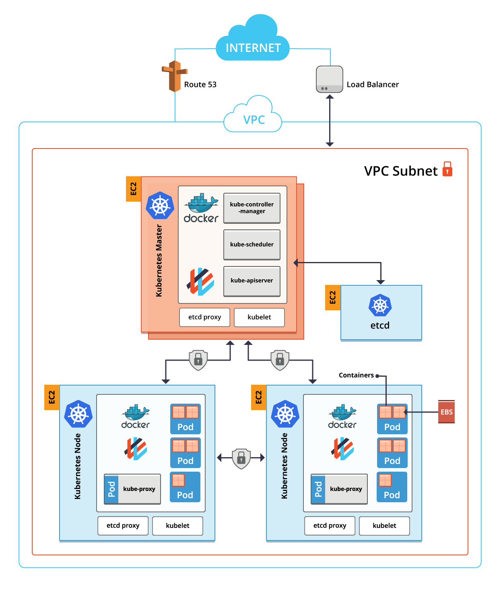

# Kubernetes Hands-on

---

## Index

<!-- TOC depthFrom:2 depthTo:6 withLinks:1 updateOnSave:1 orderedList:0 -->

* [Information](#information)
* [Prerequisites](#prerequisites)
* [Kubernetes Cluster](#kubernetes-cluster)
* [Addons](#addons)
* [Pipeline](#pipeline)

<!-- /TOC -->

---

## Information

* Kubernetes
* Kops
* Jenkins X
* Helm

---

### Kubernetes
- 컨테이너 작업을 자동화하는 오픈소스 플랫폼
- Container Orchestration
- Cluster 는 Master 와 Node 로 구성 


---

### Kops
- Kubernetes cluster up and running
- AWS is officially supported
- GCE is beta supported
- 1 Master, 2 Nodes



---

### Jenkins X
- Jenkins Pipeline Tool
- Jenkins + Kubernetes Plugins + CLI
- Jenkins 를 제외한 UI 는 제공되지 않음


---

### Helm
- Kubernetes Package Manager
- Used in Jenkins X

---

## Prerequisites

* AWS IAM - Access keys
* AWS EC2 - Key Pairs
* AWS EC2 - Ubuntu Instance

---

### AWS IAM - Access keys
* https://console.aws.amazon.com/iam/home?region=ap-northeast-2#/home

---

### AWS EC2 - Key Pairs
```bash
# create key pair
aws ec2 create-key-pair \
    --key-name hands-on \
    | grep "BEGIN RSA PRIVATE KEY" \
    | cut -d'"' -f4 \
    | sed 's/\\n/\n/g' \
    > ~/.ssh/hands-on.pem
chmod 600 ~/.ssh/hands-on.pem
```
* https://ap-northeast-2.console.aws.amazon.com/ec2/v2/home?region=ap-northeast-2#KeyPairs

---

### AWS EC2 - Ubuntu Instance
```bash
# create Ubuntu Server 16.04 LTS
aws ec2 run-instances \
    --image-id ami-191cb577 \
    --instance-type t2.micro \
    --key-name hands-on
```
* https://ap-northeast-2.console.aws.amazon.com/ec2/v2/home?region=ap-northeast-2#Instances

---

### OSX (5m)
```bash
brew tap jenkins-x/jx
brew install awscli kubectl kops jx jq
```
* https://brew.sh/index_ko

---

### Ubuntu (5m)
```bash
# connect
BASTION=
ssh -i ~/.ssh/hands-on.pem ubuntu@${BASTION}

# kubectl (1m)
curl -s https://packages.cloud.google.com/apt/doc/apt-key.gpg | sudo apt-key add -
cat <<EOF > kubernetes.list
deb http://apt.kubernetes.io/ kubernetes-xenial main
EOF
sudo mv kubernetes.list /etc/apt/sources.list.d/kubernetes.list
sudo apt update && sudo apt install -y kubectl

# kops (2m)
export VERSION=$(curl -s https://api.github.com/repos/kubernetes/kops/releases/latest | grep tag_name | cut -d'"' -f4)
curl -LO https://github.com/kubernetes/kops/releases/download/${VERSION}/kops-linux-amd64
chmod +x kops-linux-amd64 && sudo mv kops-linux-amd64 /usr/local/bin/kops

# helm (1m)
export VERSION=$(curl -s https://api.github.com/repos/kubernetes/helm/releases/latest | grep tag_name | cut -d'"' -f4)
curl -L https://storage.googleapis.com/kubernetes-helm/helm-${VERSION}-linux-amd64.tar.gz | tar xzv
sudo mv linux-amd64/helm /usr/local/bin/helm

# jenkins-x (1m)
export VERSION=$(curl -s https://api.github.com/repos/jenkins-x/jx/releases/latest | grep tag_name | cut -d'"' -f4)
curl -L https://github.com/jenkins-x/jx/releases/download/${VERSION}/jx-linux-amd64.tar.gz | tar xzv 
sudo mv jx /usr/local/bin/jx

# awscli (1m)
sudo apt install -y awscli jq
```

---

### Access Keys
```bash
# ssh key
pushd ~/.ssh
ssh-keygen -f id_rsa -N ''
popd

# aws region
aws configure set default.region ap-northeast-2

# aws credentials
cat <<EOF > ~/.aws/credentials
[default]
aws_access_key_id=
aws_secret_access_key=
EOF

# aws ec2 list
aws ec2 describe-instances | jq '.Reservations[].Instances[] | select(.State.Name == "running") | {Id: .InstanceId, Ip: .PublicIpAddress, Type: .InstanceType}'

# aws elb list
aws elb describe-load-balancers | jq '.LoadBalancerDescriptions[] | {DNSName: .DNSName, Count: .Instances | length}'
```

---

## Kubernetes Cluster
```bash
export KOPS_STATE_STORE=s3://kops-state-store-nalbam-seoul
export KOPS_CLUSTER_NAME=hands-on.k8s.local

# aws s3 bucket for state store
aws s3 mb ${KOPS_STATE_STORE} --region ap-northeast-2

# create cluster
kops create cluster \
    --cloud=aws \
    --name=${KOPS_CLUSTER_NAME} \
    --state=${KOPS_STATE_STORE} \
    --master-size=m4.large \
    --node-size=m4.xlarge \
    --node-count=2 \
    --zones=ap-northeast-2a,ap-northeast-2c \
    --network-cidr=10.10.0.0/16 \
    --networking=calico

kops get cluster --name=${KOPS_CLUSTER_NAME}

kops edit cluster --name=${KOPS_CLUSTER_NAME}

kops update cluster --name=${KOPS_CLUSTER_NAME} --yes

kops validate cluster --name=${KOPS_CLUSTER_NAME}

kops delete cluster --name=${KOPS_CLUSTER_NAME} --yes
```

---

### Modify for Jenkins-x
```yaml
spec:
  docker:
    insecureRegistry: 100.64.0.0/10
    logDriver: ""
```

---

### kubectl
```bash
# kubectl config
kubectl config view

# kubectl get
kubectl get deploy,pod,svc,job --all-namespaces
kubectl get deploy,pod,svc,job -n kube-system
kubectl get deploy,pod,svc,job -n default
```

---

### sample
```bash
# get source
git clone https://github.com/awskrug/handson-labs-2018

# install
kubectl apply -f handson-labs-2018/3_Kubernetes/sample-node.yml
kubectl apply -f handson-labs-2018/3_Kubernetes/sample-spring.yml
kubectl apply -f handson-labs-2018/3_Kubernetes/sample-web.yml

# delete
kubectl delete -f handson-labs-2018/3_Kubernetes/sample-node.yml
kubectl delete -f handson-labs-2018/3_Kubernetes/sample-spring.yml
kubectl delete -f handson-labs-2018/3_Kubernetes/sample-web.yml
```
* https://ap-northeast-2.console.aws.amazon.com/ec2/v2/home?region=ap-northeast-2#LoadBalancers

---

## Addons

* Dashboard
* Heapster

---

### Dashboard
Kubernetes Dashboard is a general purpose, web-based UI for Kubernetes clusters.
```bash
# install
kubectl apply -f handson-labs-2018/3_Kubernetes/dashboard.yml

# create role binding for kube-system:kubernetes-dashboard
kubectl create clusterrolebinding cluster-admin:kube-system:kubernetes-dashboard --clusterrole=cluster-admin --serviceaccount=kube-system:kubernetes-dashboard
kubectl get clusterrolebindings | grep cluster-admin

# get dashboard token
kubectl describe secret -n kube-system $(kubectl get secret -n kube-system | grep kubernetes-dashboard-token | awk '{print $1}')

# delete
kubectl delete -f handson-labs-2018/3_Kubernetes/dashboard.yml
```
* https://github.com/kubernetes/dashboard/

---

### Heapster
Heapster enables Container Cluster Monitoring and Performance Analysis for Kubernetes - DEPRECATED
```bash
# install
kubectl apply -f handson-labs-2018/3_Kubernetes/heapster.yml

# monitoring
kubectl top pod --all-namespaces
kubectl top pod -n kube-system

# delete
kubectl delete -f handson-labs-2018/3_Kubernetes/heapster.yml
```
* https://github.com/kubernetes/heapster/

---

## Pipeline

* Jenkins X

---

### Jenkins X
```bash
jx install --provider=aws

jx console

jx import
jx create spring -d web -d actuator

jx get applications
jx get pipelines

jx get activity -f jx-demo -w
jx get build logs nalbam/jx-demo/master
jx get build logs nalbam/jx-demo/dev

jx promote jx-demo --env production
```
* https://jenkins-x.io/

---

## Thank You
