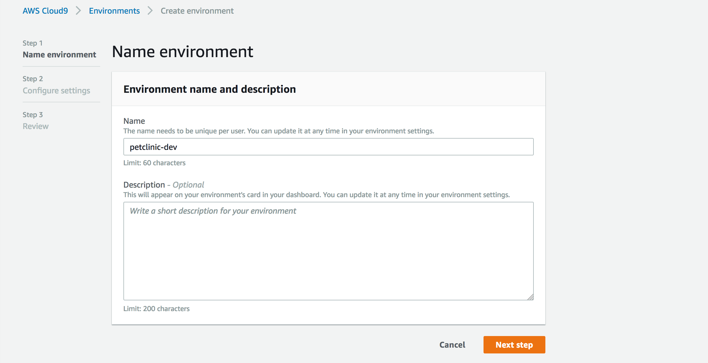
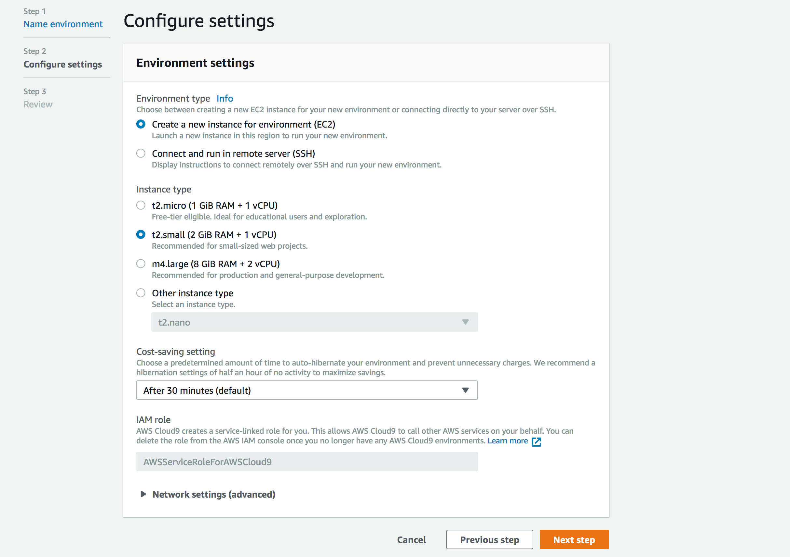
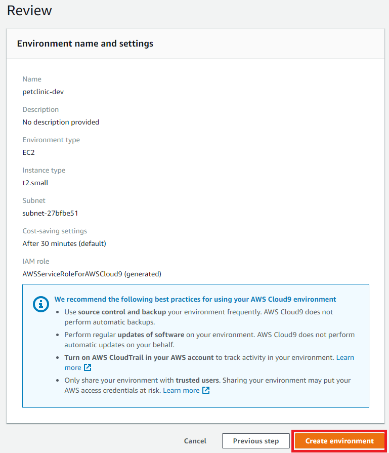
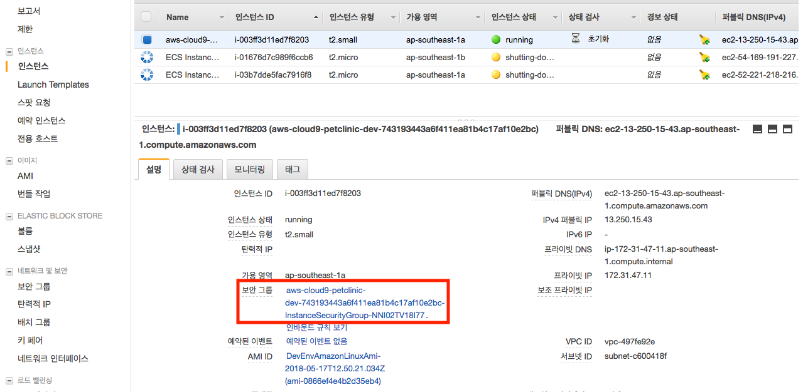
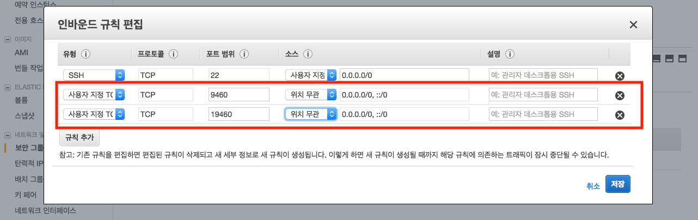
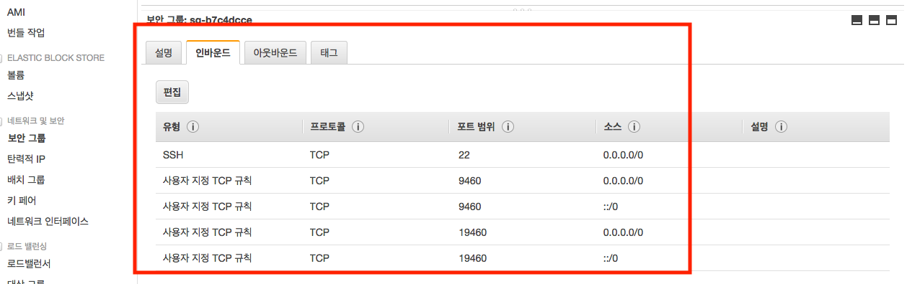
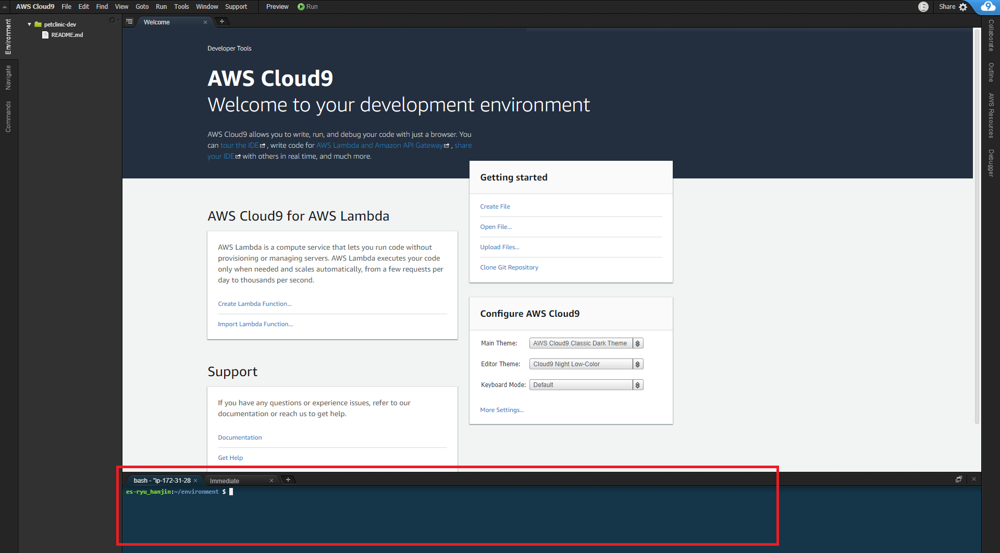
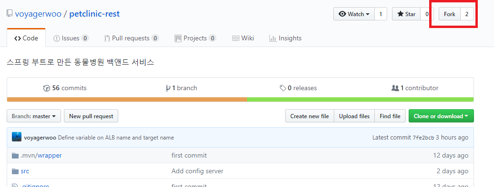
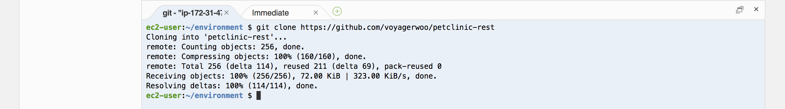
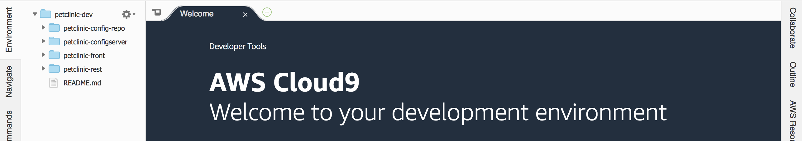

# 개발환경 구축

## Cloud9 개발환경 생성
1. AWS 로그인
    
    이번 핸즈온은 Cloud9으로 핸즈온을 진행하기때문에 AWS 계정은 루트유저(처음 가입했을때 생성된 이메일유저), 
    혹은 administrator 권한을 가진 IAM유저로 로그인하여 진행합니다.

    먼저 AWS 계정에 로그인 후 이하 링크에 접속합니다.

1. Cloud9 인스턴스 생성
    
    먼저 AWS 계정에 로그인 후 이하 링크에 접속합니다.

    https://ap-southeast-1.console.aws.amazon.com/cloud9/home/create
    
    생성할 Cloud9 인스턴스의 이름을 넣어줍니다.
    
    Name : petclinic-dev
    
     
    인스턴스 타입은 t2.small로 변경합니다.
    

    Create environment를 클릭하면 Cloud9 인스턴스가 생성되면서 Cloud9이 접속됩니다.
    

1. Cloud9 Security Group 설정

    실행된 서버를 확인하기 위해서 보안그룹을 설정합니다.
    
    
    
    
    
    

## Cloud9 개발환경 설정

Cloud9을 이용하여 핸즈온에 들어가기에 앞서, 개발환경을 설정합니다.
이하 명령어를 Terminal에 입력합니다.


1. java8 업그레이드, jq 설치
    ```bash
    # upgrade java8
    sudo yum install -y java-1.8.0-openjdk-devel.x86_64
    sudo /usr/sbin/alternatives --config java
    2         
    sudo yum remove -y java-1.7.0-openjdk
    javac -version
    #javac 1.8.0_171

    # install jq 
    sudo yum -y install jq
    ```
    
1. ecs-cli 설치
    ```bash
    sudo curl -o /usr/local/bin/ecs-cli https://s3.amazonaws.com/amazon-ecs-cli/ecs-cli-linux-amd64-latest
    sudo chmod +x /usr/local/bin/ecs-cli
    ecs-cli --
    #ecs-cli version 1.6.0
    ```

1. git config
    ```bash
    git config --global user.name {your-github-name}
    git config --global user.email {your-github-email}
  
    ```

1. fork repository
예제코드가 들어있는 github의 repository를 모두 자신의 github계정으로 fork합니다.


    - backend repository : https://github.com/voyagerwoo/petclinic-rest
    - frontend repository : https://github.com/voyagerwoo/petclinic-front
    - config repository : https://github.com/voyagerwoo/petclinic-config-repo
    - config server repository : https://github.com/voyagerwoo/petclinic-configserver

1. clone your repository
    fork한 repository내용을 cloud9으로 가져옵니다.
    이하 명령어에서 {your-github-name} 에는 자신의 github name을 입력합니다.

    ```bash
    git clone https://github.com/{your-github-name}/petclinic-rest
    git clone https://github.com/{your-github-name}/petclinic-front
    git clone https://github.com/{your-github-name}/petclinic-config-repo
    git clone https://github.com/{your-github-name}/petclinic-configserver

    ```
    

    
