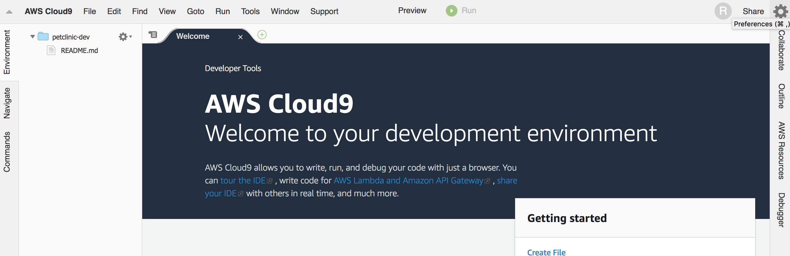
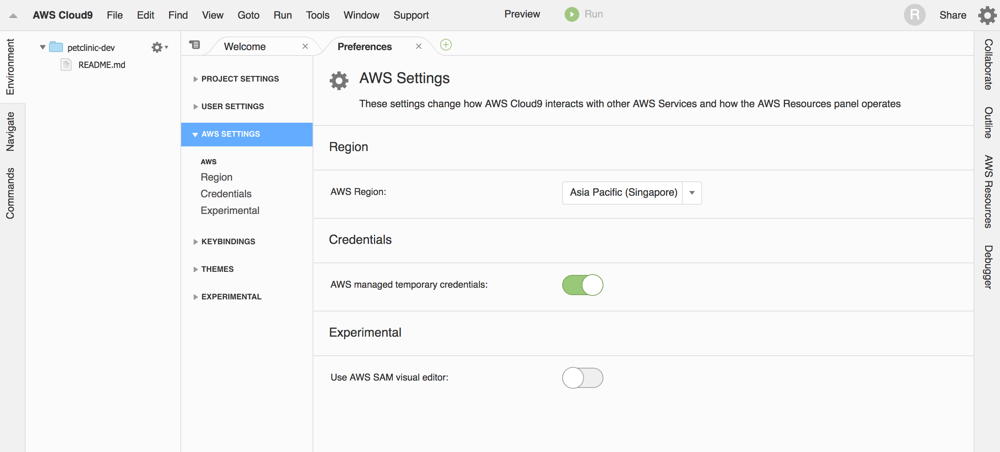
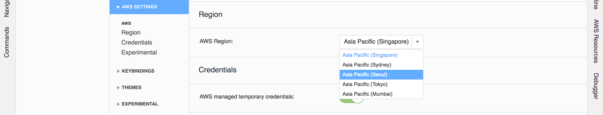

# 개발환경 구축

## Cloud9 개발환경 구축
1. Cloud9 개발환경 생성
    
    https://ap-southeast-1.console.aws.amazon.com/cloud9/home/create
    
    Name : petclinic-dev
    
    
    Instance Type : t2.small
    
    
1. Region 변경

    오른쪽 상단의 톱니바퀴 클릭 또는 맥북 `command` + `,`
    
    
    좌측에 AWS SETTINGS 클릭
    
    
    Asia Pacific (Seoul) 선택
    

1. java8 업그레이드, jq 설치
    ```bash
    # upgrade java8
    sudo yum install -y java-1.8.0-openjdk-devel.x86_64
    sudo /usr/sbin/alternatives --config java
    sudo yum remove -y java-1.7.0-openjdk
    javac -version  
 
    # install jq 
    sudo yum -y install jq
    ```
    
1. ecs-cli 설치
    ```bash
    sudo curl -o /usr/local/bin/ecs-cli https://s3.amazonaws.com/amazon-ecs-cli/ecs-cli-linux-amd64-latest
    sudo chmod +x /usr/local/bin/ecs-cli
    ecs-cli --version
    ```

1. git config
    ```bash
    git config --global user.name voyagerwoo
    git config --global user.email voyager.woo@gmail.com
  
    ```

1. aws profile 설정
    ```bash  
    aws configure --profile petclinic
    ```
    루트 권한으로 설정
    
    [IAM credentials 확인](https://console.aws.amazon.com/iam/home?region=ap-northeast-2#/users/master?section=security_credentials) 

1. fork repository

- backend repository : https://github.com/voyagerwoo/petclinic-rest
- frontend repository : https://github.com/voyagerwoo/petclinic-front
- config repository : https://github.com/voyagerwoo/petclinic-config-repo
- config server repository : https://github.com/voyagerwoo/petclinic-configserver

1. clone your repository

```bash
git clone https://github.com/{your-github-name}/petclinic-rest
git clone https://github.com/{your-github-name}/petclinic-front
git clone https://github.com/{your-github-name}/petclinic-config-repo
git clone https://github.com/{your-github-name}/petclinic-configserver

```


