# ECS web console을 이용하여 백앤드 배포하기

## ECS 인프라 만들고 배포하기
### ECR 만들기
    
이름 : petclinic-rest
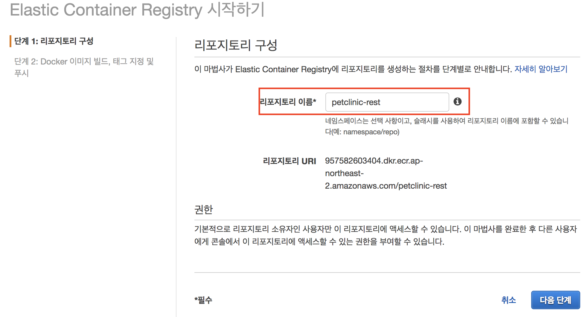
### docker image push
    
ssh 개발환경 접속
```bash
cd /home/ec2-user/environment/petclinic-rest/

# add env var DOCKER_REGISTRY_HOST
REGION=`aws configure get region`
ACCOUNT_ID=`aws sts get-caller-identity | jq -r ".Account"`
export DOCKER_REGISTRY_HOST="${ACCOUNT_ID}.dkr.ecr.${REGION}.amazonaws.com"

DOCKER_LOGIN=`aws ecr get-login --no-include-email`
${DOCKER_LOGIN}
./mvnw clean package docker:build -Dmaven.test.skip=true
docker push ${DOCKER_REGISTRY_HOST}/petclinic-rest:latest
```

> 처음에는 필요한 라이브러리를 다운받기 때문에 maven 빌드가 오래걸린다. 
### Application Load Balancer 및 관련 Security groups 생성

ecs cluster를 만들기 전에 클러스터의 로드발라서와 로드발란서의 security group, ecs instance의 security group을 미리 만들어 둔다.
1. ALB security group 


1. ECS instance security group 생성

[포트 범위 참고 링크](https://docs.aws.amazon.com/ko_kr/AmazonVPC/latest/UserGuide/VPC_ACLs.html#VPC_ACLs_Ephemeral_Ports) 
1. load balancer 생성

    1. [load balancer 생성](https://ap-northeast-2.console.aws.amazon.com/ec2/v2/home?region=ap-northeast-2#SelectCreateELBWizard:) 접속
    1. Application Load balancer 선택
    1. 로드 발란서 구성
        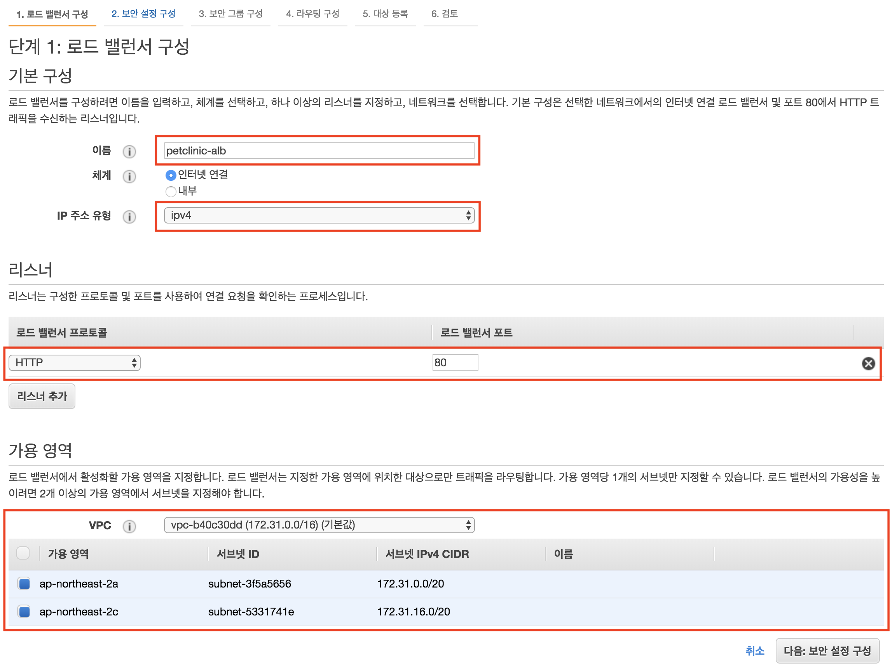    
    1. 보안설정 구성 - skip
    1. 보안그룹 구성
        
    1. 라우팅 구성
        
    1. 대상 등록 - skip
    1. 검토 
    1. 생성 완료

### ecs 클러스터 생성
> 클러스터 : 작업 요청을 수행 가능한 컨테이너 인스턴스의 묶음.
1. [ecs 클러스터 생성](https://ap-northeast-2.console.aws.amazon.com/ec2/v2/home?region=ap-northeast-2#SelectCreateELBWizard:) 접속 
1. 클러스터 탬플릿 선택 : EC2 Linux + 네트워킹
1. ecs 클러스터 구성

    - t2.micro 인스턴스로 구성해본다.
    - 롤링 업데이트를 하기 위해서 인스턴스를 2개 실행한다.
    - keypair는 처음에 만든 petclinic을 사용한다.
    
    
    
    기존의 vpc와 subnet을 사용한다.
    
    
1. 생성 완료

### 작업 정의
> 작업(Task) : 1개 이상의 도커 이미지로 정의한 기능의 단위. 
직접 작업하는 컨테이너와 그 컨테이너와 상호작용하는 컨테이너를 정의한다.  

1. [작업 정의](https://ap-northeast-2.console.aws.amazon.com/ecs/home?region=ap-northeast-2#/taskDefinitions/create) 접속
    
    
    컨테이너 소프트 제한을 둔다. 포트 매핑은 ecs가 휘발성 포트를 사용하도록 호스트 포트를 0 으로 설정한다.
    
    
    
1. 작업 생성 완료

### 서비스 생성 및 배포
> 서비스 : 정의된 작업을 바탕으로 실제 컨테이너를 운영하는 단위. 
작업 요청을 통해서도 작업만을 배포하고 테스트할 수 있지만 매끄러운 운영을 위해서는 서비스 단위로 배포해야한다.

1. [서비스 생성](https://ap-northeast-2.console.aws.amazon.com/ecs/home?region=ap-northeast-2#/clusters/petclinic-cluster/createService) 접속
    
    최소 정상 상태 백분율가 50% 라는 것은 정의된 작업개수 2개 중에서 1대만 살아있어도 정상이라는 의미이다. 
    최대 백분율이 100인것은 2대의 인스턴스에 최대 2개의 작업만 수행할 수 있다는 의미이다. 
    
    현재 상황에서 다시 정리하면 서비스가 업데이트가 될 때 한개의 작업을 중단한다. 한개를 중단해도 정상상태이다. 
    그리고 한개의 작업을 업데이트한다. 그리고 그 작업이 성공(health check 성공)하게 되면 나머지 작업도 중단하고
    업데이트를 진행한다.
    
    
    
    상태 검사 유예기간을 60으로 준다. 스프링 부트 앱이 로드될때까지 기다리는 시간이다.
    
    
    
    로드 밸런싱에 대한 정보는 이전 단계에서 만들어 두었던 petclinic-alb와 petclinic-target을 그대로 사용한다.
    
    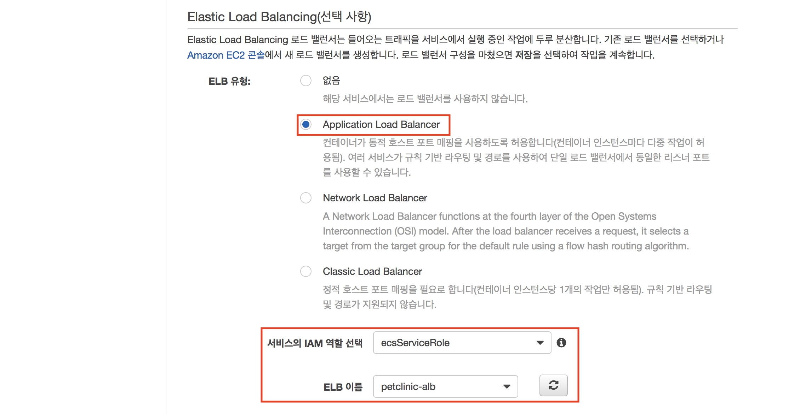
    
    
    
1. 서비스 배포 완료
    
    
    
    
### 서비스 업데이트
    
코드를 수정하고 docker image를 다시 ecr에 푸시한 다음 service update를 해본다.

### Frontend 연결
 frontend serviceHost를 elb domain으로 수정하고 다시 배포한 다음 잘 되는지 확인해본다.
 
## CodeBuild & CodePipeline

### maven 캐싱용 S3 버켓 만들기


### CodeBuild 프로젝트 만들기
    
[CodeBuild 프로젝트 만들기](https://ap-northeast-2.console.aws.amazon.com/codebuild/home?region=ap-northeast-2#/projects/create) 접속

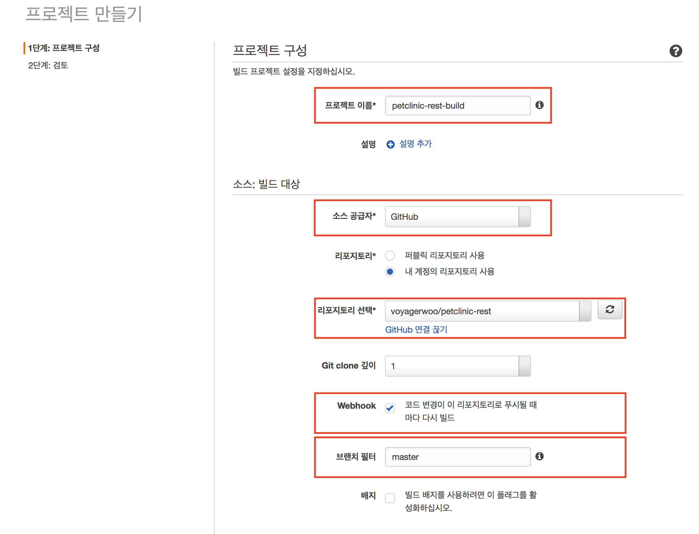

도커 이미지를 빌드하므로 `권한이 있음`에 꼭 체크한다.


이전에 만든 캐싱용 버켓으로 캐시 설정을 한다. 
캐싱을 안하면 4분 걸리는 일을 캐싱을 하면 1분도 안걸린다. 

그리고 role을 새로 만들고 이름을 기억해둔다. 
프로젝트 설정후에 ECR 관련 역할을 추가할 예정이다. 

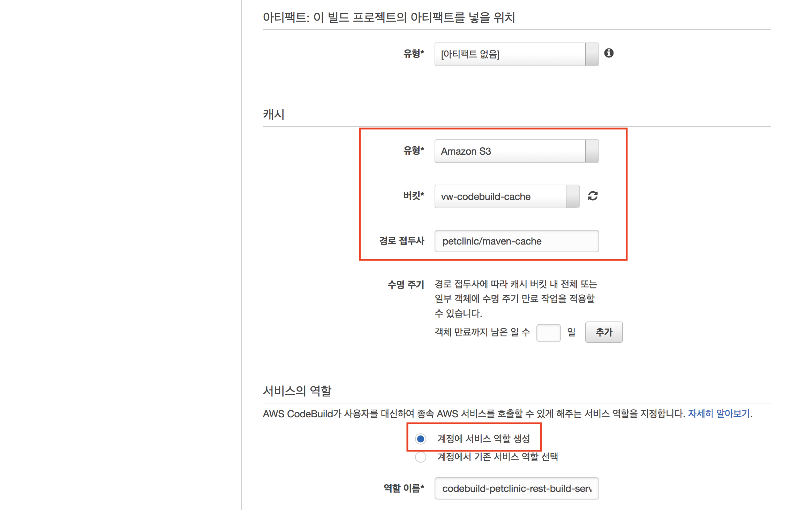

DOCKER_REGISTRY_HOST 환경 변수를 꼭 추가한다.

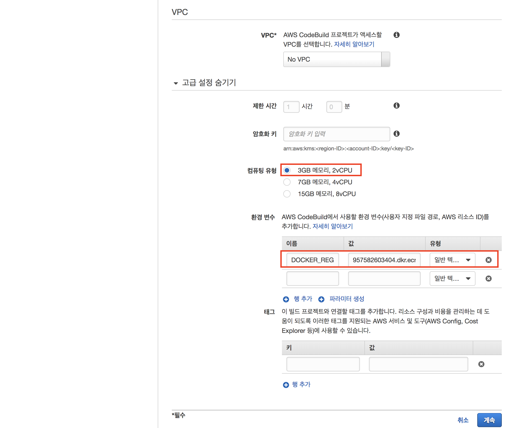

검토 


### CodeBuild role에  ECR 관련 권한 부여
    
codebuild-petclinic-rest-build role을 찾는다.


인라인으로 권한을 추가한다.
```json
{
    "Version": "2012-10-17",
    "Statement": [
        {
            "Action": [
                "ecr:BatchCheckLayerAvailability",
                "ecr:CompleteLayerUpload",
                "ecr:GetAuthorizationToken",
                "ecr:InitiateLayerUpload",
                "ecr:PutImage",
                "ecr:UploadLayerPart"
            ],
            "Resource": "*",
            "Effect": "Allow"
        }
    ]
}
```
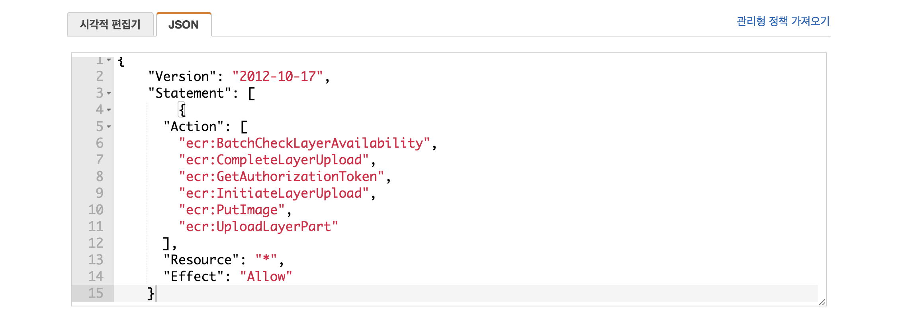

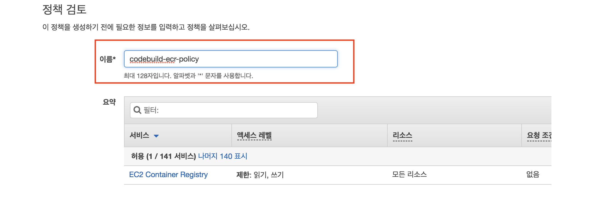

### 동작 확인 

코드를 수정하여 푸시해보고 동작하는지 확인한다.
    
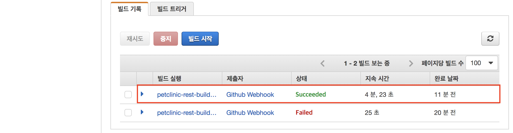


### CodePipeline 구축
    
[CodePipeline 파이프라인 생성](https://ap-northeast-2.console.aws.amazon.com/codepipeline/home?region=ap-northeast-2#/create/Name) 접속


이전 단계에서 구성한 CodeBuild를 연결한다.
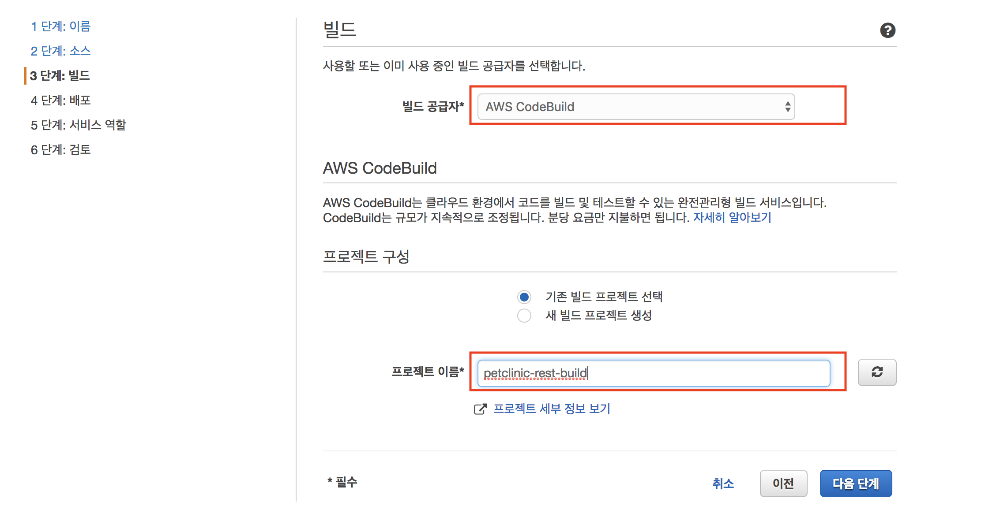

이미지 파일 이름을 생략한다.


서비스 역할을 만든다.


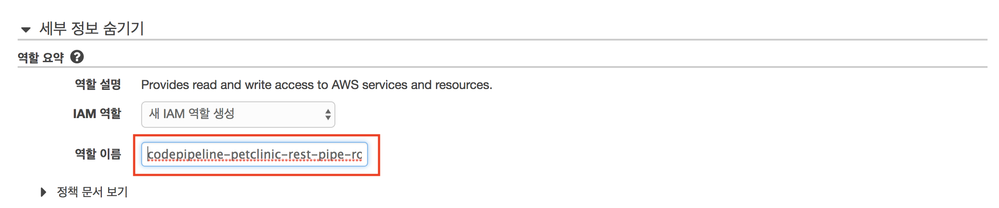


> 재미있는 것은 도커 이미지가 ECR에 푸시 되어도 
컨테이너 명과 도커 이미지 URL을 정의한 json이 Artifact로 나오지 않으면 ECS 서비스 반영 도중에 에러가 난다. 
    
### CodeBuild 설정 업데이트
    
코드가 푸시되면 CodePipeline에서 자동으로 CodeBuilder로 빌드 요청을 보내기 때문에 CodeBuild의 WebHook 체크를 해제한다. 
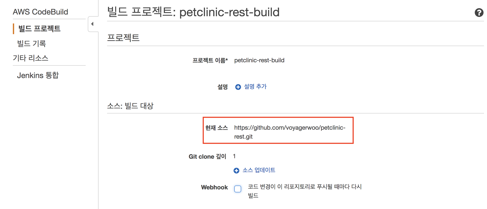

### 코드 빌드 및 반영 확인
    
CodeBuilder에 자동으로 빌드 요청이 간 것을 확인할 수 있다.
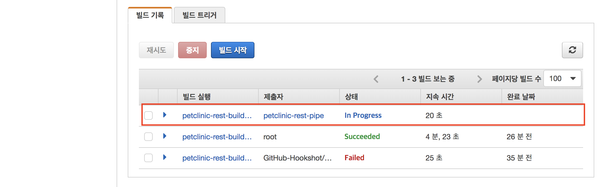

빌드가 완료되고 자동으로 ECS 서비스를 업데이트 한다.
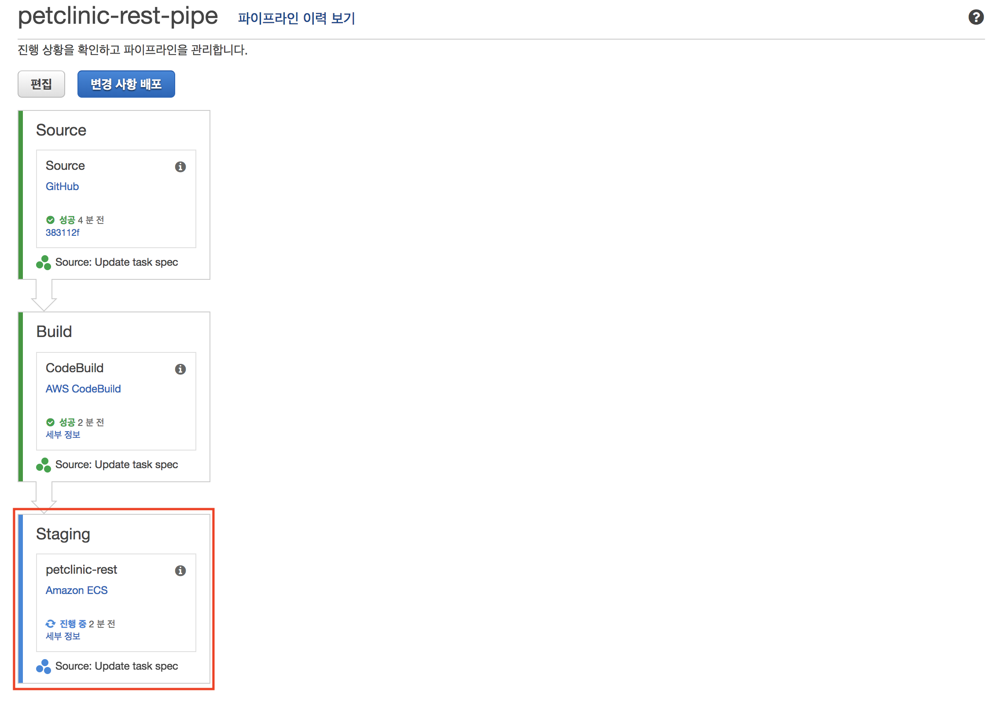    

업데이트가 좀 오래걸리는 이유는 `등록 취소 지연` 시간이 300초이기 때문이다. 
EC2 대시보드에서 대상 그룹을 확인해보면 알 수 있다.  


아래 이미지를 보면 지금 작업정의가 다른 것을 볼 수 있다. 하나씩 롤링 업데이트 중이다.


    
### 동작 확인
코드를 수정하고 푸시하고 자동으로 서비스에 반영되는지 확인해본다.

### frontend 연결

## 모두 삭제
1. CodePipeline 삭제
1. CodeBuild 삭제
1. ECS cluster 삭제
1. ECR 삭제
1. (CloudFormation 의 스택이 지워지지 않았다면 삭제)
1. Load Balancer 삭제
1. Target Group 삭제
1. Security Group 삭제

