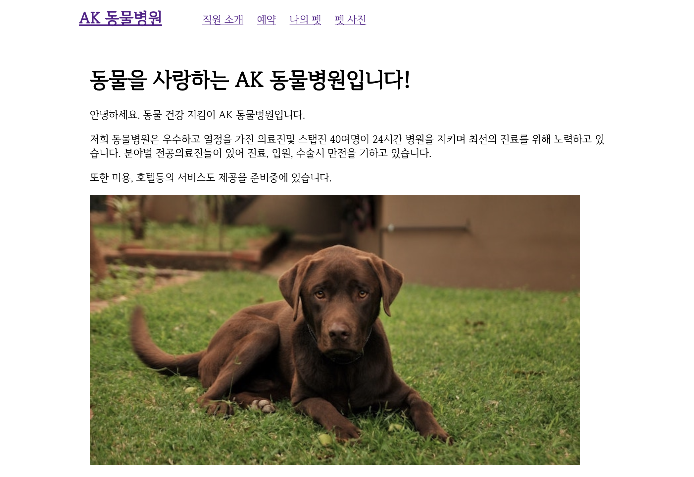

###### AWSKRUG 2nd hands-on!

# ECS를 이용하여 자바 웹서비스 배포하기 

### 우 여 명 <small>( matholic )</small>

---

## 목차
1. 발표자 소개
1. 대상 독자
1. ECS 란
1. petclinic 소개
    - 기술 스택
    - 아키텍처
1. 실습 시나리오
1. 실습 시작

---

## 발표자 소개 

- [우 여 명](https://voyagerwoo.github.io)
- [Matholic](https://www.matholic.com), [Pocketmath](https://www.pocketmath.co.kr) 개발자 
- AWSKRUG container 소모임 운영

`spring` `groovy` `AWS` `docker` 
`data engineering`
`full cycle developer`

<!-- 
만 4년이 넘은 개발자입니다. 
매쓰홀릭이라는 수학 교육 솔루션 회사에서 일하고 있습니다.
첫 회사에서 인프라를 만질 기회가 없어서 그게 한이 되었는지 배포 자동화, 인프라 구성에 관심이 좀 있습니다.
소프트웨어 생명주기 전체를 알고 운영하는 full cycle developer를 목표로 일하고 공부하고 있습니다.
오늘 할 실습도 이와 관련이 있죠.
-->

---

## 대상 독자

- 도커 컨테이너의 개념을 알고 직접 이미지를 만들어본 개발자
- 웹서비스를 개발하고 배포해본 경험이 있는 개발자

---

## ECS 란
> Amazon Elastic Container Service(ECS)는 확장성이 뛰어난 고성능 컨테이너 오케스트레이션 서비스로서, Docker 컨테이너를 지원하며 AWS에서 컨테이너식 애플리케이션을 쉽게 실행하고 확장 및 축소할 수 있습니다. 
> 
> Amazon ECS를 사용하면 자체 컨테이너 오케스트레이션 소프트웨어를 설치하고 운영할 필요가 없으며, 가상 머신의 클러스터를 관리 및 확장하거나 해당 가상 머신에서 컨테이너를 예약하지 않아도 됩니다.

<!--
개인적인 생각으로 서비스를 운영할 때 가장 무난한 학습곡선으로 프로덕션 레벨의 서비스를 배포할 수 있는 도구 입니다.
-->

---

## petclinic 소개

---

## petclinic 소개

<small>

> https://github.com/aws-samples/amazon-ecs-java-microservices

</small>

- 위 프로젝트에 큰 영향을 받아서 만든 실습 과정
- 간단한 동물병원 웹서비스

<!--
어려워서 제가 이해한 만큼 정리해보았습니다.
-->

---

## petclinic 기술 스택

### backend
- spring boot, groovy, h2db

### frontend
- vuejs

---

## petclinic architecture

---

## 실습 시나리오

1. EC2에 배포해보고 어떤 불편함이 있는지, 실제 서비스를 하게 되면 어떤 준비가 필요할지 고민해본다.
1. ECS 웹 콘솔을 이용해서 ECS를 배포해보고 CodeBuild, CodePipeline으로 지속적 통합과 배포가 가능하도록 구성해본다.
이를 통해서 ECS의 전체 흐름을 확인한다.
1. ECS CLI를 통해서 손쉽게 ECS를 배포해본다. 스텝별로 진행하면서 다시한번 ECS 과정을 상기해본다.
1. Spring config server를 ECS에 배포하고 기존 서버에 바인딩한다. 이를 통해 환경설정 외부화를 확인해본다.
