# ECS

동물병원 서비스를 ECS를 이용해서 배포해봅니다.

- backend repository : https://github.com/voyagerwoo/petclinic-rest
- frontend repository : https://github.com/voyagerwoo/petclinic-front


## Index

1. Prerequisites
1. EC2 + S3로 서비스 배포하기
1. ecs web console을 이용하여 배포하기
1. ecs cli를 이용하여 배포하기
1. CI / CD 파이프라인 구축하기
1. spring config server 배포하기

## Prerequisites
실습전에 준비해야할 사항들입니다

1. `github` 계정, `aws` 계정
1. 개발환경 설정 : [링크 DEV_ENV.md](DEV_ENV.md)
1. 우선 개발환경에 fork한 petclinic-rest, petclinic-front를 clone

## EC2 + S3로 서비스 배포하기

### EC2 배포하기

1. Amazon Linux AMI 2018.03.0 (HVM), SSD Volume Type - t2.micro 인스턴스를 하나 실행시킵니다. 이 인스턴스의 이름은 `petclinic ec2` 입니다. 
    
    ***보안 그룹***
    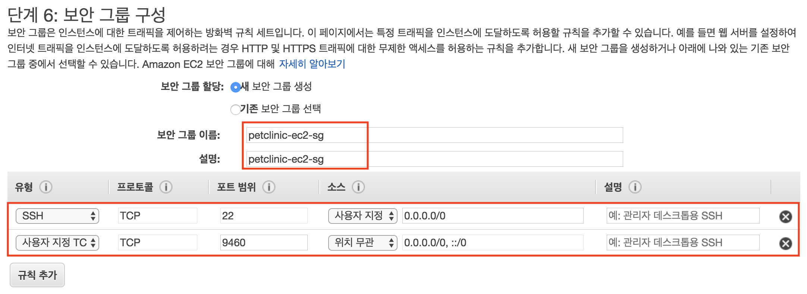
    ***키페어 이름 - petclinic***
    
1. ssh 접속!
1. `petclinc ec2` 인스턴스의 java 버전을 8로 업그레이드 합니다. (관련 링크 : http://jojoldu.tistory.com/261)
    ```bash
    sudo yum install -y java-1.8.0-openjdk-devel.x86_64
    sudo /usr/sbin/alternatives --config java
    sudo yum remove java-1.7.0-openjdk
    javac -version
    ```
1. `petclinic ec2` 인스턴스에 git을 설치합니다.
    ```bash
    sudo yum install git
    ```

1. 배포 
    ```bash 
    git clone https://github.com/{your-github-name}/petclinic-rest
    cd petclinic-rest
    ./mvnw spring-boot:run
    ```

1. 확인 하기

     - 브라우저에서 `http://your-public-ip:9460/actuator/health` 접속하여 확인
     - 브라우저에서 `http://your-public-ip:9460/vets`(수의사 리스트 API) 접속하여 확인
     
     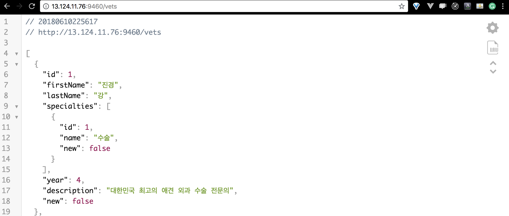
    
    

### 프론트앤드 S3에 배포하기

1. 버켓 만들기 
    
    이름은 중복되지 않도록 `${자신의 아이디}-petclinc-www` 로 짓는다. 
    
    정적 웹사이트 호스팅 설정     
    
    버켓 퍼블릭으로 설정
    

1. vs code로 개발환경 접속
    
    
    

1. 코드 수정
    1. 배포스크립트 수정
    
        package.json에 deploy:s3 스크립트에서 bucket 명을 prerequisites에서 만든 자신의 버켓명으로 수정한다.
        ```json
        ...
        "deploy:s3": "npm run build && aws s3 cp dist/ s3://{your-bucket-name} --recursive"
        ...
        ```
    1. api host 수정
    
        src/services/restService.js 에서 서비스 호스트를 배포된 호스트로 변경한다.
        ```js
        const serviceHost = 'http://your-public-ip:9460'
        ```
1. 배포
    1. ssh로 개발환경 접속
    1. 배포 스크립트 실행
    ```bash
    cd /home/ec2-user/workspace/petclinic-front/
    npm install
    npm run deploy:s3
    ```
1. 확인
    1. http://{your-bucket-name}.s3-website.ap-northeast-2.amazonaws.com 에 접속하여 확인한다.
    1. http://{your-bucket-name}.s3-website.ap-northeast-2.amazonaws.com/#/staff 에 접속하여 수의사 리스트가 나오는지 확인한다.

### :coffee: coffee break
ec2에 백앤드 서비스를 배포해 보았다. 간단하지만 단점들이 존재한다.

#### 단점
- 인스턴스를 매번 띄우고 멈추는 관리가 필요하다.
- 인스턴스에 내가 원하는 배포환경으로 설치해주어야 한다.
- 무중단 배포는 어떻게 해야하나...

## ECS를 이용하여 백앤드 배포하기
### ecs web console에서 배포하기
1. ecr 만들기
    
    이름 : petclinic-rest
    
1. docker image push
    
    ssh 개발환경 접속
    ```bash
    cd /home/ec2-user/workspace/petclinic-rest/
 
    # add env var DOCKER_REGISTRY_HOST
    ACCOUNT_ID=`aws sts get-caller-identity | jq -r ".Account"`
    export DOCKER_REGISTRY_HOST="${ACCOUNT_ID}.dkr.ecr.ap-northeast-2.amazonaws.com"
    
    DOCKER_LOGIN=`aws ecr get-login --no-include-email`
    ${DOCKER_LOGIN}
    ./mvnw clean package docker:build -Dmaven.test.skip=true
    docker push ${DOCKER_REGISTRY_HOST}/petclinic-rest:latest
    ```
    
    > 처음에는 필요한 라이브러리를 다운받기 때문에 maven 빌드가 오래걸립니다. 
1. Application Load Balancer 및 관련 Security groups 생성

    ecs cluster를 만들기 전에 클러스터의 로드발라서와 로드발란서의 security group, ecs instance의 security group을 미리 만들어 둡니다.
    1. ALB security group 
    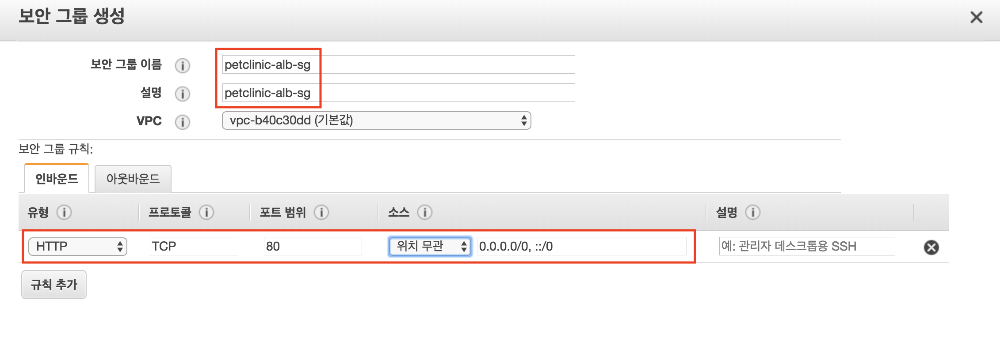
    
    1. ECS instance security group 생성
    
    [포트 범위 참고 링크](https://docs.aws.amazon.com/ko_kr/AmazonVPC/latest/UserGuide/VPC_ACLs.html#VPC_ACLs_Ephemeral_Ports) 
    1. load balancer 생성
    
        1. [load balancer 생성](https://ap-northeast-2.console.aws.amazon.com/ec2/v2/home?region=ap-northeast-2#SelectCreateELBWizard:) 접속
        1. Application Load balancer 선택
        1. 로드 발란서 구성
                
        1. 보안설정 구성 - skip
        1. 보안그룹 구성
            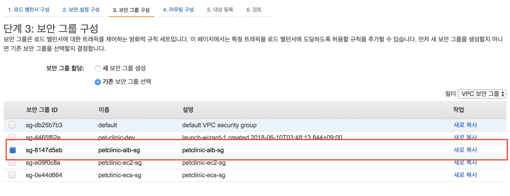
        1. 라우팅 구성
            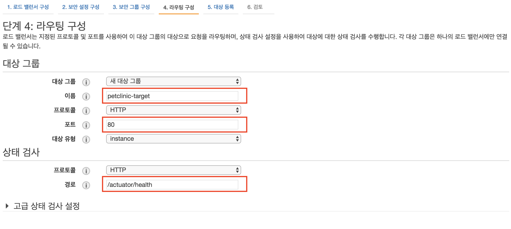
        1. 대상 등록 - skip
        1. 검토 
        1. 생성 완료

1. ecs 클러스터 생성
    1. [ecs 클러스터 생성](https://ap-northeast-2.console.aws.amazon.com/ec2/v2/home?region=ap-northeast-2#SelectCreateELBWizard:) 접속 
    1. 클러스터 탬플릿 선택 : EC2 Linux + 네트워킹
    1. ecs 클러스터 구성
    
        - t2.micro 인스턴스로 구성해본다.
        - 롤링 업데이트를 하기 위해서 인스턴스를 2개 실행한다.
        - keypair는 처음에 만든 petclinic을 사용한다.
        
        
        
        기존의 vpc와 subnet을 사용한다.
        
        
    1. 생성 완료

1. 작업 정의
    1. [작업 정의](https://ap-northeast-2.console.aws.amazon.com/ecs/home?region=ap-northeast-2#/taskDefinitions/create) 접속
        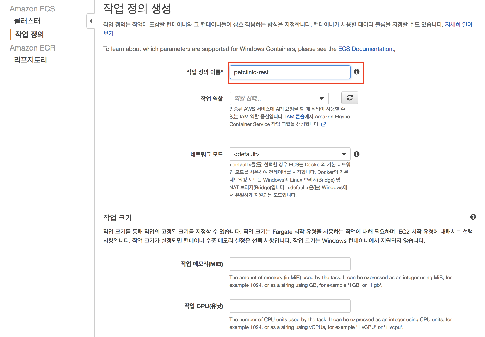
        
        컨테이너 소프트 제한을 둔다. 포트 매핑은 ecs가 휘발성 포트를 사용하도록 호스트 포트를 0 으로 설정한다.
        
        
        
    1. 작업 생성 완료

1. 서비스 생성
    1. [서비스 생성](https://ap-northeast-2.console.aws.amazon.com/ecs/home?region=ap-northeast-2#/clusters/petclinic-cluster/createService) 접속
        
        최소 정상 상태 백분율가 50% 라는 것은 현재 인스턴스 2중에 1대만 살아있어도 정상이라는 의미이다. 
        최대 백분율이 100인것은 2대의 인스턴스에 최대 2개의 작업만 수행할 수 있다는 의미이다. 
        
        현재 상황에서 다시 정리하면 서비스가 업데이트가 될 때 한개의 작업을 중단한다. 한개를 중단해도 정상상태이다. 
        그리고 한개의 작업을 업데이트한다. 그리고 그 작업이 성공(health check 성공)하게 되면 나머지 작업도 중단하고
        업데이트를 진행한다.
        
        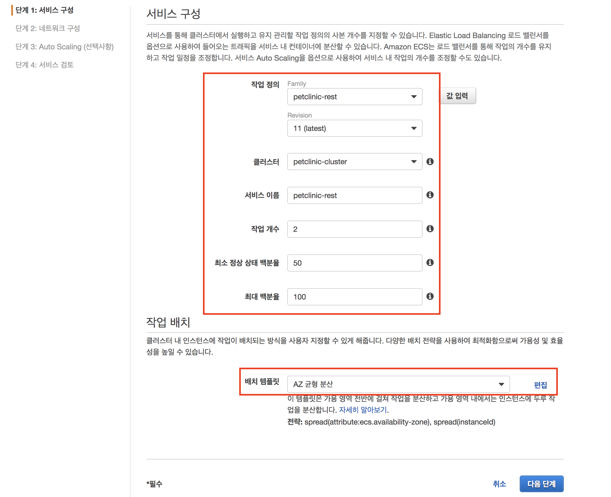
        
        상태 검사 유예기간을 60으로 준다. 스프링 부트 앱이 로드될때까지 기다리는 시간이다.
        
        
        
        로드 밸런싱에 대한 정보는 이전 단계에서 만들어 두었던 petclinic-alb와 petclinic-target을 그대로 사용한다.
        
        
        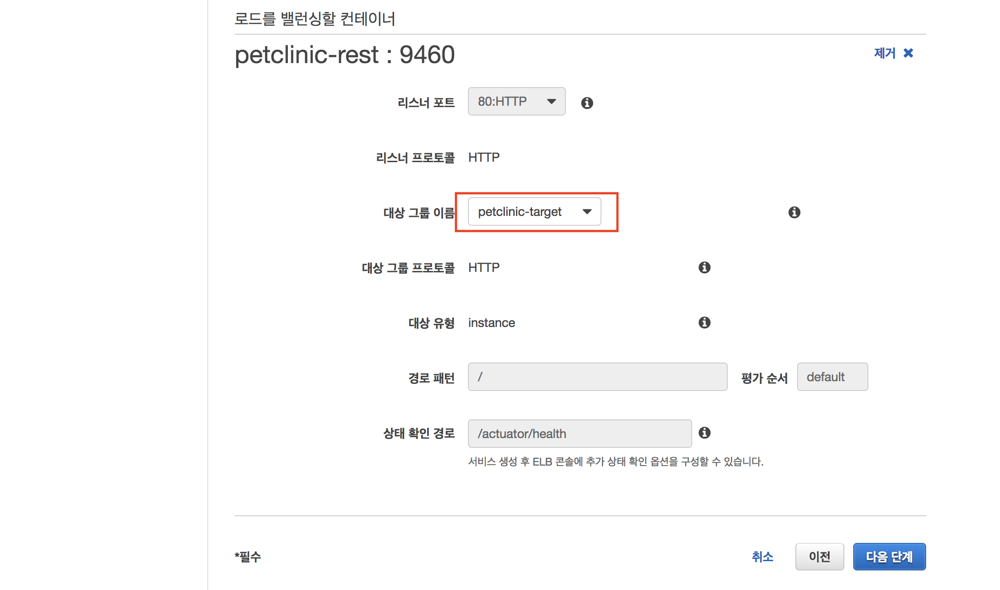
        
        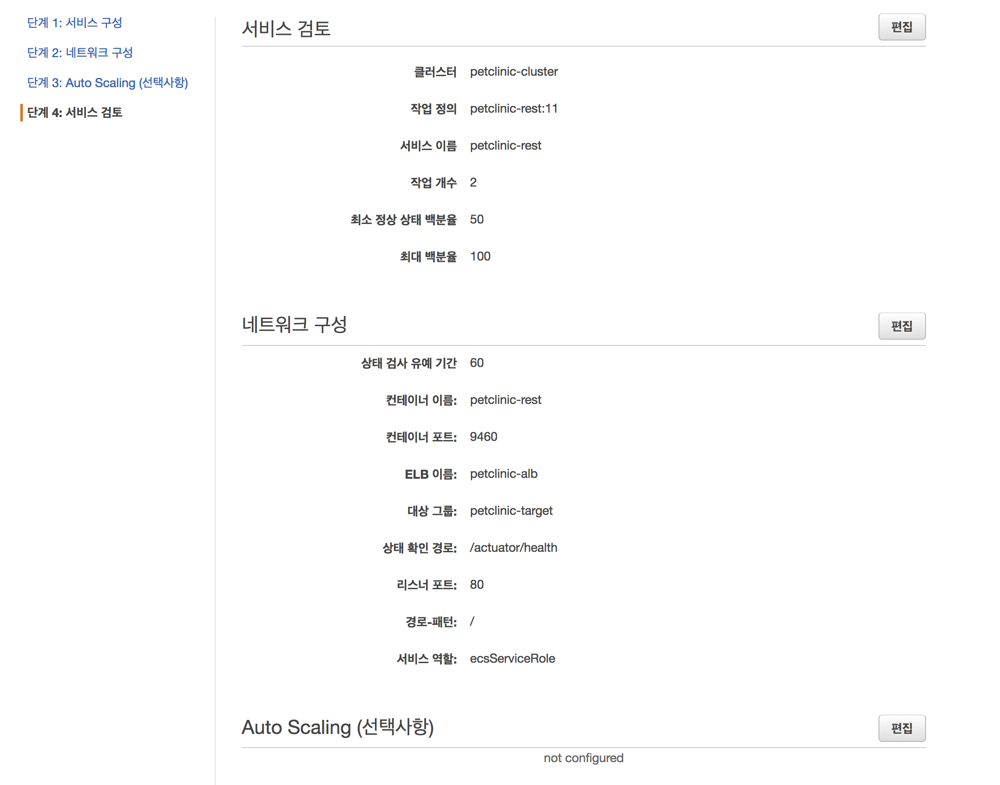
    1. 서비스 배포 완료
        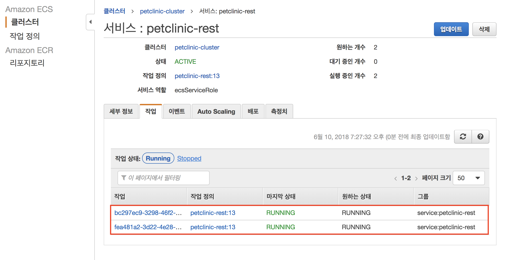
        
        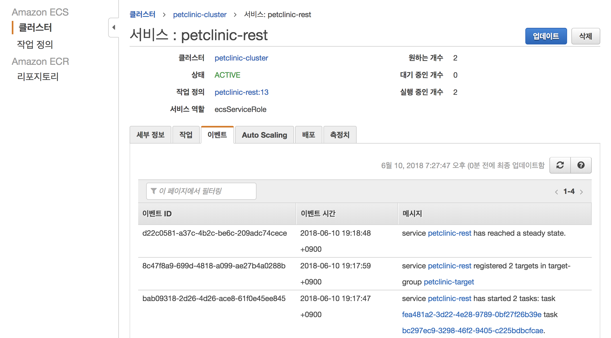
    
1. 서비스 업데이트
    코드를 수정하고 docker image를 다시 ecr에 푸시한 다음 service update를 해본다.

### ecs cli를 이용하여 배포하기
working dir : petclinic-rest

1. create and push ecr
    ```bash
    ./1_create_and_push_ecr.sh
    ```
1. create cluster
    ```bash
    ./2_create_cluster.sh 
    ```
    
1. create alb
    ```bash
    ./3_create_alb.sh 
    ```
    
1. create and run service
    ```bash
    ./4_create_and_run_service.sh 
    ```
    
    여기 까지 하면 서비스가 반영된다.
    
1. update service
    ```bash
    ./5_update_service.sh 
    ```
    코드를 수정하고 이 스크립트롤 실행하면 반영된다.
    

반영되고 petclinic-front에서 api host를 변경하고 다시 배포해본다. 

### CI / CD 파이프라인 구축하기

1. code builder 설정

1. code pipeline 설정


### spring config server 배포하기
