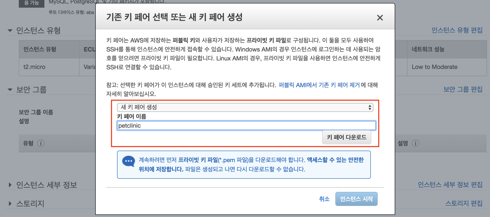

# Prerequisites

미리 필요한 것 : `github` 계정, `aws` 계정

### 간단한 배포 테스트용 EC2 인스턴스 실행

1. Amazon Linux AMI 2018.03.0 (HVM), SSD Volume Type - t2.micro 인스턴스를 하나 실행시킵니다. 이 인스턴스의 이름은 `petclinic ec2` 입니다. 
    
    ***보안 그룹***
    
    ***키페어 이름 - petclinic***
    
1. `petclinc ec2` 인스턴스의 java 버전을 8로 업그레이드 합니다. (관련 링크 : http://jojoldu.tistory.com/261)
    ```bash
    sudo yum install -y java-1.8.0-openjdk-devel.x86_64
    sudo /usr/sbin/alternatives --config java
    sudo yum remove java-1.7.0-openjdk
    javac -version
    ```
1. `petclinic ec2` 인스턴스에 git을 설치합니다.
    ```bash
    sudo yum install git
    ```
### cloud9으로 개발환경 구축
1. https://ap-southeast-1.console.aws.amazon.com/cloud9/home/product
1. Create environment


1. cloud9 실행

