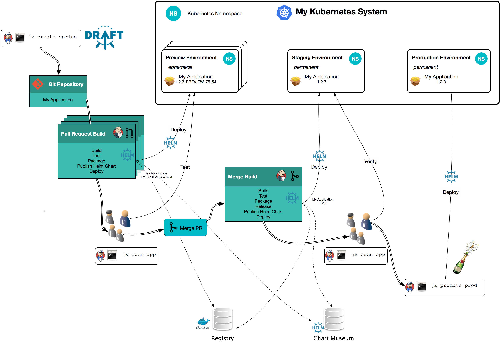

# Kubernetes Hands-on

---

## Index

<!-- TOC depthFrom:2 depthTo:6 withLinks:1 updateOnSave:1 orderedList:0 -->

* [Topic](#topic)
* [Bastion](#bastion)
* [Cluster](#cluster)
* [Addons](#addons)
* [Pipeline](#pipeline)

<!-- /TOC -->

---

### Basic Knowledge

* Kubernetes 를 들어봤다.
* AWS 에 인스턴스를 만들어 봤다.
* SSH 로 접속을 할수 있다.
* 필요 계정 : AWS, Github

---

## Topic

* Kubernetes
* Kops
* Jenkins X
* Helm

---

### Kubernetes
* 컨테이너 작업을 자동화하는 오픈소스 플랫폼
* Container Orchestration
* Cluster 는 Master 와 Node 로 구성 


---

### Kops
* Kubernetes cluster up and running
* AWS is officially supported
* GCE is beta supported
* 1 Master, 2 Nodes


---

### Jenkins X
* Jenkins Pipeline Tool
* Jenkins + Kubernetes Plugins + CLI
* Jenkins 를 제외한 UI 는 제공되지 않음



---

### Helm
* Kubernetes Package Manager
* Used in Jenkins X

Note:
- Jenkins X 에서 빌드된 이미지의 버전 관리를 위하여 사용 됩니다.
- 우리가 직접 하용하지는 않지만 우선 설치 해 줍니다.

---

## Bastion

* AWS IAM - Access keys
* AWS EC2 - Key Pairs
* AWS EC2 - Instance

---

### AWS IAM - Access keys
```
awskrug
```
* https://console.aws.amazon.com/iam/home?region=ap-northeast-2#/users

Note:
- CLI 를 이용하여 AWS 객체들을 사용하기 위하여 발급 받습니다.
- 발급 받은 키는 유출되지 않도록 잘 관리 해야 합니다.

---

### AWS EC2 - Key Pairs
```
awskrug
```
* https://ap-northeast-2.console.aws.amazon.com/ec2/v2/home?region=ap-northeast-2#KeyPairs

Note:
- 생성된 Instance 에 접속하기 위하여 필요 합니다.
- Windows 사용자의 경우 PuTTY-gen 으로 프라이빗 키를 변환 해야 합니다.

---

### AWS EC2 - Instance
```
Amazon Linux AMI
```
* https://ap-northeast-2.console.aws.amazon.com/ec2/v2/home?region=ap-northeast-2#Instances

Note:
- 모두가 같은 환경에서 진행 할수 있도록 인스턴스를 생성 합니다.
- 이때 `Amazon Linux AMI` 를 선택 하도록 합니다.

---

### Instance - 기본 설정
```bash
# update
sudo yum update -y

# git, jq
sudo yum install -y git jq

# aws-cli
pip install --upgrade --user awscli
```
* https://docs.aws.amazon.com/ko_kr/AWSEC2/latest/UserGuide/putty.html

Note:
- 인스턴스를 최신 버전으로 업데이트 합니다.
- git 과 jq 를 설치 합니다.
- aws cli 를 최신 버전으로 업데이트 합니다.

---

### kubectl - 1m
```bash
cat <<EOF > kubernetes.repo
[kubernetes]
name=Kubernetes
baseurl=https://packages.cloud.google.com/yum/repos/kubernetes-el7-x86_64
enabled=1
gpgcheck=1
repo_gpgcheck=1
gpgkey=https://packages.cloud.google.com/yum/doc/yum-key.gpg https://packages.cloud.google.com/yum/doc/rpm-package-key.gpg
EOF
sudo cp -rf kubernetes.repo /etc/yum.repos.d/kubernetes.repo
sudo yum install -y kubectl
```
* https://kubernetes.io/docs/tasks/tools/install-kubectl/

---

### kops - 2m
```bash
export VERSION=$(curl -s https://api.github.com/repos/kubernetes/kops/releases/latest | grep tag_name | cut -d'"' -f4)
curl -LO https://github.com/kubernetes/kops/releases/download/${VERSION}/kops-linux-amd64
chmod +x kops-linux-amd64 && sudo mv kops-linux-amd64 /usr/local/bin/kops
```
* https://github.com/kubernetes/kops

---

### helm - 1m
```bash
export VERSION=$(curl -s https://api.github.com/repos/kubernetes/helm/releases/latest | grep tag_name | cut -d'"' -f4)
curl -L https://storage.googleapis.com/kubernetes-helm/helm-${VERSION}-linux-amd64.tar.gz | tar xzv
sudo mv linux-amd64/helm /usr/local/bin/helm
```
* https://github.com/kubernetes/helm

---

### jenkins-x - 1m
```bash
export VERSION=$(curl -s https://api.github.com/repos/jenkins-x/jx/releases/latest | grep tag_name | cut -d'"' -f4)
curl -L https://github.com/jenkins-x/jx/releases/download/${VERSION}/jx-linux-amd64.tar.gz | tar xzv 
sudo mv jx /usr/local/bin/jx
```
* https://github.com/jenkins-x/jx

---

### Access Keys
```bash
# ssh key
ssh-keygen -q -f ~/.ssh/id_rsa -N ''

# aws region
aws configure set default.region ap-northeast-2

# aws credentials
cat <<EOF > ~/.aws/credentials
[default]
aws_access_key_id=
aws_secret_access_key=
EOF
```

Note:
- ssh 키를 생성합니다. 클러스터 내에서 서로 접속 하기 위하여 필요 합니다.
- aws cli 를 사용하여 리전을 서울로 설정 합니다.
- 그리고 위에서 발급된 access key 를 넣어줍니다.

---

## Cluster Name
```bash
export KOPS_CLUSTER_NAME=awskrug.k8s.local
export KOPS_STATE_STORE=s3://terraform-awskrug-nalbam-seoul

# aws s3 bucket for state store
aws s3 mb ${KOPS_STATE_STORE} --region ap-northeast-2
```

Note:
- 클러스터 이름을 세팅하고, 클러스터 상태를 저장할 S3 Bucket 을 만들어 줍니다.

---

## Cluster Create
```bash
kops create cluster \
    --cloud=aws \
    --name=${KOPS_CLUSTER_NAME} \
    --state=${KOPS_STATE_STORE} \
    --master-size=m4.large \
    --node-size=m4.xlarge \
    --node-count=2 \
    --zones=ap-northeast-2a,ap-northeast-2c \
    --network-cidr=10.10.0.0/16 \
    --networking=calico
```

Note:
- 마스터 1대, 노드 2대로 구성된 클러스터를 생성합니다.
- 위 명령을 실행하면 실제 클러스터는 만들어지지 않습니다.

---

## Cluster Edit
```bash
kops get cluster --name=${KOPS_CLUSTER_NAME}

kops edit cluster --name=${KOPS_CLUSTER_NAME}
```

Note:
- 클러스터 정보를 조회 합니다.
- 나중에 사용할 Jenkins X 를 위하여 설정을 수정 합니다.

---

### Modify for Jenkins-x
```yaml
spec:
  docker:
    insecureRegistry: 100.64.0.0/10
    logDriver: ""
```

Note:
- Jenkins X 에서 사용할 내부 Docker Registry 를 허용하도록 보안설정을 입력합니다.

---

## Cluster Update
```bash
kops update cluster --name=${KOPS_CLUSTER_NAME} --yes
```

Note:
- update 명령에 --yes 를 하면 실제 클러스터가 생성 됩니다.
- 클러스터 생성까지 10여분이 소요 됩니다.

---

## Cluster Validate
```bash
kops validate cluster --name=${KOPS_CLUSTER_NAME}
```

Note:
- validate 명령으로 생성이 완료 되었는지 확인 할수 있습니다.

---

### kubectl
```bash
# kubectl config
kubectl config view

# kubectl get
kubectl get deploy,pod,svc,job --all-namespaces
kubectl get deploy,pod,svc,job -n kube-system
kubectl get deploy,pod,svc,job -n default
```

Note:
- 클러스터 정보와 만들어진 객체들을 조회 할수 있습니다.
- 모든 네임스페이스 혹은 지정한 네임스페이스 객체를 조회 할수 있습니다.

---

### sample
```bash
# apply
kubectl apply -f https://raw.githubusercontent.com/nalbam/kubernetes/master/sample/sample-web.yml

# delete
kubectl delete -f https://raw.githubusercontent.com/nalbam/kubernetes/master/sample/sample-web.yml
```
* https://ap-northeast-2.console.aws.amazon.com/ec2/v2/home?region=ap-northeast-2#LoadBalancers

Note:
- 샘플 깃을 클론하고, 샘플 웹을 하나 생성해 봅니다.
- Pod 와 Service 가 만들어졌고, AWS 에서 만들었으므로 ELB 도 생겼습니다.

---

## Addons

* Dashboard
* Heapster

---

### Dashboard
```bash
# install
kubectl apply -f https://raw.githubusercontent.com/nalbam/kubernetes/master/addons/dashboard-v1.8.3.yml

# get dashboard token
kubectl describe secret -n kube-system $(kubectl get secret -n kube-system | grep kubernetes-dashboard-token | awk '{print $1}')

# create role binding for kube-system:kubernetes-dashboard
kubectl create clusterrolebinding cluster-admin:kube-system:kubernetes-dashboard --clusterrole=cluster-admin --serviceaccount=kube-system:kubernetes-dashboard
kubectl get clusterrolebindings | grep cluster-admin

# delete
kubectl delete -f https://raw.githubusercontent.com/nalbam/kubernetes/master/addons/dashboard-v1.8.3.yml
```
* https://github.com/kubernetes/dashboard/

Note:
- 대시보드를 생성합니다. 생성된 ELB 로 접속 할수 있습니다.
- 로그인을 위해 Secret 에서 토큰을 조회 해서 붙여 넣습니다.
- 접속해보면 권한 때문에 정상적으로 보이지 않을 겁니다. 권한 부여를 합니다.

---

### Heapster
```bash
# install
kubectl apply -f https://raw.githubusercontent.com/nalbam/kubernetes/master/addons/heapster-v1.7.0.yml

# monitoring
kubectl top pod --all-namespaces
kubectl top pod -n kube-system

# delete
kubectl delete -f https://raw.githubusercontent.com/nalbam/kubernetes/master/addons/heapster-v1.7.0.yml
```
* https://github.com/kubernetes/heapster/

Note:
- 대시보드 로는 충분한 정보를 볼수 잆습니다. 예를 들면 CPU, Memory 사용량 같은것들...
- 힙스터를 설치하고 잠시 기다리면 정보가 수집되고, 대시보드에 보여집니다.
- 참고로 힙스터는 현재 DEPRECATED 되었습니다.

---

## Pipeline

* Jenkins X

---

### Jenkins X
```bash
jx install --provider=aws

jx console

jx import
jx create spring -d web -d actuator

jx get applications
jx get pipelines

jx get activity -f jx-demo -w
jx get build logs nalbam/jx-demo/master
jx get build logs nalbam/jx-demo/dev

jx promote jx-demo --env production
```
* https://jenkins-x.io/

---

## Thank You
