# Customer churn prediction via Amazon Sagemaker

> 본 핸즈온은 아마존에 Sagemaker 샘플인 [xgboost_customer_churn/xgboost_customer_churn.ipynb](https://github.com/awslabs/amazon-sagemaker-examples/blob/master/introduction_to_applying_machine_learning/xgboost_customer_churn/xgboost_customer_churn.ipynb)을 이용합니다.

왜 이것을?
> 비주얼하지 않아 와 닿지 않을 수도 있지만(:sweat_smile:), 데이터 분석의 맛을 보여줄 수 있으면서도 훈련 시간이 비교적 짧아서 택함.

## 목표
*Amazon Sagemaker* 를 이용한 고객 이탈 예측
- 데이터 분석은 어떻게 하는지?
- Amazon Sagemaker 를 어떻게 사용하는지?
- 상기 사항에 대한 간략한(!) 실습

  Q. 프로그래밍 언어(여기선 파이썬) 몰라도 되요? 
  A. 아시면 더 많이 보인다?!
  Q. 그래도 몰랐으면 더 좋겠는데?
  A. 프로그래밍 언어를 사용하지 않는 서비스(*Amazon Machine Learning*나 *Amazon Sagemaker"를 웹콘솔로 운영?)도 있습니다만, 지금은 *Amazon Sagemaker* 를 프로그램적으로 써 봅시다.

## 고객 이탈?
- 고객의 서비스 해지를 방어하기 위한 비용이 해지한 고객을 돌아오게 하는 비용보다 이득입니다. 그렇다면 
  #### Q. 고객의 이탈율을 예측할 수 있다면?!

- 머신러닝이나 그 어떤 것도 완벽하게 미래를 예측할 수 없습니다.
- 그럼? 어떻게 예측하고, 예측 오류에 따른 손실과 예측 성공에 따른 이익을 잘(!) 접목해 보도록 합시다.

## 그런데 대체 어디서부터 시작하나?

데이터가 어떻게 되어 있는지 알아야 분석도 할 수 있습니다만, 실제로 보는 것은 주피터 노트북(이하 노트북)에서 보도록 합니다.
사이킷런()에서 제공하는 알고리즘 치트시트를 보며 어떻게 풀어가는 것이 좋은지 알아보도록 하겠습니다.

참고로, 사용하는 데이터는 다니엘 T라로즈 `Discovering Knowledge in Data`에서 언급된 것으로, 미국 모바일 회사의 이탈을 포함한 일부 기록(약 3333건)입니다.

물론 실제 데이터를 보면 다를 수도 있지만, 본 예측은 고객이 `이탈`할지 말지에 대한 **분류**이며 데이터량이 적으니, *SVC(Support Vector Machine Classification)* 와 비슷한 방법에서 `ensemble` 해서 사용하는 방법을 쓰는 것이 대체로 좋다 합니다.

그러나 AWS 문서(https://docs.aws.amazon.com/ko_kr/sagemaker/latest/dg/algos.html)를 살펴보면 어떤 것을 선택하실까요?

[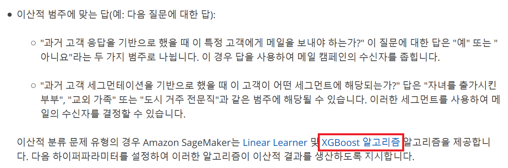]()

## Sagemaker 준비

한국 리전(ap-northeast-2)에서 다음의 두가지 작업을 진행합니다.

1. S3 버킷 생성
[S3 콘솔](https://console.aws.amazon.com/s3/home?region=ap-northeast-2)에서 앞으로 `Sagemaker`에서 사용할 S3 버킷을 만듭니다.

  - `버킷 만들기` 클릭
  
    [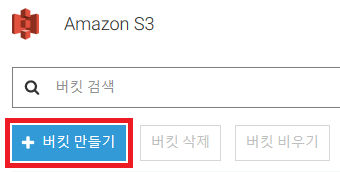]()

  - `버킷 이름`은 `awskurg핸드폰번호`로 하고, `생성` 클릭 (아래 그림에서는 임시로 `awskrug010122341234`로 입력함)
  
    [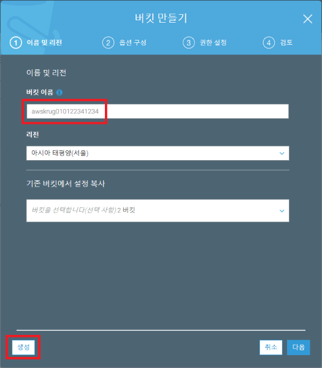]()

2. 노트북 인스턴스 생성
[Sagemaker 콘솔](https://console.aws.amazon.com/sagemaker/home?region=ap-northeast-2)에서 앞으로 사용할 노트북 인스턴스를 생성합니다.

  - `노트북 인스턴스 생성` 클릭
  
    

  - `노트북 인스턴스 이름`에는 **awskrug** 로 입력하고, `IAM 역할`에 드롭다운 리스트를 클릭
  
    [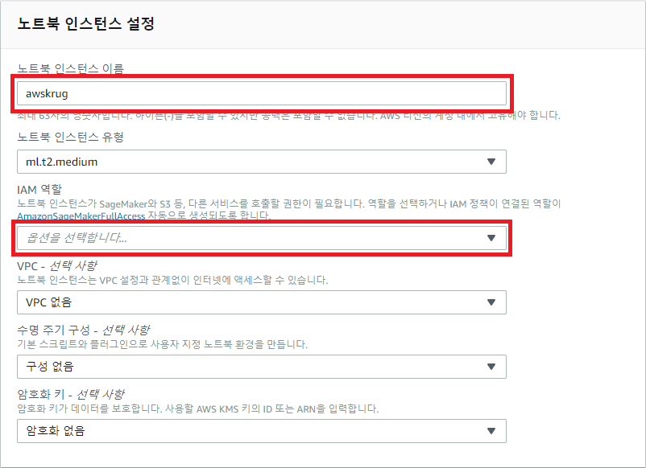]()

  - IAM 역할 생성 대화상자에서 `지정하는 S3 버킷 - 선택 사항` 에서 `모든 S3 버킷` 선택 후, `역할 생성` 클릭
  
    [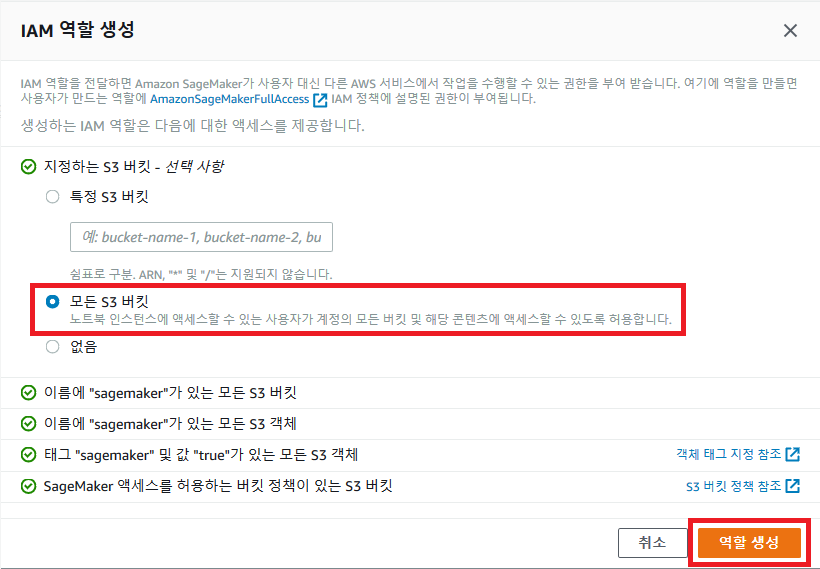]()

  - 새로운 IAM 역할이 생성되고, `노트북 인스턴스 생성` 클릭
  
    [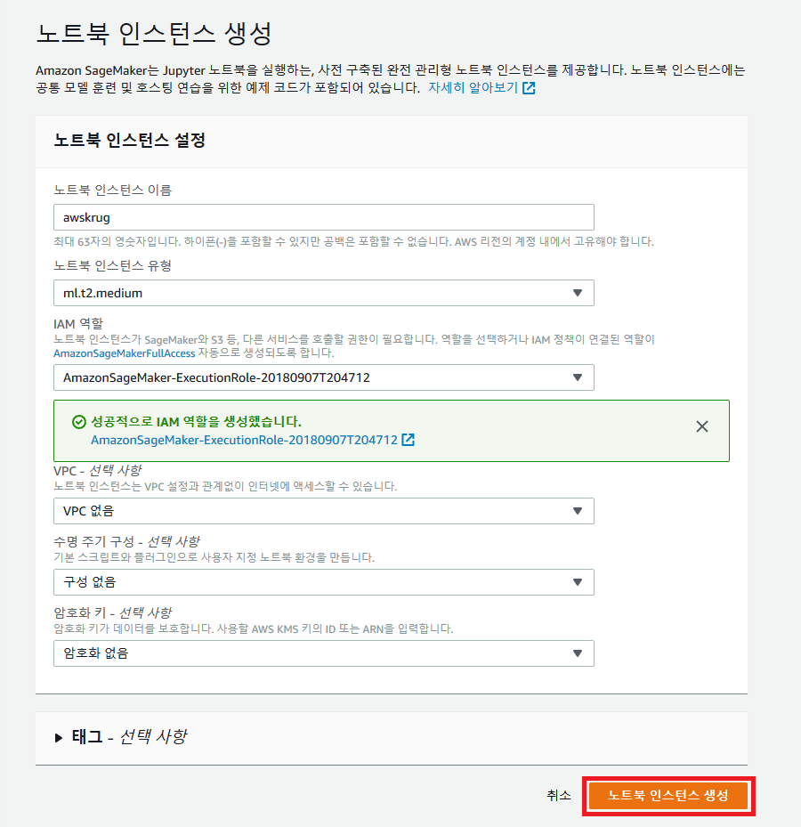]()

  - 그러면, 인스턴스를 생성하는 동안에는 상태는 `Pending` 이고, 조금 기다리면 `In service`로 변경됩니다. 이제 오른편에 `열기` 클릭
  
    [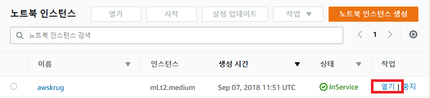]()
  
  - 노트북 화면이 나옵니다.
  
    [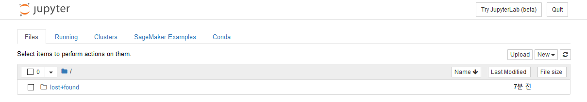]()

## 노트북 사용하기

1. 노트북 써보기
  > 노트북 및 파이선 패키지에 대한 설명은 [Jupyter notebook 이해하기](https://www.slideshare.net/dahlmoon/jupyter-notebok-20160815)을 보시면 될 것 같습니다.

  - 조작법
    - 화면 구성
    
      [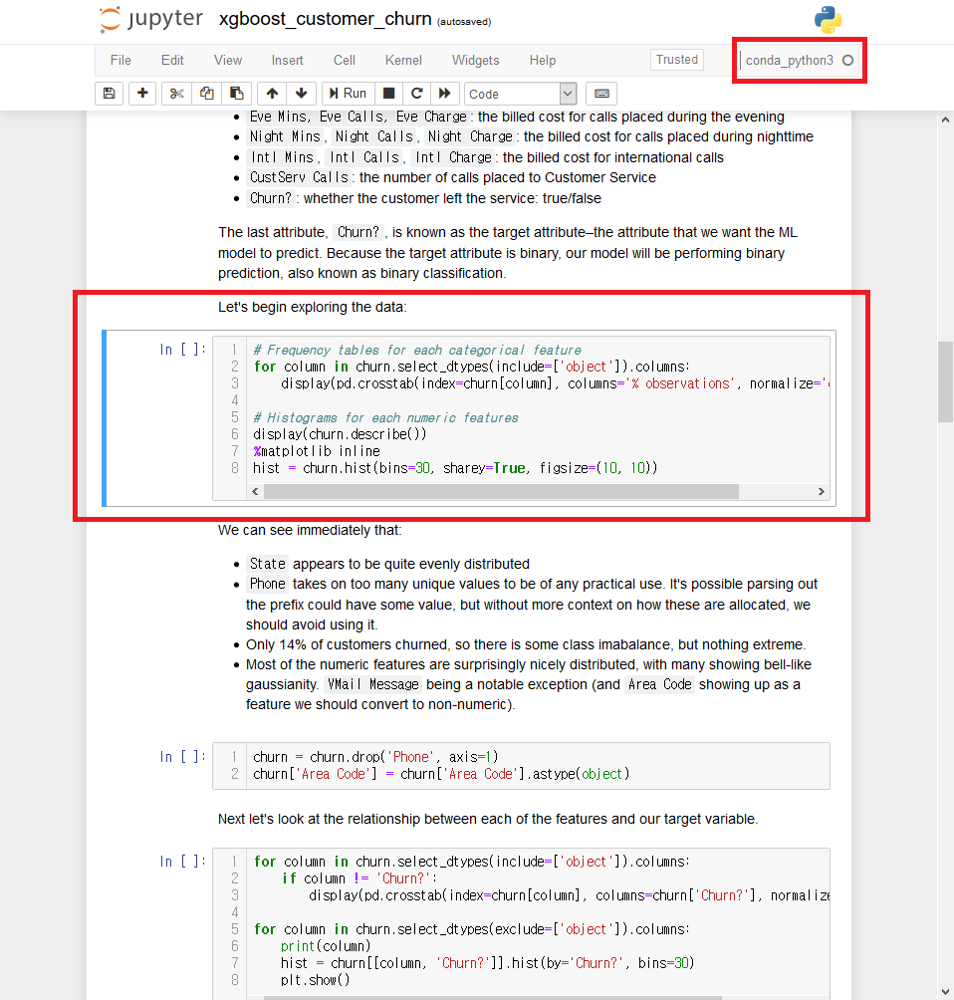]()

    - 툴바
    
      [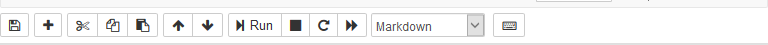]()

    - 셀
      - MS Excel 처럼 화면을 셀(cell)이라고 합니다. 컬럼이 1개라는 것이 다릅니다.
      - 셀은 Code(파이썬 코드), [Markdown](https://jupyter-notebook.readthedocs.io/en/stable/examples/Notebook/Working%20With%20Markdown%20Cells.html), Raw NBConvert(별도 렌더링없이) 로 나뉩니다.
      - 셀 좌측에 파란색이 보이는 것이 현재 선택된 셀, 셀 편집 시에는 녹색으로 바뀝니다.

    - 셀 이동
      - 위,아래 방향키로 선택한 셀을 옮길 수 있습니다.
      - Space 키로 화면 아래로 스크롤, Shift+Space 키로 화면 위로 스크롤 합니다.

    - 모드(상태)
      - Vi 에디터처럼 명령 모드(상태), 편집 모드(상태)가 있습니다.
      - Enter 키를 누르면 해당 셀이 편집 상태로 바뀌고, 더블 클릭한 셀이 편집 상태로 바뀝니다.
      - 편집 상태에서 ESC 키를 누르거나, 셀 이외의 부분을 클릭하면 명령 상태로 바뀝니다.

    - 셀 조작
      - 현재 셀 위로 추가는 A 키, 아래로 추가는 B 키
      - 현재 셀 삭제는 D + D 키(D를 2번)
      - 삭제 취소는 U 키
      - 아래 셀 합치기 Shift+M 키
      - 셀 타입을 Markdown 으로 변경 M 키
      - 셀 타입을 Code 로 변경 Y 키

    - 실행
      - 현재 셀 실행은 Ctrl+Enter 키
      - 현재 셀 실행 후 아래 셀로 내려가기는 Shift+Enter 키

    - 현재 노트북 및 상태 저장
      - S 키

## 노트북으로 작업 시작

1. 필기 가지고 오기
  - 노트북 화면에서 상단 `SageMaker Examples` 탭에서 클릭후, `xgboost_customer_churn.ipynb`을 `Use` 클릭

    [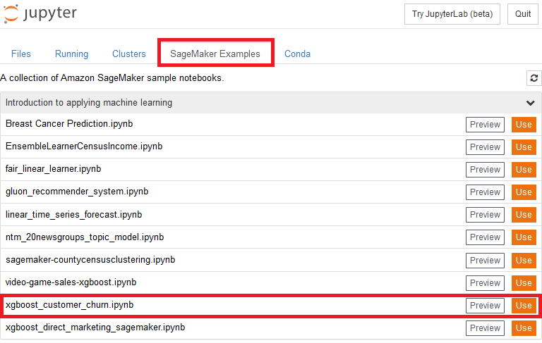]()

  - `Create a copy in your home directory` 대화상자가 나오면, `Create copy` 클릭

    [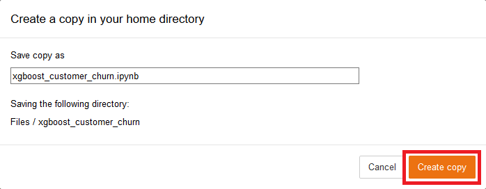]()

    필기 내용이 보입니다!

    [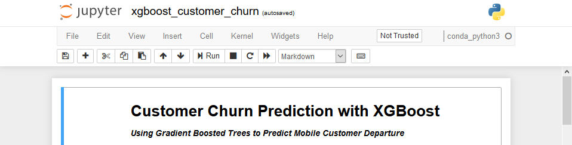]()

2. 노트북 코드 실행

  - 코드 실행에 앞서, `Sagemaker`에서 이용할 S3 버킷 이름을 입력해야 합니다.
    아래 그림에서 `<your_s3_bucket_name_here>` 부분에 전에 생성한 S3 버킷 이름을 넣습니다. `awskurg핸드폰번호` 형식으로 명명했었지요?

    [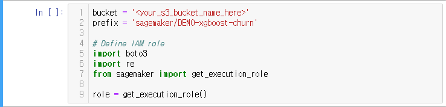]()

  - 코드 실행에서는 행번호로 보는 것이 편하므로 명령 상태에서 Shift+L 키를 누릅니다. 그럼 모든 셀에 코드에 행번호가 보입니다.

  - 맨 첫 셀을 선택합니다. 셀을 선택하면 좌측에 파란색으로 표시 됩니다.
    보인다고 선택 셀이 아닙니다. 클릭하셔야 합니다.

  - `▶| Run` 을 클릭해서 한줄만 실행해 봅니다. 혹은 첫 셀에서 Shift+Enter 키를 눌러도 되겠습니다.
    혹, 결과만 보고 싶으시다면, `Cell` 메뉴에서 `Run All` 을 선택하면 됩니다.

    첫 셀부터 순서대로 실행하지 않았다면, 제대로 동작하지 않습니다. 이 경우에는 툴바에서 재시작 버튼(`restart the kernel (with dialog)`)를 클릭하시고 첫 셀부터 실행하시면 됩니다.

  - 실행이 되면, In [ ] 에서 In [\*] 으로 변경됨을 확인할 수 있습니다.

## 코드 진행

### 데이터 준비

  - 3줄 - 데이터 로딩입니다. 받아서 압축을 풀어서 churn.txt 파일을 사용합니다.

    [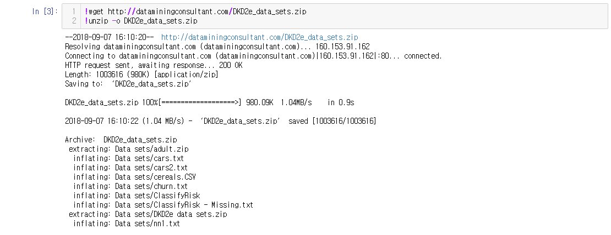]()

### 데이터 분석

  - 4줄 - 데이터 파일(churn.txt)이 요렇게 생겼습니다. .CSV 형식의 파일입니다.

    [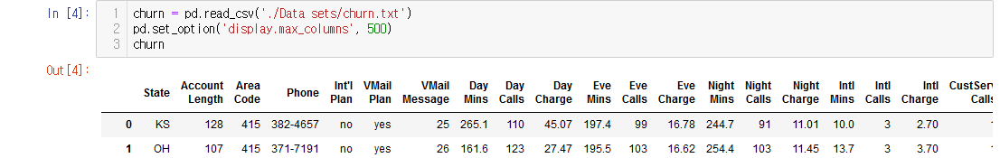]()

    자세히 보면 이렇게 생겼습니다.

    [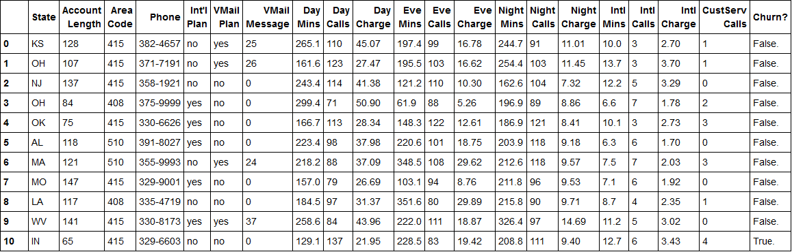]()

    컬럼명|내용
    :-|:-
    State| 미국 주 이름 약자(OH, NJ)
    Account Length| 몇 일이나 액티브한 계정인지
    Area Code| 지역 번호(3자리)
    Phone| 전화번호(7자리)
    Int’l Plan| 국제 전화 서비스 사용(yes/no)
    VMail Plan| 보이스 메일 사용(yes/no)
    VMail Message| 한달 평균 보이스 메일 개수
    Day Mins| 낮에 사용된 총 통화 시간(분)
    Day Calls| 낮 동안 걸려온 총 통화수
    Day Charge| 낮 동안 총 통화 비용
    Eve Mins, Eve Calls, Eve Charge| 저녁 통화시간, 통화수, 통화비용
    Night Mins, Night Calls, Night Charge| 밤 통화시간, 통화수, 통화비용
    Intl Mins, Intl Calls, Intl Charge| 국제 전화 통화시간, 통화수, 통화비용
    CustServ Calls| 고객 서비스(114) 통화 회수
    Churn?| 고객이 이탈 여부(true/false)

    > 2 종류의 값을 가지고 있는 컬럼도 많고, 아무튼 데이터의 특성이 보이기 시작합니다.
    > 이런 종류의 데이터로 고객 이탈을 예측 해볼 수 있을까요? 되니까 했겠지만... 가능성을 파악해봅시다.

  - 5줄 - 각 컬럼별로 값 분포를 파악하기 쉽도록 각 컬럼 타입에 맞춰서, 오브젝트인 경우는 구성 비율을 표로, 숫자인 경우에는 히스토그램으로 보여줍니다.
  
    [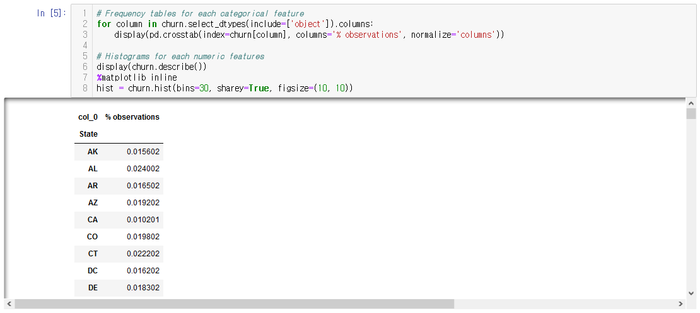]()

    ! `pd.crosstab` 는 pandas의 교차분석(cross tabulations) 함수입니다.

    전체적으로 다 보셔야 하겠지만, 대부분 값이 고르고(정규분포), 눈여겨 봐야 할 부분은

    [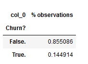]()

    > 이탈율이 무려 14.4914%.

    이것을 적은 비용으로 개선해서 이익을 증가시키는 것이 목표가 되겠습니다.

    그리고 히스토그램을 살펴보면, 알고리즘 적용상 문제가 될 수 있는 부분도 파악할 수 있습니다.

    [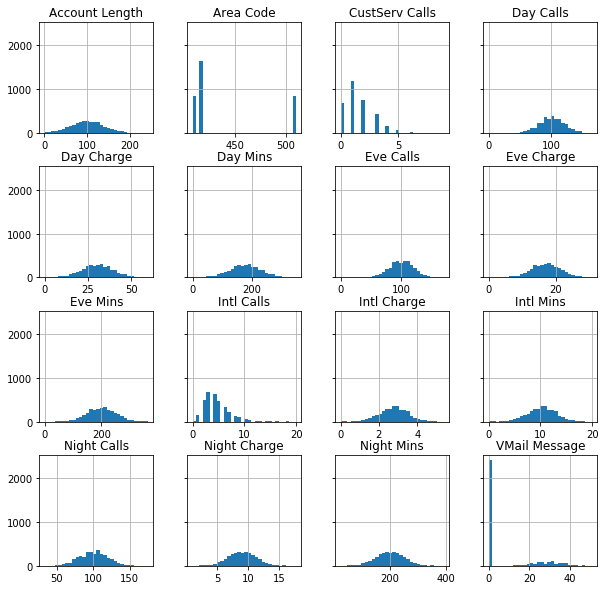]()

    전화번호는 고유치가 너무 많고, 다른 통찰을 끌어내기엔 추가 데이터가 없으니 입력 데이터에서는 제거합니다.
    Area code 의 형식을 숫자로 잘못 판단했으니, 오브젝트로 바꿉니다.
    요 내용은 19줄에서 처리합니다.

  - 7줄 - 그럼 각 컬럼은 이탈 여부와는 어떤 관계가 있는지 교차 분석을 합니다.

    [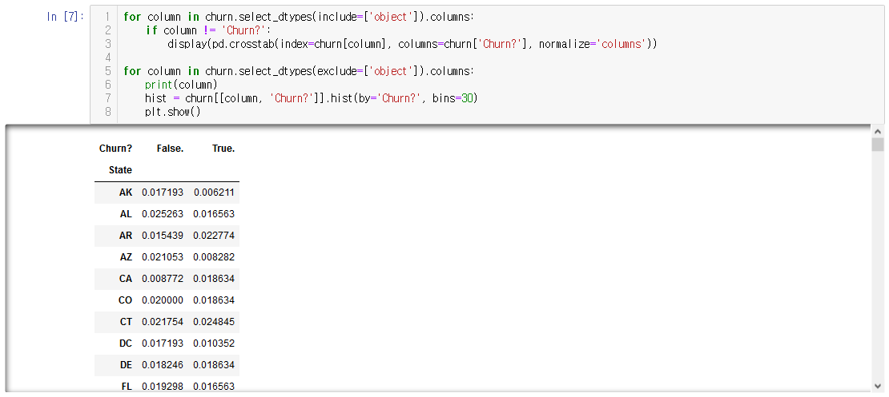]()

    [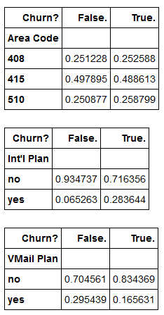]()

    - 이탈자의 지역번호는 고르게 분포 되어 있고,
    - 국제 전화 서비스와 연관이 있고,
    - 보이스 메일과는 적고
    - 주간 사용양이 유지 고객의 평균보다 높거나 낮으며
    - 고객 서비스 요청이 많았다
    - 이탈자들의 주간 사용양/비용의 분포가 서로 비슷해 보이나, 사용량에 따라 과금되는 것이니 고려 하지 않는다.

  - 8줄 - 모든 컬럼별 상관관계를 피어슨 상관계수(Pearson correlation coefficient)로 계산(pd.corr)하여 보여주고,
    
    [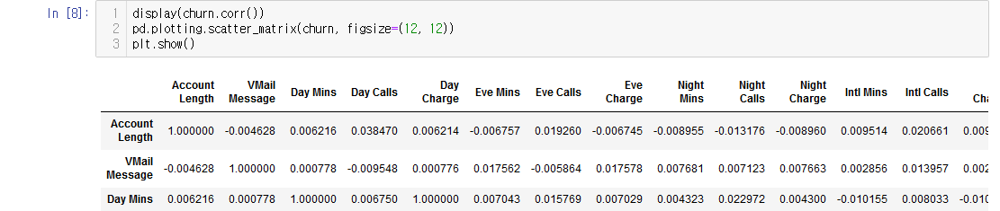]()

    [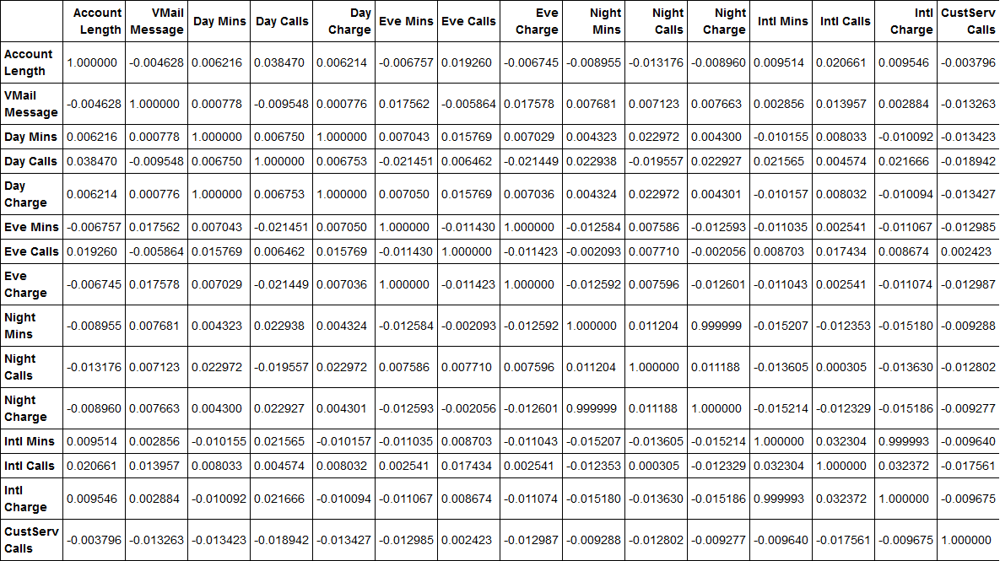]()
    > 참고로 피어슨 상관계수는 1과 가까울수록 양의 상관관계이며(완전 동일), 0은 완전 다름, -1과 가까울수록 음의 상관관계(반대방향으로 완전 동일)입니다. from http://gomguard.tistory.com/173

    100% 일치하는 것으로 보이는 컬럼은 제거합니다. 딱 봐도 많이 썼으니까 많이 나오는 당연한 결과입니다만 다소 문제를 일으킬 수 있기 때문에 다음 컬럼은 9줄에서 제거합니다.
    
    Day Charge,  Night Charge, Intl Charge

### 데이터 모델링
  - 10줄 - 모델 데이터 형식에 맞추는 작업
    알고리즘 적용을 위해서 데이터를 가공합니다.
    - .CSV 형식을 고수하나 예측 대상값은 첫번째 컬럼이어야 하고(10줄에서는 Churn 컬럼을 앞에 놓습니다.)
    - 헤더가 없어야 합니다.
    - 모델링을 위해서 숫자형식으로 바꿔야 합니다.

    그런데 왜 XGBoost 를 쓴다고 하나?
    - 회귀 알고리즘을 사용시에는 다항식 혹은 버킷형의 개념을 만들어야 하기 때문이기도 하나, XGBoost 는 경사 부스트 트리 방식(gradient boosted trees)은 예측 대상과 다른 변수간에 비선형 관계를 쉽게 풀어줄 수 있다고 합니다.

  - 11줄 - 데이터를 학습을 위해 임의로 70% 추출, 검증을 위해 20% 추출, 테스트를 위해 10% 추출하나, 서로 중복되지 않습니다.

    [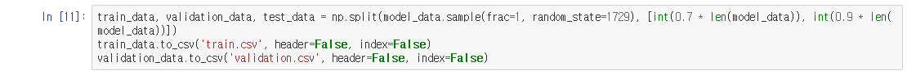]()

    추출한 데이터는 .CSV 형식으로 저장해서
    12줄에서 S3 버킷으로 train/train.csv, validation/validation.csv 으로 올립니다.

## 예측 모델 학습
  - 13줄 - 학습 시작
    14줄 - S3 버킷 주소 생성

  - 15줄 - Sagemaker 세션 연결하고 XGBoost 에 하이퍼 파라미터를 설정해서 생성해서 학습 시작

    

    XGBoost 의 하이퍼 파라메터라고 알려진 몇개 파라미터를 수정합니다.

    파라미터명|값|내용
    :-|:-:|-
    max_depth| 5 | 트리의 최대 깊이. 이 값이 증가하면 모델이 더욱 복잡해지고 과적합의 가능성이 높습니다. 
    subsample| 0.8 | 교육 인스턴스의 하위 샘플 비율.
    num_round| 100 | 교육을 실행할 라운드의 수.
    eta| 0.2 | 과적합 방지 업데이트에 사용되는 단계 크기 축소입니다. 각 부스팅 단계 이후 직접 새 특징의 가중치를 직접 가져옵니다. eta 파라미터는 실제로 특징 가중치를 축소하여 부스팅 프로세스를 더욱 보수적으로 만듭니다.
    gamma| 4 | 트리의 리프 노드에 추가 파티션을 생성하는 데 필요한 최소 손실 감소. 값이 클수록 알고리즘이 더욱 보수적입니다.

    깃헙(https://github.com/dmlc/xgboost/blob/master/doc/parameter.rst) 혹은 AWS 도움말(https://docs.aws.amazon.com/ko_kr/sagemaker/latest/dg/xgboost_hyperparameters.html) 에 설명되어 있습니다.

### 예측 모델 평가
  - 16줄 - 예측 모델 엔드 포인트 생성
    ml.m4.xlarge 으로 내부 컨테이너를 생성한다!

  - 17줄 - 평가 시작
    18줄 - 평가 함수

    평가 방법은 간단하게
      1. 데이터 셋 중에서, 미니 배치를 운영하기 위해 적당한 크기로 행별로 쪼개서
      2. CSV 형식으로 바꾸고
      3. 그 모델 데이터로 XGBoost 엔드포인트를 호출해서
      4. CSV 형식의 예측 결과를 받아서, 그것을 NumPy 의 배열로 변경한다.

  - 19줄 - 예측 모델 평가
    
    [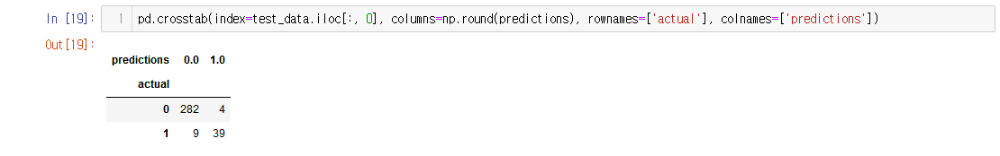]()

    결과로 나온 표의 값은 다음을 뜻합니다.
    
    [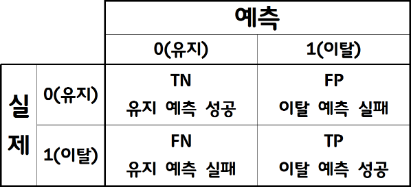]()

    이 값은 모델링 데이터를 샘플링할 때에 임의로 데이터를 추출했기 떄문에, 이 값과는 다를 수 있습니다.

    대략 48 명의 이탈자가 생겼는데, 39명을 옳게 예측했고(TP), 4명은 이탈할 것이라 했는데 유지했고(FP), 9명은 유지할 것이라 했는데 이탈했다(FN).

    여기서 살펴볼 것은 XGBoost 알고리즘의 결과는 0 ~ 1 사이 숫자인데 이탈/유지의 두 값으로 맞추기 위해서 마치 cutoff 값으로 0.5를 택한 것 같은 np.round(반올림) 함수를 사용했다는 것이다.
    
    이탈 고객은 이탈할 것이라 생각해서 유지시키려는 비용보다 더 많은 비용이 발생하므로, 요 cutoff 값을 조정해 볼 수 있습니다. 요렇게 하면, FP 값은 늘어나겠지만, TP 값도 늘고, 진정 손해가 나는 FN 값이 줄어들 것입니다.

    [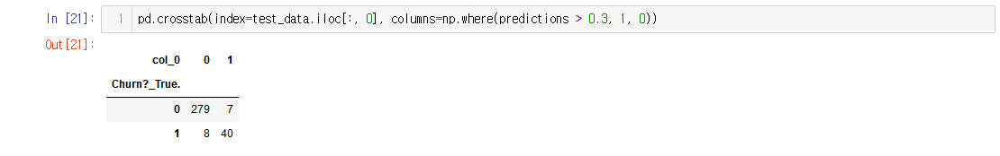]()
    cutoff 값을 0.5 에서 0.3 으로 바꾸면, TP 값은 1, FP 는 3 이 늘고 FN 은 1 이 줍니다. 전체적으로 작은 값이지만, 6~10% 의 전체 고객이 이동한 것입니다. 이것은 맞는 결정인가요?
    우리는 3 명의 여분의 고객을 보유하게 될지도 모릅니다. 그러나 우리는 또한 머물렀던 5 명의 고객을 불필요하게 비용을 지불합니다.
    **최적의 컷오프를 결정하는 것은 실제 환경에서 기계 학습을 적절하게 적용하는 핵심 단계입니다.**

    **상대적인 오류 비용**
    둘 중 하나로 구분하는 바이너리 분류 문제는 cutoff 값에 민감합니다. 그 자체로는 문제가 아닙니다. 그 점수를 정말 쉽게 나눌 수 있었다면, 이렇게 머신러닝까지 안 써도 되는 해결할 수 있는 문제였을 거니까요.

    더 중요한 것은, 실제 적용하게 되면, 문제되는 것은 잘못 예측한 그러니까 FP, FN 으로 말미암는 비용이 있다는 것과 이와 비슷한 관점으로 TP, TF 로 인한 비용도 보아야 한다는 것입니다.
    cutoff 결정은 이 4개의 통계값에 영향을 주게 되니 더욱 더 신중하게 cutoff 값을 고려해야 합니다.

    **비용 할당**
    고객 이탈에 문제의 비용이 무엇인가? 비지니스를 수행에 따른 비용인데 다음을 가정해 보자.
    
    1. **TN 은 \$0 이라 가정한다**.

    2. FP 가 문제다. 이탈 고객을 유지할 것이라 잘못 예측했고, 고객을 잃고, 이익과 광고 비용과 관리 비용, 판매 비용, 장비 비용 등 다른 고객을 유치할 비용을 지출해야 한다. 대략 몇백 불의 손해를 본다. 그러니 **FN에 따른 손해비용을 \$500 로 가정한다.**

    3. 이탈할 것으로 예측한 고객에게 들어가는 해지방어를 위한 비용을 \$100라 하자. 즉, **FP, TP에 따른 손해비용은 \$100 으로 가정한다.**
       고객에게 해지방어 프로모션을 하게 되면 고객은 해지할지 말지 한번 더 생각해 볼 수 있습니다. 물론 TP, FP 던 이탈한 것이니까 모두 비용이 듭니다. 그렇지만 이탈할 것이라 예측했으나 실제로는 유지한 FP 고객의 경우는 \$100를 낭비하는 듯 하지만, 이것으로 고객의 충성도를 올려 주니 그렇게 나쁘지는 않습니다.

    **최적의 cutoff 값 찾기**

    위에 정리한 것에 따라서, 비용 함수를 한번 만들어보면 다음과 같습니다.

    `COST(C) = $500 * FN(C) + $0 * TN(C) + $100 * FP(C) + $100 * TP(C)`

    C 는 cutoff 변수이고, FN(C) 는 cutoff 값에 따른 FN 함수입니다. TN, FP, TP 도 유사하게 갑니다.

    뭐 이것에 최적값을 찾는 방법이 있지만, 여기서는 100 개 가능한 값을 가지고 테스트해 봅니다.

    [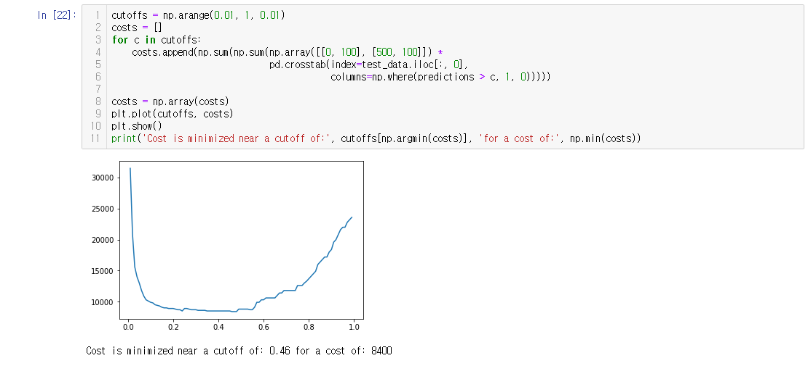]()
  
    위의 차트는 임계 값을 너무 낮게 선택하면 모든 고객에게 보존 인센티브가 주어지면서 비용이 급증하는 것을 보여줍니다. 한편 임계 값을 너무 높게 설정하면 고객이 너무 많이 손실되어 결과적으로 거의 비용이 많이 들게됩니다. 전체 비용은 컷오프를 0.46으로 설정하여 \$8400 달러로 최소화 할 수 있습니다. 이는 어떤 조치도 취하지 않음으로써 손실 될 것으로 예상되는 \$20k 이상보다는 훨씬 낫습니다.

### 예측 모델 확장

  예측 모델을 작성 및 비용 초소화를 위해 임계값을 최적으로 설정하는 방법을 보았습니다. 모델을 확장하기 위해서는 다음과 같은 고려사항이 있을 수 있습니다.

  - 가입 유지 인센티브를 받는 일부 고객은 예측 불허입니다. 비용 함수(COST(C))에 인센티브를 받았음에도 불구하고 이탈 확률을 포함하면 고객 유치 프로그램에 더 높은 투자효율이 나겠지요?
  - 요금제를 저가로 전환하거나 유료기능을 비활성화 한 고객들도 모델링 할 수 있는 다양한 종류의 이탈 방식을 찾아봅니다.
  - 고객 행동의 진화 모델링.
    사용량이 감소하고 고객 서비스에 걸려 오는 전화 수가 증가하는 경우 추세가 반대라면 변동될 수 있습니다. 고객 행동 동향은 수시로 반영해야 합니다.
  - 실제 금전적 비용 계산은 훨씬 더 복잡할 수 있습니다.
  - 각 유형의 이탈 유형에 대한 다양한 모델이 필요할 수 있습니다.

## 정리
  - [Sagemaker 콘솔](https://console.aws.amazon.com/sagemaker/home?region=ap-northeast-2)에서 다음 리소스를 삭제
    - 모델
    - 노트북 인스턴스.
        
    삭제하기 전에 인스턴스를 중지해야 합니다.

  - [S3 콘솔](https://console.aws.amazon.com/s3/home?region=ap-northeast-2) 에서 생성한 버킷을 삭제

  - [CloudWatch 콘솔](https://console.aws.amazon.com/cloudwatch/home?region=ap-northeast-2)에서 이름이 /aws/sagemaker/로 시작하는 모든 로그 그룹을 삭제

  - 필요하다면, [IAM 콘솔](https://console.aws.amazon.com/iam/)에서 AmazonSageMaker-* 역할을 삭제합니다.
