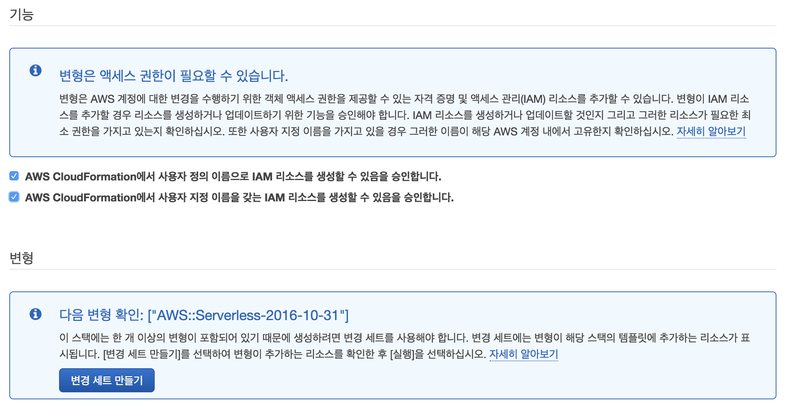
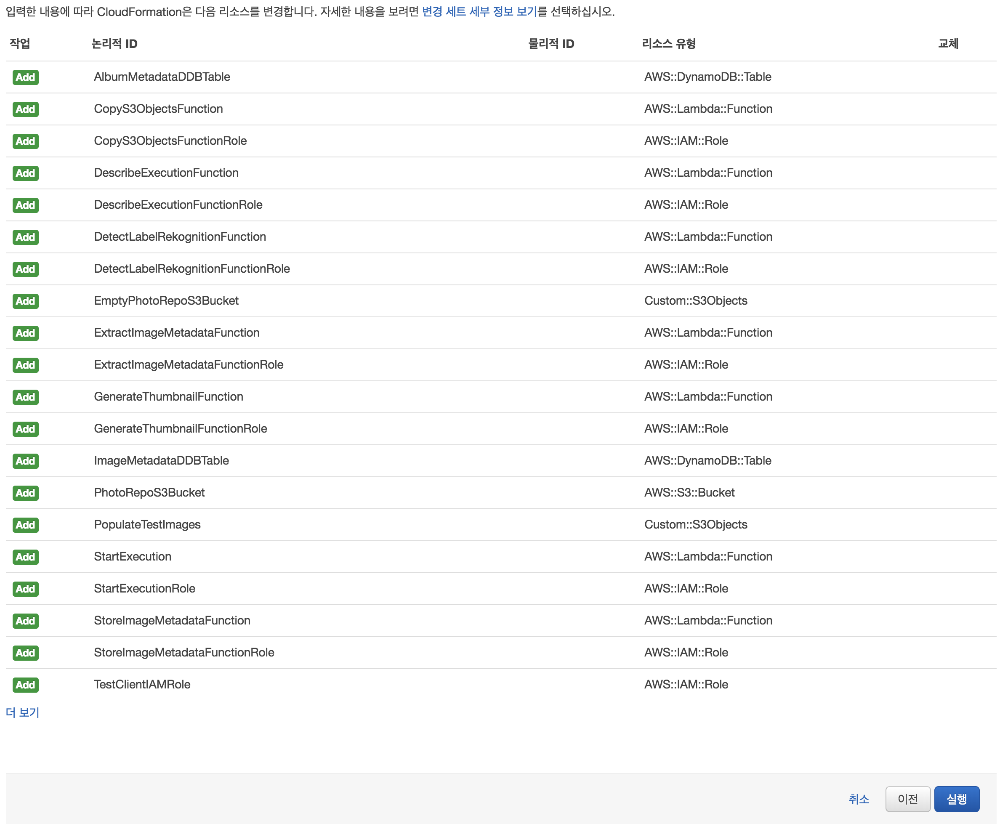

## 0 단계 : 리소스 설정

### 단계 0A : 람다 함수 및 데이터 저장소 설정

이 핸즈온에서 만들 AWS Step Functions 상태 머신은 각 단계에 대한 로직을 구현하는 다수의 람다 함수를 조정합니다. 람다 함수 중 일부는 Amazon S3 버킷 또는 Amazon DynamoDB 테이블과 같은 AWS 리소스 및 데이터 저장소가 필요합니다.

이 섹션에서는 AWS 람다 함수와 필요한 모든 리소스를 생성하기 위해 `CloudFormation`을 사용합니다.

이 단계에서 어떤 리소스가 설정되어 있는지 이해하려면 아래 구성도를 참조하세요. 이 핸즈온에서는 처리 작업을 수행하는 람다 함수를 조정하기 위해 단계 함수 상태 머신 (중간에 회색으로 표시됨)을 생성합니다.
 

 
 

Region| Code | Launch
------|------|-------
서울 | ap-northeast-2 | 

<strong> CloudFormation 실행 지침 (자세한 내용은 펼치기) </strong>

 
1. 위의 **Launch Stack** 버튼을 클릭하세요.

1. **템플릿 선택** 페이지에서 **다음**을 클릭하세요.

1. **세부 정보 지정** 페이지에서 모두 기본값 그대로 두고 **다음**을 클릭하세요.

1. **옵션** 페이지에서 모두 기본값 그대로 두고 **다음**을 클릭하세요.

1. **검토** 페이지에서 CloudFormation이 IAM 리소스를 생성 확인란을 선택하고 **변경 세트 만들기**를 클릭하세요.
	

	>이 템플릿은 람다가 처리해야 하는 리소스에 대한 적절한 사용 권한을 부여하는 많은 IAM 역할을 작성합니다.

1. 변경 세트 만들기가 완료되면 **실행**을 클릭하세요.
	

1. `sfn-workshop-setup` 스택이 `CREATE_COMPLETE`의 상태에 도달할 때까지 기다리세요. (새로 생성된 스택을 보려면 새로고침 버튼을 클릭해야 할 수도 있습니다).

	
### 다음 단계
이제 [1 단계](step-1.md)로 이동할 준비가 되었습니다!
