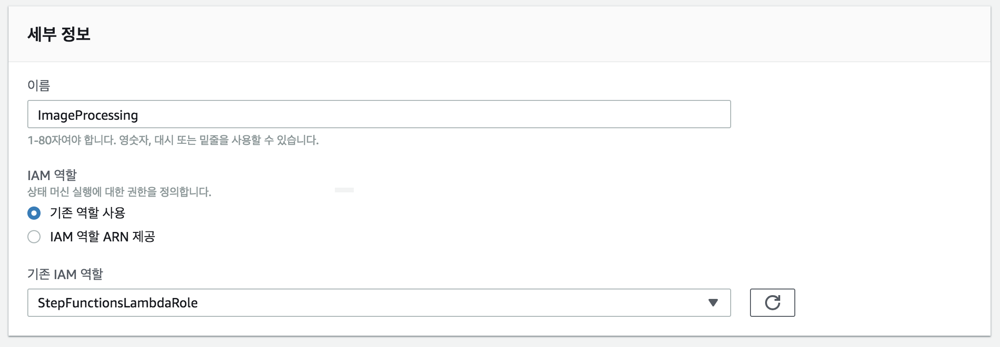
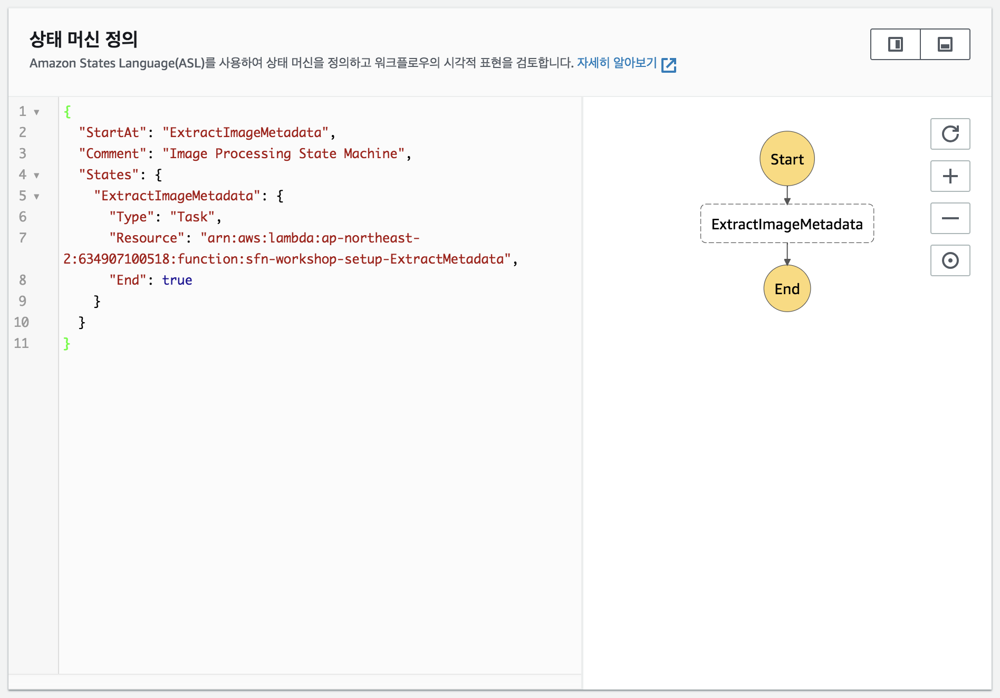
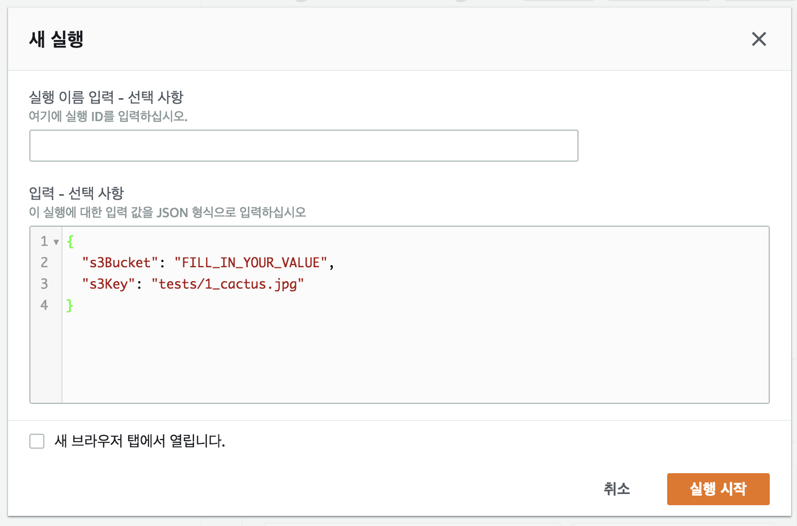
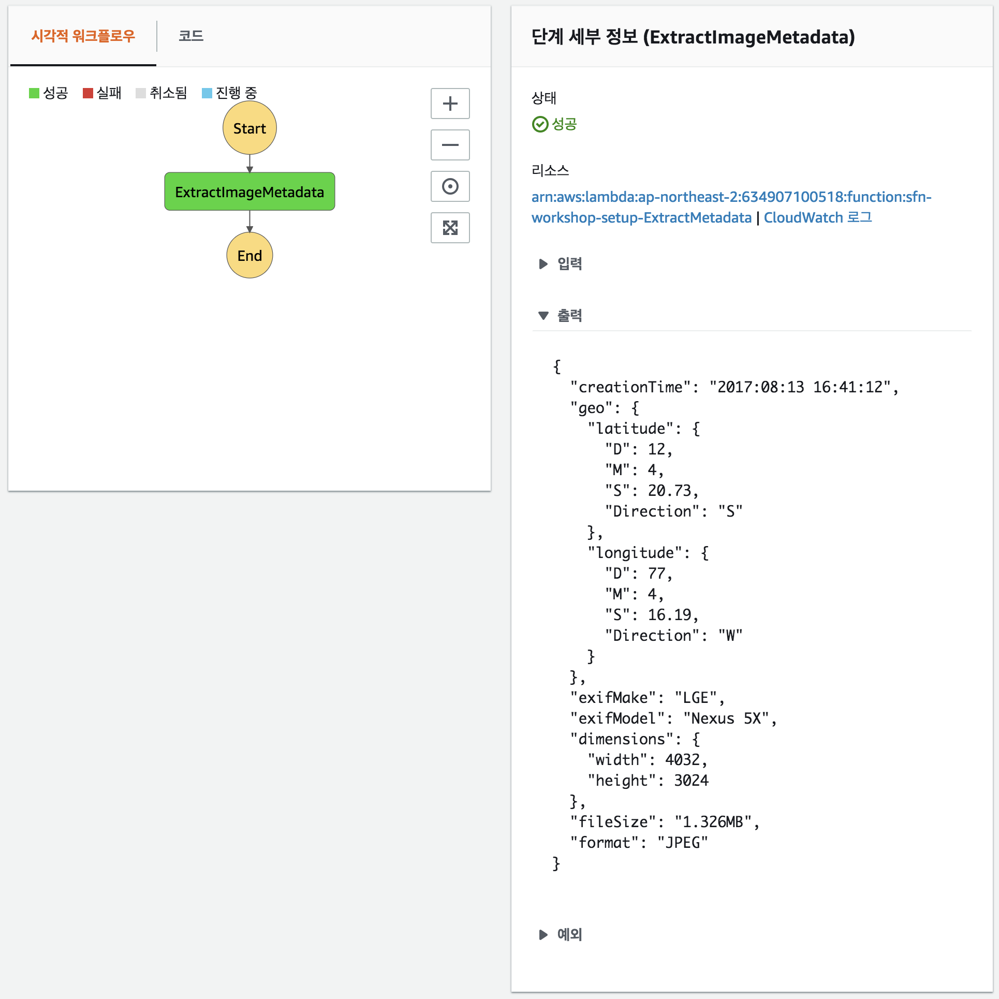
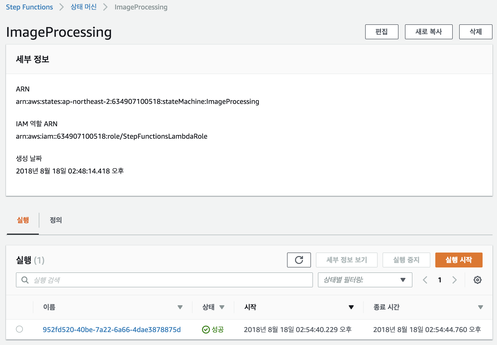
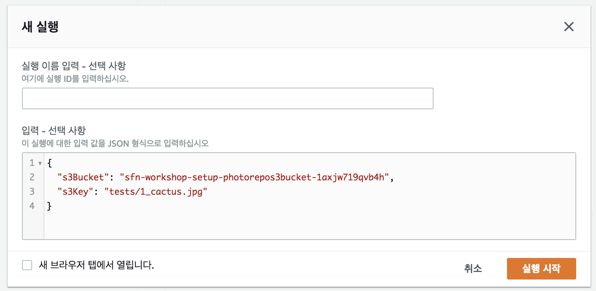
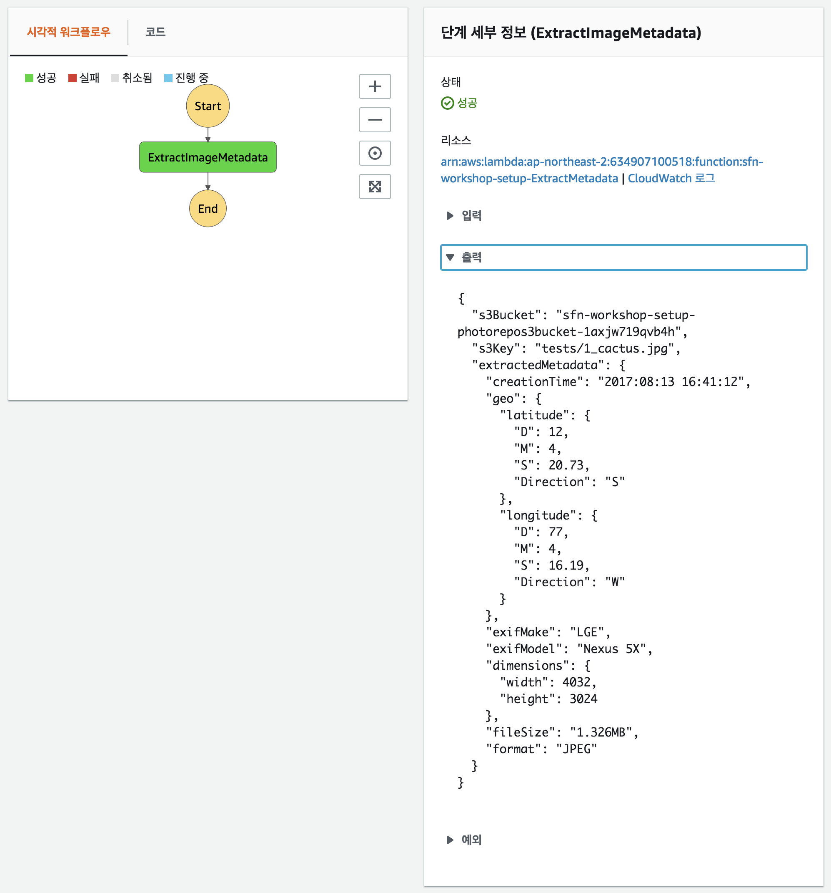

## 1 단계 : AWS Step Functions 상태 머신 추가

AWS Step Functions 상태 머신을 작성하여 처리 단계를 조정하려면 단일 단계가 포함된 머신부터 시작합니다.

단계 함수 상태 머신은 [Amazon States Language](https://states-language.net/spec.html)를 사용하여 JSON에 정의됩니다. 단일 단계로 상태 머신을 정의하는 아래의 JSON을 살펴보세요.

```javascript
{
  "StartAt": "ExtractImageMetadata",
  "Comment": "Imgage Processing State Machine",
  "States": {
    "ExtractImageMetadata": {
      "Type": "Task",
      "Resource": "arn:aws:lambda:ap-northeast-2:012345678912:function:sfn-workshop-setup-ExtractMetadata",
      "End": true
    }
  }
}
```	

이 상태 머신이 시작되면 AWS Step Functions 인터프리터는 시작 상태를 식별하여 실행을 시작합니다. 실행 한 다음 States가 `"End: "`로 표시되는지 확인합니다. 그러면 상태 머신은 결과를 리턴합니다. 상태가 `"End": `가 아니면 인터프리터는 다음에 실행할 상태를 결정하기 위해 `"Next": `필드를 찾습니다. 상태가 성공, 실패 또는 종료 상태에 도달하거나 런타임 오류가 발생할 때까지 이 프로세스를 반복합니다.

JSON을 직접 작성하여 상태 머신 정의를 구성하는 경우 [statelint](https://github.com/awslabs/statelint) 도구를 사용하여 상태 머신을 만들기 전에 JSON의 유효성을 검사해야합니다.

### 1A 단계 : IAM 역할 만들기 

1. [IAM](https://console.aws.amazon.com/iam/home) 로 이동하세요.

1. 역활 메뉴에서 **역할 만들기** 버튼을 클릭하세요.

1. 이 역할을 사용할 서비스 선택에서 **Step Functions**을 선택하고 **다음: 권환**을 클릭하세요.

1. 역할 만들기에서 기본값으로 두고 **다음: 검토**을 클릭하세요.

1. 역할 이름을 `StepFunctionsLambdaRole`을 입력하고 **역할 만들기**를 클릭하세요.


### 1B 단계 : AWS Step Functions 상태 머신 생성

1. [AWS Step Functions 관리 콘솔](http://console.aws.amazon.com/states/home)로 이동하세요.

1. 이전에 AWS Step Functions를 사용하지 않았다면 시작 페이지를 볼 수 있습니다. 이 경우 **시작** 버튼을 클릭하면 새 상태 머신을 만드는 페이지로 연결됩니다. 그렇지 않으면 **상태 머신 생성** 버튼을 클릭하세요.

1. 상태 머신 이름으로 `ImageProcessing`을 입력하세요.

1. **기존 역할 사용**을 선택하여 생성한 `StepFunctionsLambdaRole` IAM 역할을 선택하세요.

	

1. 아래의 JSON을 상태 머신 정의에 복사 및 붙여넣기 하세요.

	```javascript
	{
	  "StartAt": "ExtractImageMetadata",
	  "Comment": "Image Processing State Machine",
	  "States": {
	    "ExtractImageMetadata": {
	      "Type": "Task",
	      "Resource": "REPLACE_WITH_YOUR_LAMBDA_ARN",
	      "End": true
	    }
	  }
	}
	```	

1. JSON에서 `REPLACE_WITH_YOUR_LAMBDA_ARN` 문자열을 메타 데이터 추출 AWS 람다 함수의 ARN으로 대체합니다.
	> 메타 데이터 추출 람다 함수의 ARN을 찾으려면 AWS CloudFormation 콘솔에서 **sfn-workshop-setup** 스택으로 이동하고 출력 섹션에서 **ExtractMetadata** 람다를 찾습니다.
	>
	> `arn:aws:lambda:ap-northeast-2:<YOUR-ACCOUNT-ID>:function:sfn-workshop-setup-ExtractMetadata`와 같은 형식이어야합니다.
	>
	>  **:honey_pot:TIP:** `REPLACE_WITH_YOUR_LAMBDA_ARN` 클릭하면 현재 생성되어 있는 람다 함수가 나옵니다. :satisfied:

1. **Visual Workflow** 옆의 &#x21ba; 아이콘을 클릭하여 상태 머신의 시각적 표현을 새로 고칩니다.

	

1. **상태 머신 생성**을 클릭하세요.

### 1C 단계 : 상태 머신 실행 테스트

1. **실행 시작** 버튼을 클릭하세요.

1. AWS Step Functions 상태 머신으로 전달 된 입력 데이터를 처리하도록 지정합니다.

   상태 머신에 각 실행에는 고유한 ID가 있습니다. 실행을 시작할 때 하나를 지정하거나 서비스가 생성하도록 할 수 있습니다. `실행 이름 입력 - 선택 사항` 라는 텍스트 필드에 실행 이름을 지정하거나 비워 둘 수 있습니다.

	입력 데이터의 경우 다음 JSON 템플릿을 사용하세요. 자신의 값으로 s3Bucket 필드를 대체하세요.

	```JSON
	{
	  "s3Bucket": "FILL_IN_YOUR_VALUE",
	  "s3Key": "tests/1_cactus.jpg"
	}
	```
	`s3Bucket` 필드의 경우, CloudFormation 콘솔에서 **sfn-workshop-setup** 스택에서 **출력** 탭에 `PhotoRepoS3Bucket` 키의 값을 보세요.
	
	> 's3Bucket' 및 's3Key` 필드는 Amazon S3 버킷명과 사진이 저장되는 위치를 알려줍니다.
	>
	> **:honey_pot:TIP:** 테스트 입력 JSON을 메모장 또는 텍스트 편집기에 저장하세요. 이후 단계에서 다시 사용하기 때문입니다.
	        
	**실행 시작**을 클릭하세요.


	

1. 이제 상태 머신의 실행 상태를 볼 수 있습니다. 콘솔에서 여러 탭을 탐색하여 사용할 수 있는 정보를 확인하세요.

	


### 1D 단계 : ResultPath를 사용하여 원본 입력과 출력을 결합합니다.

방금 만든 상태 머신의 **출력**을 살펴보면 람다 함수에 의해 이미지에서 추출 된 메타 데이터에 대한 유용한 정보가 많이 있습니다. 그렇다면 전달된 입력 데이터를 전달하려는 경우에는 어떻게 해야할까요?

한 가지 옵션은 람다 함수 자체에 이 논리를 작성하여 입력 데이터를 람다 함수의 출력으로 복사하는 것입니다. 또는 Step Functions에서 우리가 활용할 수 있는 기능을 제공합니다. **Paths** 기능을 사용하면 작업에 전달 된 입력을 조작하고 JSON 경로 표현식을 사용하여 다음 상태로 전달되는 작업의 출력을 조작 할 수 있습니다.

**Paths** 필드에 세 가지 유형이 있습니다. **InputPath**, **ResultPath**, **OutputPath**. ([documentation](https://docs.aws.amazon.com/step-functions/latest/dg/awl-ref-paths.html) 및 [Amazon States Language specification.](https://states-language.net/spec.html#path))

우리의 특별한 필요에 따라 **ResultPath**필드를 사용할 것입니다. 이 필드는 데이터를 다음 상태로 전달하기 위해 정의되며, 입력 JSON의 일부가 실행 결과로 대체됩니다. (예: 람다 함수의 출력) 기본적으로 생략 된 경우 필드는`$`을 취합니다. 즉, 실행 결과는 전체 데이터가 다음에 전달되는 것을 의미합니다. OutputPath는 ResultPath의 출력을 추가로 필터링 할 수 있습니다. 이 동작은 명시적으로 JSON 경로를 지정하여 변경할 수 있습니다.

- **ResultPath** JSON 경로 표현식이 상태 입력의 항목과 일치하면 해당 입력 항목 만 상태 작업 실행 결과로 겹쳐 쓰입니다. 수정 된 전체 입력이 주 출력에 사용 가능하게됩니다.

- **ResultPath** JSON 경로 표현식이 상태 입력의 항목과 일치하지 않으면 해당 항목이 입력에 추가됩니다. 이 항목에는 상태 작업을 실행 한 결과가 포함됩니다. 확장된 입력이 상태 출력에 사용 가능하게됩니다.

이제 이미 생성한 상태 머신에 **ResultPath**에 `$.extractedMetadata`를 추가하세요.

<details>
<summary><strong> 단계별 지침 펼치기 </strong> </summary><p>

1. AWS Step Functions 관리 콘솔 페이지에서 **상태 머신**를 클릭하여 상태 머신 목록으로 돌아갑니다.

1. 방금 만든 상태 머신을 선택하세요. 그리고 **편집**을 클릭하세요.

	

1. 테스크에 `"ResultPath": "$.extractedMetadata"`를 추가하세요. 마지막 JSON은 다음과 같아야합니다.

	```javascript
	{
	  "StartAt": "ExtractImageMetadata",
	  "Comment": "Image Processing State Machine",
	  "States": {
	    "ExtractImageMetadata": {
	      "Type": "Task",
	      "Resource": "arn:aws:lambda:ap-northeast-2:012345678912:function:sfn-workshop-setup-ExtractMetadata",
	      "ResultPath": "$.extractedMetadata",
	      "End": true
	    }
	  }
	}
	```

1. **저장**를 클릭하고 **실행 시작**을 클릭하세요.

1. 1C-2 단계에서 사용한 것과 동일한 JSON 입력을 입력하세요. (`ImageProcessing`의 실행 기록으로 이동하여 세부 정보> 입력에서 JSON을 복사하여 찾을 수 있습니다). **실행 시작**을 클릭하세요.

	

</details>

변경 후 새로운 실행을 위해 **출력**에 상태 입력 속성과 작업 출력을 포함하는 추가 필드 `extractedMetadata`가 포함되어 입력과 출력을 효과적으로 병합합니다.



이제 [2 단계](step-2.md)로 이동할 준비가 되었습니다!
