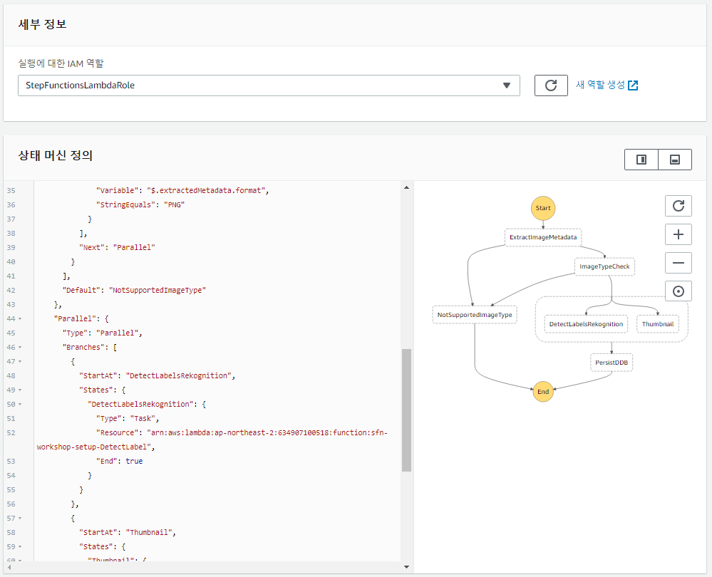

## 2 단계 : 상태 머신에 분기 로직 추가

Step Functions 의 첫 단계에서 이미지에 대한 상세 정보를 얻었습니다. 이 정보를 바탕으로 어떤 추가작업을 진행할지 결정할 수 있습니다. 예를 들어, 입력된 파일이 예제에서 지원하지 않는 포멧일 경우, 포멧변환 Lambda Function으로 보내거나 혹은 에러메시지를 보내고 작업을 종료할 수 있습니다.

분기를 가능하게하는 AWS Step Functions에는 [Choice State](https://docs.aws.amazon.com/step-functions/latest/dg/awl-ref-states-choice.html)와 [Error Try/Catches](https://docs.aws.amazon.com/step-functions/latest/dg/awl-ref-errors.html)를 참조하세요. Choice State는 if/else 또는 case/switch 조건에 기반하여 다음 상태를 선택할 수 있습니다 (And, Or, Not, =>, <)연산자 조합을 지원합니다. Error Try/Catch를 사용하면 현재 실행에 의해 발생된 오류 유형에 따라 다음 상태를 선택할 수 있습니다.

이 단계에서는 Error Try/Catches 및 Choice State를 모두 사용하여 상태 확인 기능을 상태 머신에 추가합니다. 이 단계가 끝나면 상태 머신은 다음과 같이 보입니다.


### 2A 단계 : 상태 머신 정의에 분기 추가

시나리오에서는 JPEG 및 PNG 형식만 지원합니다. 이미지 분석 람다 함수는 이미지 포맷을 감지할 수 있으므로 첫번째 단계 이후에 선택 상태를 사용하여 메타 데이터 추출의 결과를 평가하고 분기 결정을 내릴 수 있습니다. 이미지 처리 라이브러리에는 분석기가 없는 다른 파일 유형의 경우 람다 함수에서 예외가 발생합니다. 이제 Choice State와 Error Try/Catch를 사용하여 결합할 수 있습니다.

1. 상태 머신 정의가 있는 텍스트 편집기로 돌아가세요. 다음과 같이 표시되어야 합니다.
	
	```JSON
	{
	  "StartAt": "ExtractImageMetadata",
	  "Comment": "Imgage Processing State Machine",
	  "States": {
	    "ExtractImageMetadata": {
	      "Type": "Task",
	      "Resource": "REPLACE_WITH_YOUR_LAMBDA_ARN",
          "ResultPath": "$.extractedMetadata",
	      "End": true
	    }
	  }
	}
	```

1. 상태 머신에 추가 할 다음 단계는 실패 상태인 **NotSupportedImageType**입니다. 이 단계는 종료되고 이미지 유형이 지원되지 않기 때문에 진행할 수 없는 실행에 대한 실패를 표시합니다.

	상태 머신 정의에 **ExtractImageMetadata** 상태 다음에 **Fail** 상태를 추가하세요.

	```JSON
		,
	    "NotSupportedImageType": {
	      "Type": "Fail",
	      "Cause": "Image type not supported!",
	      "Error": "FileTypeNotSupported"
	    },
	```

1. 다음으로, 오류 상태를 가리키는 **ExtractImageMetadata** 단계에 Error Try/Catch 를 추가합니다. 람다 함수는 이미지로 파싱할 수 없는 파일 유형 (예 : txt)을 만나면 `ImageIdentifyError` 유형의 오류를 발생 시키도록 작성되었습니다. Step Functions의 Error Try/Catch 기능을 사용하여 오류가 발생할 때 **NotSupportedImageType** Fail 상태로 전환하도록 상태 머신을 구성할 수 있습니다.

	**ExtractImageMetadata** 단계에 **Catch** 블록을 추가하세요.
	
	<pre>
	    "ExtractImageMetadata": {
	      "Type": "Task",
	      "Resource": "REPLACE_WITH_YOUR_LAMBDA_ARN",<b>
	      "Catch": [{
	        "ErrorEquals": [
	          "ImageIdentifyError"
	        ],
	        "ResultPath": "$.error",
	        "Next": "NotSupportedImageType"
	      }],</b>
	      "ResultPath": "$.extractedMetadata",
	       "End": true
	    }
	</pre>

	> Lambda 함수에서 사용자 정의 오류 코드를 정의하는 방법은 [블로그 게시물](https://aws.amazon.com/blogs/compute/automating-aws-lambda-function-error-handling-with-aws-step-functions/)을 참조하세요.

1. JPEG 및 PNG 이미지만 추가로 처리할 수 있도록하려면 이미지 형식이 JPEG 또는 PNG가 아닌 경우 *NotSupportedImageType* Fail 상태로 지정하는 선택 상태를 만듭니다.

	**NotSupportedImageType** 실패 상태 다음에 **Choices** 상태를 추가하세요.

	```JSON
	  "ImageTypeCheck": {
	      "Type": "Choice",
	      "Choices": [{
	        "Or": [{
	            "Variable": "$.extractedMetadata.format",
	            "StringEquals": "JPEG"
	          },
	          {
	            "Variable": "$.extractedMetadata.format",
	            "StringEquals": "PNG"
	          }
	        ],
	        "Next": "Parallel"
	      }],
	      "Default": "NotSupportedImageType"
	  },
	```
	
	또한 **Choices** 상태는 **ExtractImageMetadata** 상태를 따라야하므로 첫번째 상태를 업데이트하고 다음 단계로 선택 상태에 대한 포인터로 "End": true를 대체하세요. "ImageTypeCheck"`:

	<pre>
		"ExtractImageMetadata":{  
		   "Type":"Task",
		   "Resource":"REPLACE_WITH_YOUR_LAMBDA_ARN",
		   "Catch":[  
		      {  
		         "ErrorEquals":[  
		            "ImageIdentifyError"
		         ],
		         "ResultPath":"$.error",
		         "Next":"NotSupportedImageType"
		      }
		   ],
		   "ResultPath":"$.extractedMetadata",
		   <b>"Next":"ImageTypeCheck"</b>
		}
	</pre>
				

	
	
1. 선택 사항 상태는 단계 기능 상태 시스템의 종료 상태가 아니어야합니다. 따라서 우리는 선택 상태 다음 상태를 가져야합니다. 지금은 자리 표시 자 **패스** 상태를 만들어 병렬 처리 단계로 바꿉니다. (**ImageTypeCheck** 상태에서 이 상태에 대한 '다음' 포인터가 이미 있음).
	
	``````JSON
	    "Parallel": {
	      "Type": "Pass",
	      "Result": {
	        "message": "This is a placeholder we will replace it with a Parallel state soon"
	      },
	      "End": true
	    }
    ```
	
1. [이것](https://jsonformatter.curiousconcept.com/)과 같은 JSON 유효성 검사기와 포맷터를 사용하여 JSON 형식이 올바른지 확인하세요.


### 2B 단계 : AWS 스텝 함수 상태 머신 업데이트

1. [AWS Step Functions 관리 콘솔](http://console.aws.amazon.com/states/home)로 이동하세요. AWS Region 선택이 지금까지 작업한 AWS Region 선택과 일치하는지 확인하세요.

1. `ImageProcessing` 상태 머신을 선택하세요. **상태 머신 편집**을 클릭하세요.

1. 아래로 스크롤하여 2A 단계에서 생성 된 JSON에 붙여 넣습니다.

1. &#x21ba; **Visual Workflow** 옆의 아이콘을 클릭하여 상태 시스템의 시각적 표현을 새로 고칩니다.

	

1. **저장**를 클릭하고 **실행 시작**을 클릭하세요.


### 2C 단계 : 상태 머신 실행 테스트

1. **1C 단계**에서 했던 것과 동일한 입력으로이 새로운 상태 머신을 테스트하세요.

	```JSON
	{
	  "s3Bucket": "FILL_IN_YOUR_VALUE",
	  "s3Key": "tests/1_cactus.jpg"
	}
	```

	실행이 성공했고 작업 흐름에 다음 출력이 표시됩니다.
	
	```JSON
	{
	  "output": "This is a placeholder we will replace it with a Task state soon"
	}
	```
	또한 워크 플로가 끝날 때까지 모든 단계를 거쳤음을 알 수 있습니다.
	
	

1. 이제 다른 입력 (*.tiff* 이미지 유형)으로 시도해 보겠습니다.

	```JSON
	{
	  "s3Bucket": "FILL_IN_YOUR_VALUE",
	  "s3Key": "tests/2_lake_snow.tiff"
	}
	```
	지원되지 않는 이미지 유형이 사용되었습니다. 다음은 우리가 볼 수 있는 결과입니다.
	
	```JSON
	{
	  "error": "FileTypeNotSupported",
	  "cause": "Image type not supported!"
	}
	```
	따라서 실행 워크 플로는 우리의 실수를 확인합니다.
	
	

1. .jpg 접미사를 잘못 추가한 *.txt* 파일로 테스트하세요.

	```JSON
	{
	  "s3Bucket": "FILL_IN_YOUR_VALUE",
	  "s3Key": "tests/3_txt_prentending_jpg.jpg"
	}
	```
	
	우리는 *ExtractImageMetadata* lambda 함수가 `ImageIdentifyError`를 던져 버릴 것을 기대합니다. ImageIdentifyError는 **Choices** 상태를 거치지 않고 플로우를 실패 상태로 유도합니다
	
	
	

### 최종 JSON

도중에 문제가 발생하여 상태 머신이 예상대로 작동하지 않으면 JSON 정의가 아래 내용과 일치하는지 다시 확인하세요.
<details>
<summary><strong> Expand to see JSON definition</strong></summary><p>

```JSON
{  
   "StartAt":"ExtractImageMetadata",
   "Comment":"Image Processing State Machine - step 2 final",
   "States":{  
      "ExtractImageMetadata":{  
         "Type":"Task",
         "Resource":"arn:aws:lambda:us-west-2:012345678901:function:sfn-workshop-setup-ExtractMetadata",
         "Catch":[  
            {  
               "ErrorEquals":[  
                  "ImageIdentifyError"
               ],
               "ResultPath":"$.error",
               "Next":"NotSupportedImageType"
            }
         ],
         "ResultPath":"$.extractedMetadata",
         "Next":"ImageTypeCheck"
      },
      "NotSupportedImageType":{  
         "Type":"Fail",
         "Cause":"Image type not supported!",
         "Error":"FileTypeNotSupported"
      },
      "ImageTypeCheck":{  
         "Type":"Choice",
         "Choices":[  
            {  
               "Or":[  
                  {  
                     "Variable":"$.extractedMetadata.format",
                     "StringEquals":"JPEG"
                  },
                  {  
                     "Variable":"$.extractedMetadata.format",
                     "StringEquals":"PNG"
                  }
               ],
               "Next":"Parallel"
            }
         ],
         "Default":"NotSupportedImageType"
      },
      "Parallel":{  
         "Type":"Pass",
         "Result":{  
            "message":"This is a placeholder we will replace it with a Parallel state soon"
         },
         "End":true
      }
   }
}
```
</details>

문제가 지속되면 항상 최종 JSON을 사용하여 작동하는 상태 머신을 만들 수 있습니다. 설정을 반영하도록 람다 함수 ARN의 AWS 지역 및 AWS 계정 ID를 업데이트하세요.


### 다음 단계
이제 [3 단계](step-3.md)로 이동할 준비가 되었습니다!


