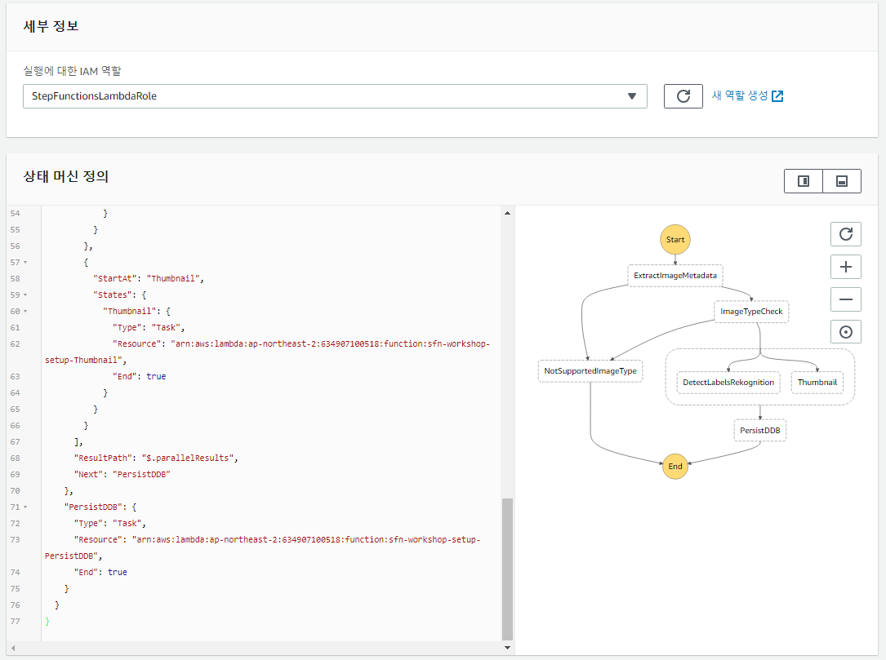
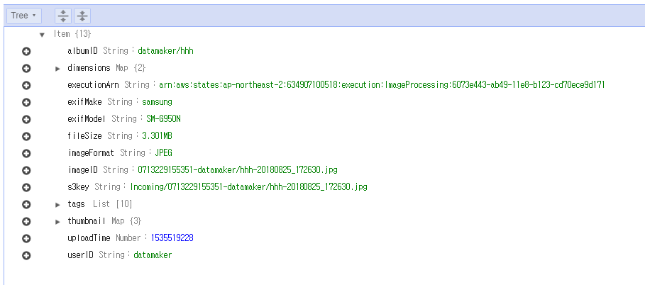

## 4 단계 : 레이블 및 이미지 메타 데이터 생성

이제 상태 머신을 통해 이미지의 섬네일과 메타 데이터 생성 뿐 아니라 이미지 분석(태깅)이 가능하게 되었습니다.


### 4A 단계 : DynamoDB에 메타 데이터를 저장하는 단계 추가

이 부분에서는 다시 JSON을 수동으로 편집 할 것입니다. 이전에 3 단계에서 작성한 JSON으로 이동하여 추가합니다. 여기에서 DynamoDB에 모든 것을 저장하는 람다 함수 `sfn-workshop-setup-PersistDDB`를 실행하기 위해 상태 시스템에 한 단계 더 추가하십시오.

구문에 대한 도움이 필요한 경우 이 설명서를 살펴보세요.

- [작업 상태](https://docs.aws.amazon.com/step-functions/latest/dg/amazon-states-language-task-state.html)
- [Amazon States Language Spec](https://states-language.net/spec.html)

	> 람다 함수의 ARN을 찾으려면 AWS CloudFormation Console에서 **sfn-workshop-setup**스택으로 이동하여 출력 섹션에서 **StoreImageMetadataFunction**을 찾습니다.
	>
	>`arn:aws:lambda:us-west-2:<YOUR-ACCOUNT-ID>:function:sfn-workshop-setup-PersistDDB`와 같이 보일 것입니다.

1. 방금 추가 한 새로운 단계를 Parallel 단계 다음 단계로 만듭니다.

1. 생성 된 JSON을 복사하세요. 문제가 발생하면 이 페이지 하단에서 JSON을 찾으세요.


### 4 단계 : 결과를 테스트하기 위해 AWS 단계 함수 상태 머신 만들기

1. [AWS Step Functions 관리 콘솔](http://console.aws.amazon.com/states/home)로 이동하세요.

1. 'ImageProcessing'상태 머신을 선택하세요. **상태 시스템 편집**을 클릭하세요.

1. 4A 단계에서 생성 한 편집기에서 JSON에 붙여 넣기하세요.

1. **Visual Workflow**옆의 &#x21ba; 아이콘을 클릭하여 상태 시스템의 시각적 표현을 새로 고칩니다.

	

1. **업데이트**를 클릭하고 실행을 시작하세요.


### 4C 단계 : 상태 머신 실행 테스트

1. 지금까지 사용해온 다음 입력을 사용하여 실행을 테스트하세요.

	```JSON
	{
	  "s3Bucket": "FILL_IN_YOUR_VALUE",
	  "s3Key": "tests/1_cactus.jpg"
	}
	```


1. 모든 것이 정상적으로 작동하고 워크 플로가 모든 단계를 성공적으로 수행했는지 확인합니다.

 	

1. DynamoDB 테이블과 그 안에 저장된 항목이 어떤 것인지 확인할 수 있습니다. [Amazon DynamoDB 관리 콘솔](https://console.aws.amazon.com/dynamodb/home?#tables:)으로 이동하세요. 다음 테이블과 비슷한 이름의 테이블이 두 개 있어야합니다.

    - `sfn-workshop-setup-AlbumMetadataDDBTable`
 	- `sfn-workshop-setup-ImageMetadataDDBTable`

1. 'sfn-workshop-setup-ImageMetadataDDBTable`을 클릭하고 **Items**폴더를 클릭하세요. 성공적으로 처리 된 각 이미지에 대해 하나의 항목이 있는지 확인하세요.

 	


1. 항목을 클릭하고 구조를 살펴보세요.

 	


### 최종 JSON
<details>
<summary><strong> JSON 정의를 확장합니다.</strong></summary><p>

```JSON
{
  "StartAt": "ExtractImageMetadata",
  "Comment": "Image Processing State Machine",
  "States": {
    "ExtractImageMetadata": {
      "Type": "Task",
      "Resource": "arn:aws:lambda:us-west-2:012345678901:function:sfn-workshop-setup-ExtractMetadata",
      "Catch": [
        {
          "ErrorEquals": [
            "ImageIdentifyError"
          ],
          "ResultPath": "$.error",
          "Next": "NotSupportedImageType"
        }
      ],
      "ResultPath": "$.extractedMetadata",
      "Next": "ImageTypeCheck"
    },
    "NotSupportedImageType": {
      "Type": "Fail",
      "Cause": "Image type not supported!",
      "Error": "FileNotSupported"
    },
    "ImageTypeCheck": {
      "Type": "Choice",
      "Choices": [
        {
          "Or": [
            {
              "Variable": "$.extractedMetadata.format",
              "StringEquals": "JPEG"
            },
            {
              "Variable": "$.extractedMetadata.format",
              "StringEquals": "PNG"
            }
          ],
          "Next": "Parallel"
        }
      ],
      "Default": "NotSupportedImageType"
    },
    "Parallel": {
      "Type": "Parallel",
      "Branches": [
        {
          "StartAt": "DetectLabelsRekognition",
          "States": {
            "DetectLabelsRekognition": {
              "Type": "Task",
              "Resource": "arn:aws:lambda:us-west-2:012345678901:function:sfn-workshop-setup-DetectLabel",
              "End": true
            }
          }
        },
        {
          "StartAt": "Thumbnail",
          "States": {
            "Thumbnail": {
              "Type": "Task",
              "Resource": "arn:aws:lambda:us-west-2:012345678901:function:sfn-workshop-setup-Thumbnail",
              "End": true
            }
          }
        }
      ],
      "ResultPath": "$.parallelResults",
      "Next": "PersistDDB"
    },
    "PersistDDB": {
      "Type": "Task",
      "Resource": "arn:aws:lambda:us-west-2:012345678901:function:sfn-workshop-setup-PersistDDB",
      "End": true
    }
  }
}
```
</details>

### 다음 단계
이제 [5 단계](step-5.md)로 이동할 준비가 되었습니다!
