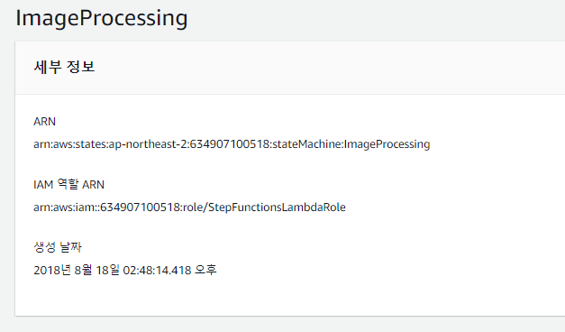
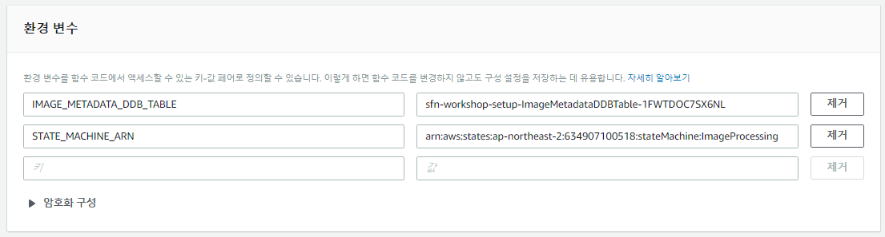
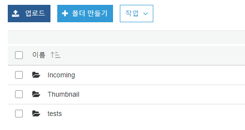
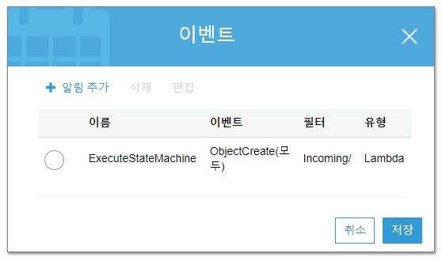
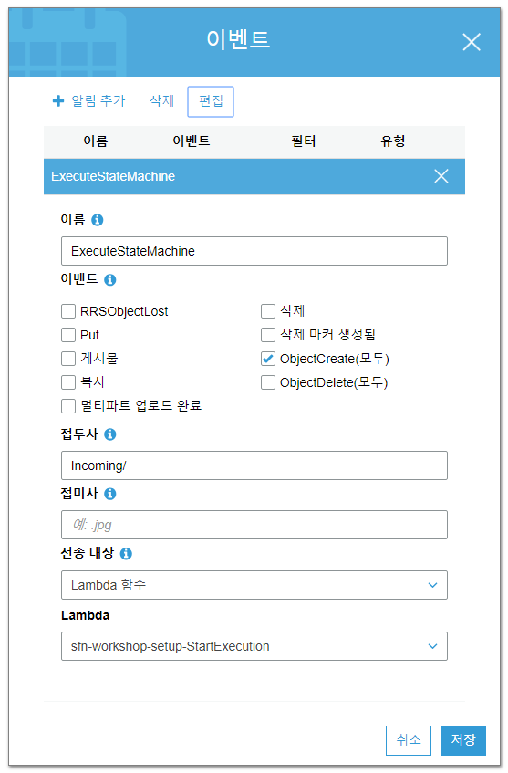
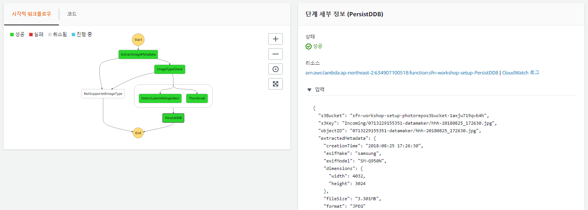

## 5 단계 : S3 이벤트에서 실행 시작

마지막으로 상태 머신이 가동됩니다! 실행을 자동화 할 차례입니다.
이미지가 S3 버킷에 업로드 될 때 상태 머신이 실행 됩니다.

여기에는 두 가지 가능성이 있습니다.

1. CloudWatch Events를 사용하여 S3 버킷의 활동을 모니터링하고 Step Functions을 실행 대상으로 선택합니다.

1. 다음과 같은 람다 함수를 사용합니다. :
	- 상태 머신을 호출합니다.
	- S3 이벤트에 의해 트리거됩니다.

첫번째 단계는 CloudTrail을 활성화해야하기 때문에 몇 가지 추가 구성이 필요합니다. 간결성을 위해 옵션 2를 사용할 것입니다.

### 5A 단계 : StartExecution Lambda 함수는 어떤 상태 머신을 실행할지 결정

1. [AWS Step Functions 관리 콘솔](http://console.aws.amazon.com/states/home)로 이동하세요. AWS Region 선택이 지금까지 작업 한 AWS Region 선택과 일치하는지 확인하세요.

1. 대시 보드에서 상태 머신을 찾습니다. 이전 단계에 대한 지시 사항을 따른 경우 *ImageProcessing* 이어야 합니다.

1. 페이지의 오른쪽 상단 모서리에 있는 **State Machine Arn** 을 찾아서 복사하십시오.

	

1. [AWS Lambda 관리 콘솔](https://console.aws.amazon.com/lambda/home)로 이동하여 이름이 `StartExecution` 으로 끝나는 람다 함수를 찾으세요. 이것이 상태 머신을 트리거하는 것입니다. 해당 이름의 링크를 클릭하여 선택하세요.

1. 실행되는 특정 AWS Step Function 상태 머신은 구성 가능한 환경 변수로 람다 함수에 전달됩니다. **환경 변수** 섹션으로 스크롤하여 `STATE_MACHINE_ARN`의 키값을 찾아 `FILL_WITH_YOUR_VALUE`을 상태 머신의 ARN으로 변경하세요.

	

1. 페이지 상단으로 스크롤 한 다음 **저장**을 클릭하세요.

### 단계 5B : StartExecution 람다 함수를 트리거하도록 S3 이벤트 설정

람다 함수는 이제 우리가 실행시키고자 하는 상태 머신을 알고 있습니다. 이제는 람다 함수를 트리거하는 이벤트를 설정해야합니다. 새 객체가 랜딩 버켓에 업로드 될 때마다 자동으로 실행되기를 원하기 때문에 S3 이벤트에 의해 람다 함수가 트리거되어야합니다.

1. S3 관리 콘솔로 이동하여 랜딩 버킷을 선택하세요.

	```
	sfn-workshop-setup-photorepos3bucket-xxxxxxxxxxxxx
	```

1. **Incoming** 폴더를 만드세요. 

	

1. **속성**탭을 클릭하세요.

1. **이벤트**를 클릭하세요.

	

1. **알림 추가**를 클릭하세요.

1. 다음 매개 변수를 입력하세요.
	- **이름**: ExecuteStateMachine
	- **이벤트**: ObjectCreate(모두)
	- **접두사**: Incoming/
	- **전송 대상**: Lambda Function
	- **Lambda**: sfn-workshop-setup-StartExecution

	>**참고** : 매개 변수는 중요합니다. 즉, 이미지 파일이 "Incoming/" **접두사**로 처리 될 때만 처리 흐름을 트리거하도록 이벤트 트리거를 제한합니다. 썸네일 생성 프로세스는 접두사를 제한하지 않고 동일한 S3 버킷에 썸네일을 업로드하므로 썸네판 업로드는 다른 워크 플로를 트리거하고 무한 루프를 발생시킵니다.

	
	
1. **저장**을 클릭하세요.

### 5C 단계 : S3에 사진을 업로드하여 이벤트 트리거 테스트

이제 이벤트를 테스트 할 준비가되었습니다! S3 버킷 내의 이미지를 "Incoming"폴더에 업로드하고 Step Functions 콘솔에서 실행을 확인하세요!

1. S3 관리 콘솔에서 랜딩 버켓의 'Incoming/'로 이동하여 **업로드**를 클릭하세요. 지원되는 형식 (JPEG 또는 PNG)의 이미지를 선택하세요. **다음**을 클릭하세요.

1. **다음** 및 **업로드**를 클릭하세요.

1. 상태 머신이 트리거되고 성공적으로 실행되는지 확인하세요. DynamoDB에 저장된 쌈네일 및 데이터를 확인합니다.

	


### 다음 단계
이제 [6 단계](step-6.md)로 이동할 준비가 되었습니다!


