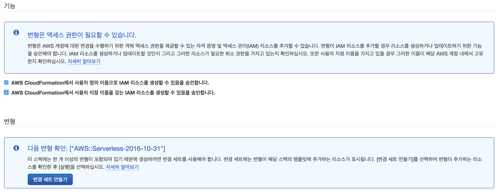
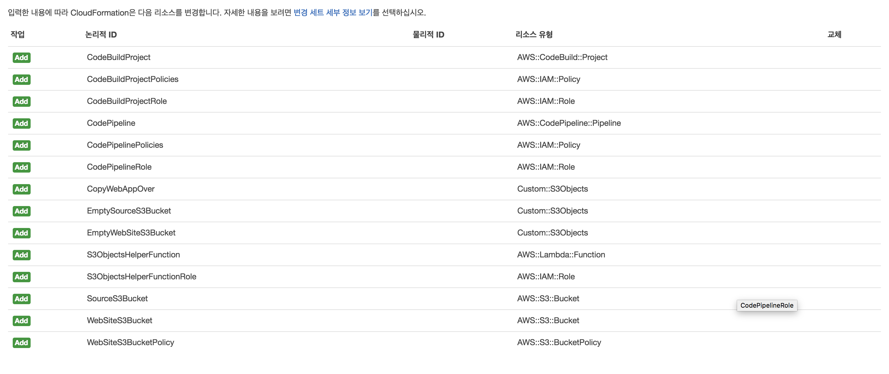
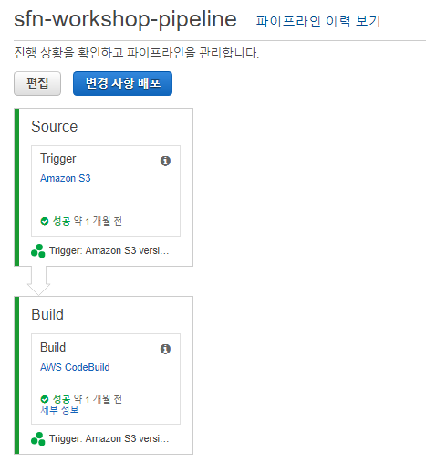
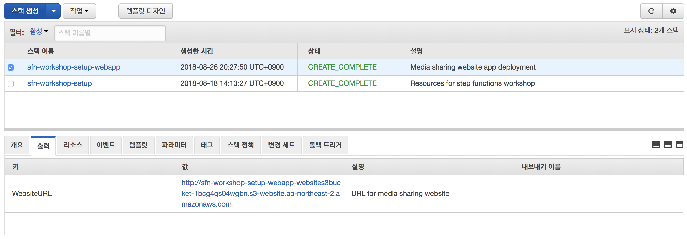
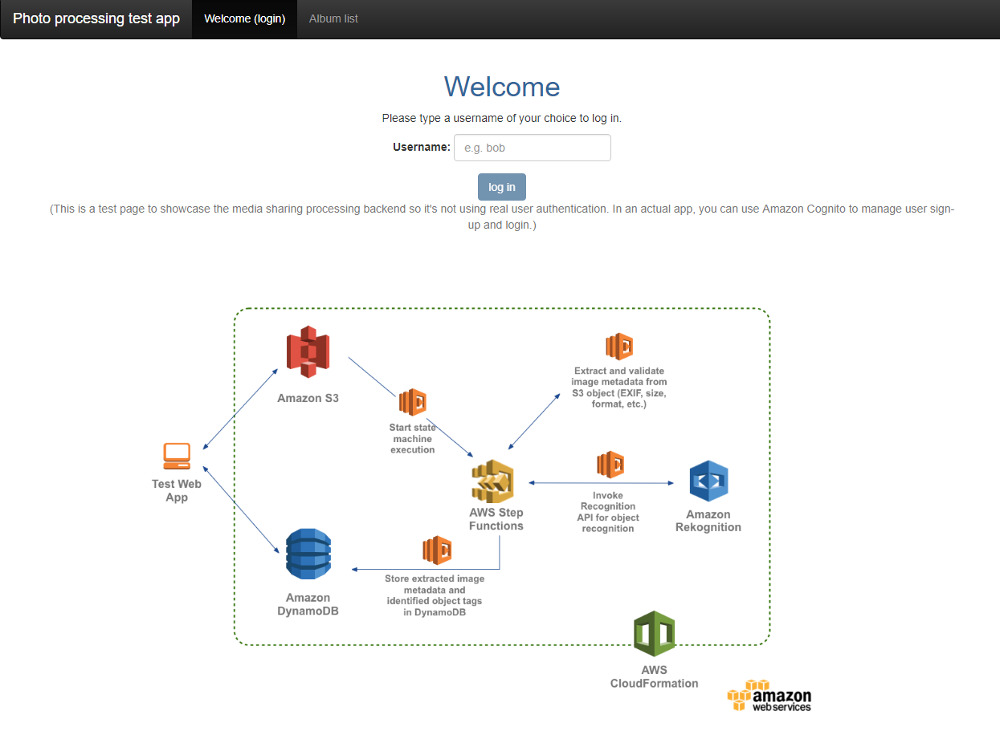
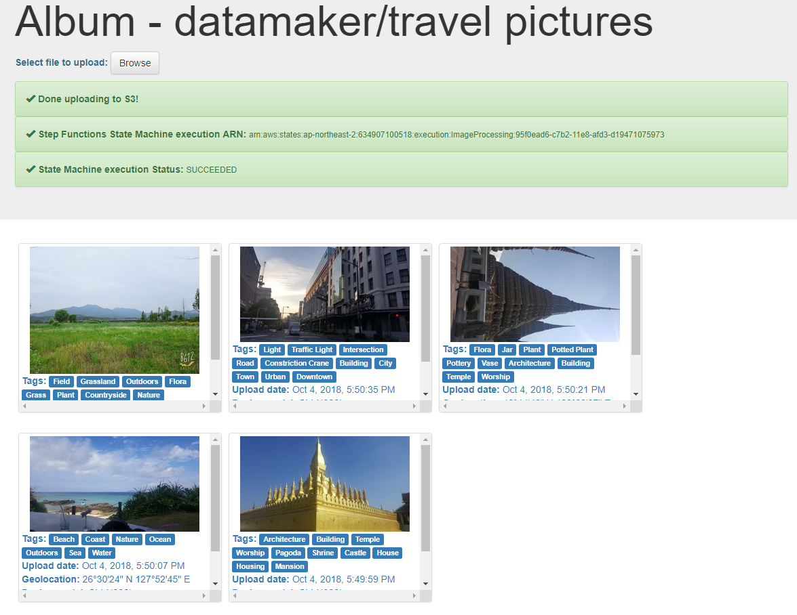

# 6 단계 : 웹 응용 프로그램 빌드 및 실행

처리중인 워크 플로를 확인하기 위해 AngularJS 기반으로 만든 웹사이트를 사용하여 앨범을 만들고 사진을 업로드합니다.

### 6A : 사진 처리 웹 응용 프로그램 설정

핸즈온 테스트를 완료하려면 AngularJS을 기반의 웹사이트에 앨범을 만들고 사진을 업로드하세요.

이 섹션에서는 웹사이트 호스팅을 위해 구성된 S3 버킷에 웹사이트를 패키징하고 배포하기 위해 CloudFormation 템플릿을 사용할 것입니다.

>이 클라우드 템플릿은 AWS CodeBuild 및 AWS CodePipeline을 활용하여 웹사이트 패키징 및 배포를 자동화합니다.

Region| Code | Launch
------|------|-------
서울 | ap-northeast-2 | 

#### CloudFormation 실행 지침

1. 위의 **Launch Stack** 링크를 클릭하세요.

1. 템플릿 선택 페이지에서 **다음**를 클릭하세요.

1. 세부 정보 지정 페이지에서 모든 기본값을 그대로 두고 **다음**을 클릭합니다.

1. 옵션 페이지에서 기본값을 모두 그대로 두고 **다음**을 클릭하세요.

1. 검토 페이지에서 확인란을 선택하여 CloudFormation이 IAM 만들고 **변경 세트 만들기**를 클릭하세요.

	

1. 변경 사항 설정이 완료되면 컴퓨팅 변경 사항을 완료하고 **실행**을 클릭하세요.

	

1. `sfn-workshop-setup-webapp` 스택이 `CREATE_COMPLETE`의 상태에 도달 할 때까지 기다리세요.

	스택을 완료하는 데 1분 정도 걸립니다. 그것의 일부로, 웹 애플리케이션 소스를 대상 버킷으로 복사하고 이것이 배달 pipleline을 트리거합니다.

1. [AWS CodePipeline 관리 콘솔](http://console.aws.amazon.com/codepipeline/home)로 이동하세요. `sfn-workshop-pipeline`으로 식별 된 파이프 라인을 클릭하고 성공적으로 완료되었는지 확인하세요.

	

1. [AWS CloudFormation 관리 콘솔](http://console.aws.amazon.com/cloudformation/home)로 이동하세요. `sfn-workshop-setup-webapp` 스택을 선택하고 **출력** 탭을 클릭하세요. `WebsiteURL` 키는 **웹 브라우저**에서 액세스하기 위한 URL링크를 말합니다.

	

1. 해당 링크를 클릭하여 **웹 브라우저**으로 이동하세요.
**참고 : FireFox, Chrome 웹브라우저를 열어야합니다.**

	

 

### 6B 단계 : 샘플 웹 사이트를 사용하여 종단 간 워크 플로 테스트
##### 로그인
로그인 할 사용자 이름 선택 (실제 사용자 인증을 사용하지 않도록 백엔드를 보여주는 테스트 응용 프로그램입니다. 실제 응용 프로그램에서는 Amazon Cognito를 사용하여 사용자 등록 및 로그인을 관리할 수 있습니다.)

사용자 이름은 업로드 된 이미지의 소유권 메타 데이터를 저장하는데 사용됩니다.

##### 앨범 목록
새 앨범을 만들거나 기존 앨범을 선택하여 이미지를 업로드하세요.

##### 사진 갤러리
다음과 같은 경우 이미지 업로드 및 상태 업데이트보기 :

1. S3 버킷에 업로드가 성공합니다.
1. AWS Step Function 실행이 시작됩니다. 실행 ARN은 UI에 제공되므로 단계 기능 [콘솔](https://console.aws.amazon.com/states/home) 에서 세부 정보를 쉽게 찾을 수 있습니다.
1. AWS Step Function 실행이 완료되었습니다.

단계 함수 실행에서 생성 된 축소판과 함께 추출 된 이미지 메타 데이터 및 인식 된 태그의 샘플 세트가 업로드 된 각 이미지에 대해 표시됩니다.

### 다음 단계 : 리소스 정리

이 핸즈온을 위해 만든 리소스를 정리할 준비가 되면 [리소스 정리](./clean-up.md) 지침을 참조하세요.

