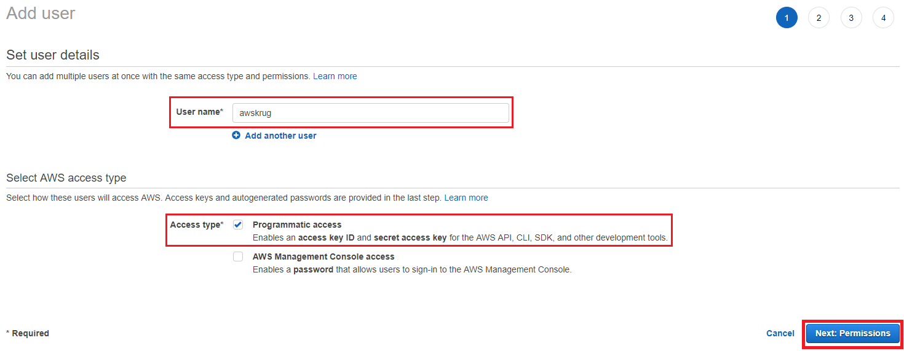
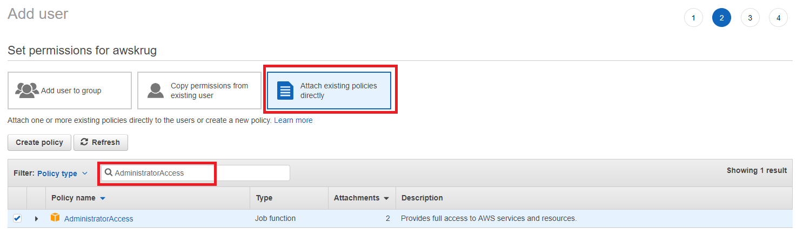
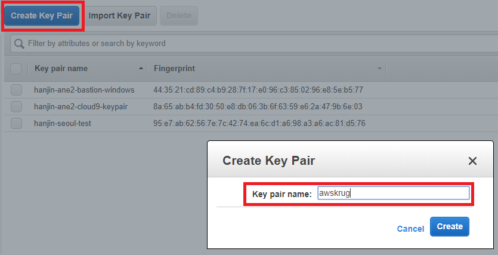
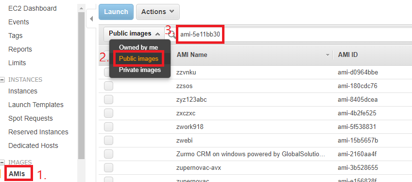
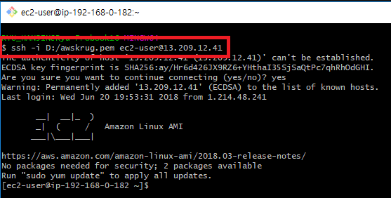
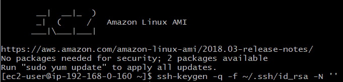
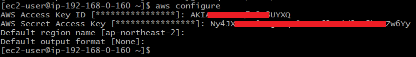
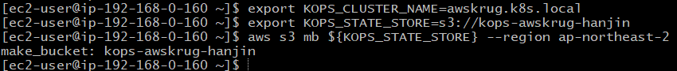
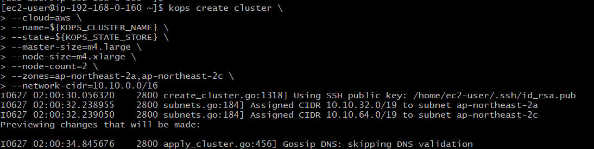

# Kubernetes Hands-on

## Index

<!-- TOC depthFrom:2 depthTo:6 withLinks:1 updateOnSave:1 orderedList:0 -->

* [Bastion](#bastion)
* [Cluster](#cluster)
* [Addons](#addons)
* [Pipeline](#pipeline)

<!-- /TOC -->

### Basic Knowledge

* Kubernetes 를 들어봤다.
* AWS 에 인스턴스를 만들어 봤다.
* SSH 로 접속을 할 수 있다.
* 필요 계정 : AWS
  * https://aws.amazon.com/ko/

## Bastion

### AWS IAM - Access keys

* AWS 객체들을 관리하기 위하여 Access Key 를 발급 받습니다.
* https://console.aws.amazon.com/iam/home?region=ap-northeast-2 를 브라우저에서 엽니다.
* 좌측 메뉴에서 `Users` 를 선택합니다.
* `Add user` 버튼으로 새 사용자를 만듭니다.

* User name 에 `awskrug` 를 입력합니다.
* `Programmatic access` 를 체크합니다.
* `Next: Permissions` 버튼을 눌러 다음 화면으로 이동합니다.

* `Attach existing policies directly` 를 선택합니다.
* `AdministratorAccess` 를 검색하여 선택합니다.
* `Next: Review` 버튼을 눌러 다음 화면으로 이동합니다.
* `Create user` 버튼을 눌러 새 유저를 만듭니다.
* 생성된 Access key ID와 Secret access key 는 실습에 사용하므로 메모장에 복사해둡니다.

Note:
- `발급 받은 키는 유출되지 않도록 잘 관리 해야 합니다.`
- `Administrator` 는 너무 많은 권한을 가지고 있고, 이를 가진 유저 생성은 추천하지 않습니다.
- IAM 의 권한은 다음만 주셔도 됩니다.
  - AmazonEC2FullAccess
  - AmazonRoute53FullAccess
  - AmazonS3FullAccess
  - IAMFullAccess
  - AmazonVPCFullAccess

### AWS EC2 - Key Pairs

* 생성할 Instance 에 접속하기 위하여 프라이빗 키를 발급 받습니다.
* https://ap-northeast-2.console.aws.amazon.com/ec2/v2/home 를 브라우저에서 엽니다.
* 좌측 메뉴에서 `Key Pairs` 를 선택합니다.

* `Create Key Pair` 버튼으로 새 키페어를 생성합니다.
* 이름은 `awskrug` 로 하겠습니다.
* 프라이빗 키 파일을 잘 저장해 둡니다.

Note:
- 파일명은 `awskrug.pem` 일 것 입니다.

### AWS EC2 - Instance

* 빠른 진행을 위하여 필요한 툴이 미리 설치된 AMI 로 부터 인스턴스를 생성 합니다.
* https://ap-northeast-2.console.aws.amazon.com/ec2/v2/home 를 브라우저에서 엽니다.

* 좌측 메뉴에서 `AMIs` 를 선택합니다.
* `Owned by me` 를 `Public images` 로 변경합니다.
* Add filter 에서 `AMI ID:` 를 선택 하고 `ami-021e47ad857e8fccb` 를 입력합니다.
* 검색된 이미지로 `Launch` 를 선택 합니다.
* 기본 값인 `t2.micro` 를 사용 하겠습니다.
* `Next`와 `Review and Launch` 버튼을 눌러 다음 화면으로 이동합니다.
* `Launch` 버튼을 눌러 인스턴스를 생성합니다.
* Select a key pair 에 `awskrug` 가 선택 되었는지 확인합니다.
* 체크 박스를 체크 하고, `Launch Instances` 버튼으로 인스턴스를 생성합니다.

Note:
- 쉽게 찾는 링크
  - https://ap-northeast-2.console.aws.amazon.com/ec2/v2/home?region=ap-northeast-2#Images:visibility=public-images;imageId=ami-021e47ad857e8fccb
- AMI 에 설치된 서비스
  - awscli, kops, kubectl, helm, docker, jenkins-x, openjdk8, maven, nodejs
- CentOS 혹은 Amazon Linux 에서 다음 쉘로 설치 가능 합니다.
  - `curl -sL toast.sh/helper/bastion.sh | bash`

### AWS EC2 - 접속 (Windows 사용자 - Git Bash)

* https://ap-northeast-2.console.aws.amazon.com/ec2/v2/home 를 브라우저에서 엽니다.
* 좌측 메뉴에서 `Instances` 를 선택합니다.
* 방금 만들었던 인스턴스를 선택 합니다.
* `IPv4 Public IP` 에 생성된 `IP` 를 확인 합니다.

* https://git-scm.com/download/win 를 브라우저에서 엽니다.
  * 다운로드 되는 파일을 설치 합니다.



* `Git Bash` 로 인스턴스에 접속 할수 있습니다.
  * `PEM_PATH` 를 다운받은 `awskrug.pem` 파일 경로로 변경 합니다.
  * `PUBLIC_IP` 를 위에서 확인한 `IP` 로 변경하여 접속 합니다.

```bash
chmod 600 PEM_PATH/awskrug.pem
ssh -i PEM_PATH/awskrug.pem ec2-user@PUBLIC_IP
```

### AWS EC2 - 접속 (Windows 사용자 - PuTTY)

* https://ap-northeast-2.console.aws.amazon.com/ec2/v2/home 를 브라우저에서 엽니다.
* 좌측 메뉴에서 `Instances` 를 선택합니다.
* 방금 만들었던 인스턴스를 선택 합니다.
* `IPv4 Public IP` 에 생성된 `IP` 를 확인 합니다.

* https://the.earth.li/~sgtatham/putty/latest/w64/putty-64bit-0.70-installer.msi 를 다운로드 하여 설치 합니다.

* `PuTTYgen` 으로 프라이빗 키를 변환 해야 합니다.
  * `PuTTYgen` 을 시작합니다.
  * `Type of key to generate` 에서 `RSA` 를 선택합니다.
  * `Load` 를 선택합니다. `.pem` 파일을 찾으려면 모든 유형의 파일을 표시하는 옵션을 선택합니다.
  * `awskrug.pem` 을 선택합니다.
  * `Save private key` 버튼을 눌러 저장 합니다.
  * `awskrug.ppk` 가 만들어 졌습니다.

* `PuTTY` 로 인스턴스에 접속 할수 있습니다.
  * `PuTTY` 를 시작합니다.
  * `Category` 창에서 `Session` 을 선택하고 다음 필드를 작성합니다.
  * `Host Name` 에 `ec2-user@` 과 위에서 확인한 `IP` 를 입력 합니다.
  * `Category` 창에서 `Connection` `SSH` 를 확장하고, `Auth` 를 선택 합니다.
  * `Browse` 버튼을 눌러 `awskrug.ppk` 파일을 찾아 선택 합니다.
  * `Open` 버튼을 눌러 접속 합니다.

Note:
- https://docs.aws.amazon.com/ko_kr/AWSEC2/latest/UserGuide/putty.html

### AWS EC2 - 접속 (Mac 사용자)

* https://ap-northeast-2.console.aws.amazon.com/ec2/v2/home 를 브라우저에서 엽니다.
* 좌측 메뉴에서 `Instances` 를 선택합니다.
* 방금 만들었던 인스턴스를 선택 합니다.
* `IPv4 Public IP` 에 생성된 `IP` 를 확인 합니다.

* `Terminal` 로 인스턴스에 접속 할수 있습니다.
  * `PEM_PATH` 를 다운받은 `awskrug.pem` 파일 경로로 변경 합니다.
  * `PUBLIC_IP` 를 위에서 확인한 `IP` 로 변경하여 접속 합니다.

```bash
chmod 600 PEM_PATH/awskrug.pem
ssh -i PEM_PATH/awskrug.pem ec2-user@PUBLIC_IP
```

### SSH Key Gen



* 클러스터를 관리할 ssh-key 를 생성 합니다.

```bash
ssh-keygen -q -f ~/.ssh/id_rsa -N ''
```

Note:
- 클러스터 내에서 서로 접속 하기 위하여 필요 합니다.

### AWS Credentials



* IAM 으로 생성하여 메모장에 복사해둔 Access key ID 와 Secret access key 를 등록합니다.

```bash
aws configure
```

Note:
- AWS 에 객체를 생성하기 위하여 필요 합니다.

## Cluster



* 클러스터 이름을 설정 합니다.
* 클러스터 상태를 저장할 S3 Bucket 을 만들어 줍니다.
* `MY_UNIQUE_ID` 에는 본인의 이름을 넣어 만들어 주세요.

```bash
export KOPS_CLUSTER_NAME=awskrug.k8s.local
export KOPS_STATE_STORE=s3://kops-awskrug-MY_UNIQUE_ID

aws s3 mb ${KOPS_STATE_STORE} --region ap-northeast-2
```

### Create Cluster



* Cloud 는 AWS 를 사용 하겠습니다.
* Master Node 는 `m4.large` 1대로 하겠습니다. (cpu 2 / mem 8)
* Worker Node 는 `m4.xlarge` 2대로 하겠습니다. (cpu 4 / mem 16)

```bash
kops create cluster \
    --cloud=aws \
    --name=${KOPS_CLUSTER_NAME} \
    --state=${KOPS_STATE_STORE} \
    --master-size=m4.large \
    --node-size=m4.xlarge \
    --node-count=2 \
    --zones=ap-northeast-2a,ap-northeast-2c \
    --network-cidr=10.10.0.0/16
```
```
Must specify --yes to apply changes

Cluster configuration has been created.

Suggestions:
 * list clusters with: kops get cluster
 * edit this cluster with: kops edit cluster awskrug.k8s.local
 * edit your node instance group: kops edit ig --name=awskrug.k8s.local nodes
 * edit your master instance group: kops edit ig --name=awskrug.k8s.local master-ap-northeast-2a
```

Note:
- 위 명령을 실행해도 아직 클러스터는 만들어지지 않습니다.
- 저는 Jenkins X 시연을 위하여 m4.xlarge 를 선택 하였습니다.
- https://aws.amazon.com/ko/ec2/pricing/on-demand/

### Update Cluster

* 클러스터를 생성하기 전, 클러스터를 수정 할수 있습니다.

```bash
kops edit cluster --name=${KOPS_CLUSTER_NAME}
```
```yaml
spec:
  docker:
    insecureRegistry: 100.64.0.0/10
    logDriver: ""
```

Note:
- Jenkins X 를 구성한다면, 위 내용을 추가 해야 합니다.
- 여러분은 하지 않으셔도 상관 없습니다.

### Create Cluster

* `kops update` 명령에 `--yes` 옵션으로 실제 클러스터가 생성 됩니다.

```bash
kops update cluster --name=${KOPS_CLUSTER_NAME} --yes
```
```
Cluster is starting.  It should be ready in a few minutes.

Suggestions:
 * validate cluster: kops validate cluster
 * list nodes: kubectl get nodes --show-labels
 * ssh to the master: ssh -i ~/.ssh/id_rsa admin@api.awskrug.k8s.local
```

Note:
- VPC, Instance, ELB, Auto Scaling Group 에 관련 객체들이 생성됩니다.
- 클러스터 생성 완료까지 `10분` 정도 소요 됩니다.

### Validate Cluster

* `kops validate` 명령으로 생성이 완료 되었는지 확인 할수 있습니다.

```bash
kops validate cluster --name=${KOPS_CLUSTER_NAME}
```
```
Validating cluster awskrug.k8s.local

INSTANCE GROUPS
NAME                   ROLE   MACHINETYPE MIN MAX SUBNETS
master-ap-northeast-2a Master m4.large    1   1   ap-northeast-2a
nodes                  Node   m4.xlarge   2   2   ap-northeast-2a,ap-northeast-2c

NODE STATUS
NAME                                           ROLE   READY
ip-10-10-10-10.ap-northeast-2.compute.internal master True
ip-10-10-10-11.ap-northeast-2.compute.internal node   True
ip-10-10-10-12.ap-northeast-2.compute.internal node   True

Your cluster awskrug.k8s.local is ready
```

### kubectl

* 생성이 완료 되었으면, 다음 명령으로 정보를 조회 할수 있습니다.

```bash
kubectl get node

kubectl get node,deploy,pod,svc --all-namespaces

kubectl get deploy,pod,svc -n kube-system
kubectl get deploy,pod,svc -n default
```

Note:
- 모든 네임스페이스 혹은 지정한 네임스페이스 객체를 조회 할수 있습니다.
- https://kubernetes.io/docs/tasks/

### Sample

* 샘플 웹을 생성해 봅니다.

```bash
kubectl apply -f https://raw.githubusercontent.com/nalbam/kubernetes/master/sample/sample-node-ing.yml

kubectl apply -f https://raw.githubusercontent.com/nalbam/kubernetes/master/sample/sample-web-ing.yml
```
```
deployment.apps "sample-node" created
service "sample-node" created
ingress.extensions "sample-node" created

deployment.apps "sample-web" created
service "sample-web" created
ingress.extensions "sample-web" created
```
```bash
kubectl get pod,svc -o wide -n default
```

* Pod 와 Service 가 만들어졌고, AWS 에서 만들었으므로 ELB 도 생겼습니다.
  * https://ap-northeast-2.console.aws.amazon.com/ec2/v2/home?region=ap-northeast-2#LoadBalancers

Note:
- ELB 가 구분 되지 않으면, `Tags` 를 확인해 봅니다.

## Addons

### Dashboard

* 웹 UI 를 통하여 정보와 상태를 볼수 있도록 Dashboard 를 올려 보겠습니다.

```bash
kubectl apply -f https://raw.githubusercontent.com/nalbam/kubernetes/master/addons/dashboard-v1.8.3.yml
```
```
secret "kubernetes-dashboard-certs" created
serviceaccount "kubernetes-dashboard" created
role.rbac.authorization.k8s.io "kubernetes-dashboard-minimal" created
rolebinding.rbac.authorization.k8s.io "kubernetes-dashboard-minimal" created
deployment.apps "kubernetes-dashboard" created
service "kubernetes-dashboard" created
```
```bash
kubectl get svc -o wide -n kube-system
```

* 생성된 ELB 로 접속 할수 있습니다.
  * https://ap-northeast-2.console.aws.amazon.com/ec2/v2/home?region=ap-northeast-2#LoadBalancers
* ELB 의 `DNS name` 에 `https://` 를 붙여서 접속 해야 합니다.

* 서버인증서가 없어 사이트가 안전하지 않다고 하지만 이동 하도록 하겠습니다.

* dashboard 에 접속 하기 위해 `ServiceAccount` 와 `Role` 이 필요 합니다.

* `kube-system` 네임스페이스에 `admin` 유저를 만들겠습니다.

```bash
kubectl create serviceaccount admin -n kube-system
```
```
serviceaccount "admin" created
```

* `cluster-admin` 권한을 부여 하겠습니다.

```bash
kubectl create clusterrolebinding cluster-admin:kube-system:admin --clusterrole=cluster-admin --serviceaccount=kube-system:admin
```
```
clusterrolebinding.rbac.authorization.k8s.io "cluster-admin:kube-system:admin" created
```

* 로그인은 `Token` 을 사용 하겠습니다.
* `Secret` 에서 `admin-token` 을 조회 해서 붙여 넣습니다.

```bash
kubectl describe secret $(kubectl get secret -n kube-system | grep admin-token | awk '{print $1}') -n kube-system
```

Note:
- https://github.com/kubernetes/dashboard/

### Heapster

* 대시보드 로는 충분한 정보를 볼수 잆습니다. 예를 들면 CPU, Memory...
* 힙스터를 설치하고 잠시 기다리면 정보가 수집되고, 대시보드에 보여집니다.

```bash
kubectl apply -f https://raw.githubusercontent.com/nalbam/kubernetes/master/addons/heapster-v1.7.0.yml
```
```
deployment.extensions "heapster" created
service "heapster" created
serviceaccount "heapster" created
clusterrolebinding.rbac.authorization.k8s.io "heapster" created
role.rbac.authorization.k8s.io "system:pod-nanny" created
rolebinding.rbac.authorization.k8s.io "heapster-binding" created
```

* 잠시후 Heapster 가 정보를 수집하면 Dashboard 에 관련 정보를 추가로 볼수 있습니다.
* 또한, CLI 로도 조회가 가능 합니다.

```bash
kubectl top pod --all-namespaces

kubectl top pod -n kube-system
kubectl top pod -n default
```

Note:
- 힙스터는 현재 `DEPRECATED` 되었습니다.
- https://github.com/kubernetes/heapster/

## Pipeline

* https://jenkins-x.io/
* https://github.com/jenkins-x/jx

### Jenkins X

* Jenkins X 를 설치 합니다.
* 설치중 메세지가 화면에 잘 보이지 않을수 있습니다.

```bash
jx install --provider=aws
```

* git 에서 사용할 `user name` 을 입력해 줍니다.
* git 에서 사용할 `email` 을 입력해 줍니다.

```
? Please enter the name you wish to use with git:
? Please enter the email address you wish to use with git:
```

* `ingress controller` 를 설치 하겠습니다.

```
? No existing ingress controller found in the kube-system namespace, shall we install one? [? for help] (Y/n)
```

* ELB 도메인을 이용하여 IP 를 얻도록 하겠습니다.

```
? Would you like wait and resolve this address to an IP address and use it for the domain? [? for help] (Y/n)
```

* ELB 의 IP 를 이용한 nio.io 도메인을 이용 합니다.

```
? Domain [? for help] (0.0.0.0.nip.io)
```

* Github user name 에 본인의 계정을 입력합니다.

```
? GitHub user name:
```

* API Token 입력을 위하여 제시된 주소를 브라우저에서 엽니다.
* `Token description` 에 토큰 이름을 넣습니다.
* `Generate token` 버튼을 눌러 토큰을 만듭니다.
* `토큰 복사/붙여넣기 하면서 토큰 문자열 앞의 공백에 주의해 주세요.`

```
Please click this URL https://github.com/settings/tokens/new?scopes=repo,read:user,user:email,write:repo_hook
Then COPY the token and enter in into the form below:

? API Token:
```

* Jenkins 를 생성하고, Jenkins 주소가 나타날 것입니다.
* 아이디 `admin` 과 제시된 비밀번호를 입력해 주세요.
* `Show API Token` 버튼을 눌러 키를 합니다. 그리고 화면에 붙여 넣습니다.

```
Please go to http://jenkins.jx.0.0.0.0.nip.io/me/configure and click Show API Token to get your API Token
Then COPY the token and enter in into the form below:

? API Token:
```

* `staging` 과 `production` 관리 repo 를 저장할 계정을 선택 합니다.

```
To import existing projects into Jenkins:     jx import
To create a new Spring Boot microservice:       jx create spring -d web -d actuator
To create a new microservice from a quickstart: jx create quickstart
```

* 이제 Jenkins X 설치가 완료 되었습니다.

* `environment` 빌드가 완료 될때 까지 잠시 기다려 주세요.

```bash
jx get pipelines
```

### Create Project

* 프로젝트를 생성합니다.

```bash
# spring boot
jx create spring -d web -d actuator

# or

# quickstart
jx create quickstart
```
```
? Language: java
? Group: com.example
? Artifact: demo
? Do you wish to use nalbam as the git user name: Yes
? Would you like to initialise git now? Yes

Initialized empty Git repository in /home/ec2-user/demo/.git/
```
```
Pushed git repository to https://github.com/nalbam/demo

Created Jenkins Project: http://jenkins.jx.0.0.0.0.nip.io/job/nalbam/job/demo/

Watch pipeline activity via:    jx get activity -f demo -w
Browse the pipeline log via:    jx get build logs nalbam/demo/master
Open the Jenkins console via    jx console
You can list the pipelines via: jx get pipelines
When the pipeline is complete:  jx get applications
```

* Github 에 프로젝트가 생성 되었고, `master` Branch 의 빌드가 진행 중 입니다.
* 로그를 보며 완료 되길 기다립니다.

```bash
jx get activity -w
```

Note:
- 빌드가 완료 되면, `staging` 환경에 배포되어 결과를 확인 할수 있습니다.
- 최초 빌드 이므로 `10분` 정도 소요 됩니다.

### Pull Request

* Branch 를 만들어 줍니다.
* 약간의 소스를 수정 하고 `Pull Request` 를 보내봅니다.
* `PR-1` 빌드가 시작 되었습니다.

```bash
jx get activity -w
```

* 빌드가 완료되면, Pull Request 에 `preview` 링크가 덧글로 등록 됩니다.

Note:
- https://github.com/nalbam/demo/pull/1

### PR Merge

* PR 을 merge 하면, `master` Branch 의 빌드가 진행 됩니다.

* 빌드가 완료 되면, `staging` 환경에 배포되어 결과를 확인 할수 있습니다.

### Production

* `production` 환경에 배포하기 위하여 다음의 명령을 실행 합니다.

```bash
jx promote demo -v 0.0.2 -e production
```

* Github user name 과 password 가 필요 합니다.

* 배포가 완료 되면, 다음 명령어로 결과를 확인 할수 있습니다.

```bash
jx get applications
```

## Clean Up

* Kubernetes Cluster 를 지웁니다.

```bash
kops delete cluster --name=${KOPS_CLUSTER_NAME} --yes
```

* EC2 Instance 를 지웁니다.
  * https://ap-northeast-2.console.aws.amazon.com/ec2/v2/home?region=ap-northeast-2#Instances

* EC2 Key Pair 를 지웁니다.
  * https://ap-northeast-2.console.aws.amazon.com/ec2/v2/home?region=ap-northeast-2#KeyPairs

* IAM User 를 지웁니다.
  * https://console.aws.amazon.com/iam/home?region=ap-northeast-2#/users

* Github 토큰을 지웁니다.
  * https://github.com/settings/tokens

## Thank You
