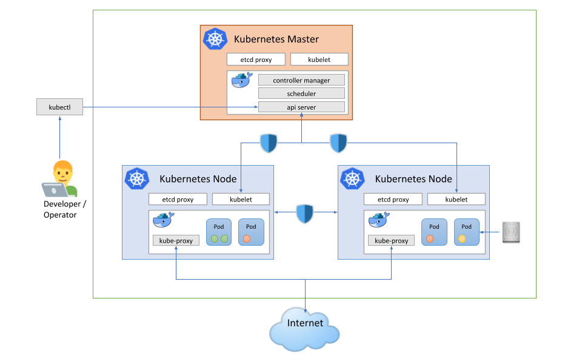
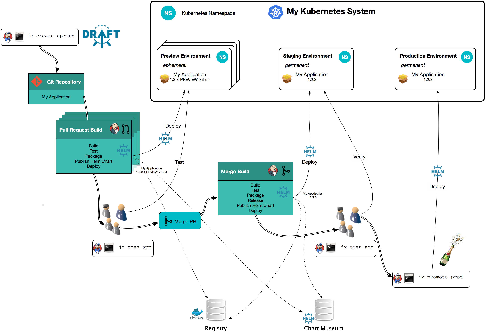

## Kubernetes

and

## Jenkins X

#### 유정열 (awskrug)

Note:
- 저는 아마존사용자그룹의 유정열 입니다.
- 이번 세션에서는 아마존 클라우드 위에서 쿠버네티스 클러스터 구성하는 방법과
- 젠킨스엑스 에 관하여 이야기 해보려합니다.

<!--s-->

## Kubernetes

* 컨테이너 작업을 자동화하는 오픈소스 플랫폼 <!-- .element: class="fragment" -->
* Container Orchestration <!-- .element: class="fragment" -->
* Cluster <!-- .element: class="fragment" -->
  * Master <!-- .element: class="fragment" -->
  * Node <!-- .element: class="fragment" -->

Note:
- 먼저 쿠버네티스는 컨테이너 작업을 자동화하는 오픈소스 플랫폼입니다.
- 컨테이너 오케스트레이션은 컨테이너 배치 최적화를 의미 합니다.
- 또한 로드밸런싱, 디스커버리, 장애 복구, 외부에 서비스를 제공을 지원 합니다.
- 쿠버네티스 클러스터는 마스터 와 노드 로 구성 됩니다.

<!--v-->

Note:
- 제일 기본적인 구성인 한개의 마스터와 두개의 노드로 구성된 클러스터 입니다.
- 마스터에서는 API Server 를 동하여 정보를 제공하고.
- Controller 와 Scheduler 로 Node 의 객체를 관리합니다.
- 노드에는 한개이상의 컨테이너가 Pod 로 감싸져서 배포가 되고
- Service 를 통하여 Pod 를 Discovery 하고 LoadBalancing 을 합니다.
- 이 서비스는 Kube-proxy 및 Ingress 설정에 따라 외부로 서비스 될수 있습니다.
- 이뿐 아니라 ConfigMap, Secret, Account, Role 등도 지원 합니다.

<!--v-->

https://kubernetes.io/

https://github.com/kubernetes/kubernetes

Note:
- 더 자세한 내용은 해당 주소에서 찾아보실수 있습니다.

<!--s-->

## KOPS

* Kubernetes Operations <!-- .element: class="fragment" -->
* Kubernetes Cluster 를 구성하는 제일 쉬운 방법 <!-- .element: class="fragment" -->
* AWS 공식 지원 <!-- .element: class="fragment" -->
* GCE 베타 지원 <!-- .element: class="fragment" -->

Note:
- 쿠버네티스 오페레이션의 약자입니다.
- 간단한 명령어로 Kubernetes Cluster 를 구성 할수 있습니다.
- 아마존 클라우드는 현재 공식 지원하고 있고
- 구글 클라우드는 베타 지원 상태 입니다.

<!--v-->

Note:
- 아마존 클라우드를 예를 들어 VPC, Subnet, Security Group 을 생성하고
- Auto Scaling Group 으로 EC2 인스턴스를 생성하여 Master 와 Node 를 구성 합니다.
- 또한 Route53 과 ELB 를 통하여 외부에 서비스를 제공 합니다.

<!--v-->

https://github.com/kubernetes/kops

Note:
- 더 자세한 내용은 해당 주소에서 찾아보실수 있습니다.

<!--s-->

## Jenkins X

* Pipeline <!-- .element: class="fragment" -->
  * Automated CI and CD
* Environments <!-- .element: class="fragment" -->
  * Environment Promotion via GitOps
* Preview Environments <!-- .element: class="fragment" -->
  * Pull Request Preview Environments
* Feedback <!-- .element: class="fragment" -->
  * Feedback on Issues and Pull Requests

Note:
- Jenkins X 는 쿠버네티스를 위한 빌드/배포 클랫폼입니다.
- 자동화된 CI/CD 파이프라인을 구성 하도록 해주며
- GitOps 를 통하여 staging, production 등 여러 환경에 배포할수 있도록 해줍니다.
- Git 의 Pull Request 가 접수되면 Preview 환경에 배포하여 테스트 할수 있게 해주고.
- Issues 와 PR 을 통하여 Feedback 을 받아 다은 프로세스를 진행 합니다.

<!--v-->

Note:
- Jenkins X 의 파이프라인을 간략화한 그립입니다. 보기엔 복잡해 보이지만 알고보면 어렵지 않습니다.
- 어떤 서비스를 생성 하여 깃에 올리고, 수정하여 Pull Request 를 보내게 되면
- Jenkins X 는 Webhook 을 받아 빌드하여 임시버전을 Preview 환경에 배포합니다.
- 개발자 혹은 테스터가 PR 의 Comment 에 등록된 주소를 통하여 확인 후, Merge 를 하면
- 다시 빌드 하여 정식 할당된 버전을 Staging 환경에 배포 합니다.
- 이때 이미지는 내장된 Registry 로, 버전관리는 Helm 을 사용하여 관리합니다. 
- 테스터는 Staging 환경에 배포된 서비스를 테스트하고 이상이 없으면
- Production 환경에 배포 하게 됩니다.

<!--v-->

https://jenkins-x.io/

https://github.com/jenkins-x

Note:
- 더 자세한 내용은 해당 주소에서 찾아보실수 있습니다.

<!--s-->

## Hands-on

* Kubernetes Cluster with KOPS <!-- .element: class="fragment" -->
* Jenkins X Pipeline <!-- .element: class="fragment" -->

Note:
- 이번 시간에 설명했던 내용들을 오늘 오후 핸즈온을 통하여 실습 해보실수 있습니다.
- KOPS 를 이용하여 AWS 에 Kubernetes Cluster 를 구성해 보며
- 남은 시간에 따라 Jenkins X Pipeline 시연을 합니다.

<!--v-->

### Room E2 <!-- .element: class="fragment" -->

### 15:30 ~ 17:20 <!-- .element: class="fragment" -->

Note:
- Room E2 에서
- 오후 3시 30분 부터 5시 20분가지 진행 됩니다.

<!--s-->

## Thank You
