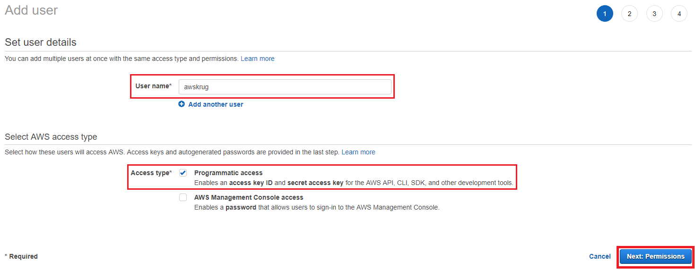
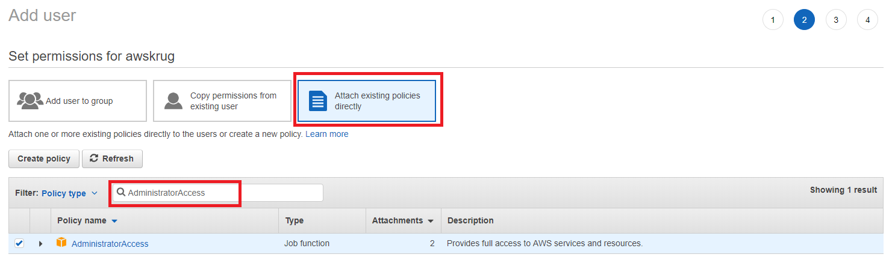
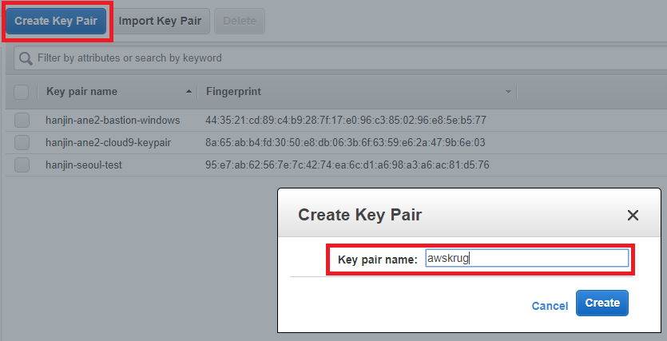
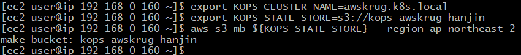

# Kubernetes Hands-on

## Bastion

### AWS IAM - Access keys

* AWS 객체들을 관리하기 위하여 Access Key 를 발급 받습니다.
* <https://console.aws.amazon.com/iam/home?region=ap-northeast-2> 를 브라우저에서 엽니다.
* 좌측 메뉴에서 `Users` 를 선택합니다.
* `Add user` 버튼으로 새 사용자를 만듭니다.



* User name 에 `awskrug` 를 입력합니다.
* `Programmatic access` 를 체크합니다.
* `Next: Permissions` 버튼을 눌러 다음 화면으로 이동합니다.



* `Attach existing policies directly` 를 선택합니다.
* `AdministratorAccess` 를 검색하여 선택합니다.
* `Next: Review` 버튼을 눌러 다음 화면으로 이동합니다.
* `Create user` 버튼을 눌러 새 유저를 만듭니다.
* 생성된 Access key ID와 Secret access key 는 실습에 사용하므로 메모장에 복사해둡니다.

Note:

* `발급 받은 키는 유출되지 않도록 잘 관리 해야 합니다.`
* `Administrator` 는 너무 많은 권한을 가지고 있고, 이를 가진 유저 생성은 추천하지 않습니다.
* IAM 의 권한은 다음만 주셔도 됩니다.
  * AmazonEC2FullAccess
  * AmazonRoute53FullAccess
  * AmazonS3FullAccess
  * IAMFullAccess
  * AmazonVPCFullAccess

### AWS EC2 - Key Pairs

* 생성할 Instance 에 접속하기 위하여 프라이빗 키를 발급 받습니다.
* <https://ap-northeast-2.console.aws.amazon.com/ec2/v2/home> 를 브라우저에서 엽니다.
* 좌측 메뉴에서 `Key Pairs` 를 선택합니다.



* `Create Key Pair` 버튼으로 새 키페어를 생성합니다.
* 이름은 `awskrug` 로 하겠습니다.
* 프라이빗 키 파일을 잘 저장해 둡니다.

Note:

* 파일명은 `awskrug.pem` 일 것 입니다.

### AWS EC2 - Instance

* 빠른 진행을 위하여 필요한 툴이 미리 설치된 AMI 로 부터 인스턴스를 생성 합니다.
* <https://ap-northeast-2.console.aws.amazon.com/ec2/v2/home> 를 브라우저에서 엽니다.


* 좌측 메뉴에서 `AMIs` 를 선택합니다.
* `Owned by me` 를 `Public images` 로 변경합니다.
* Add filter 에서 `AMI ID:` 를 선택 하고 `ami-0fade7d6d32c285f4` 를 입력합니다.
* 검색된 이미지로 `Launch` 를 선택 합니다.
* 기본 값인 `t2.micro` 를 사용 하겠습니다.
* `Next`와 `Review and Launch` 버튼을 눌러 다음 화면으로 이동합니다.
* `Launch` 버튼을 눌러 인스턴스를 생성합니다.
* Select a key pair 에 `awskrug` 가 선택 되었는지 확인합니다.
* 체크 박스를 체크 하고, `Launch Instances` 버튼으로 인스턴스를 생성합니다.

Note:

* 쉽게 찾는 링크
  * <https://ap-northeast-2.console.aws.amazon.com/ec2/v2/home?region=ap-northeast-2#Images:visibility=public-images;imageId=ami-0fade7d6d32c285f4>
* AMI 에 설치된 서비스
  * awscli, kops, kubectl, helm, docker, jenkins-x, openjdk8, maven, nodejs
* CentOS 혹은 Amazon Linux 에서 다음 쉘로 설치 가능 합니다.
  * `curl -sL toast.sh/helper/bastion.sh | bash`

### AWS EC2 - 접속 (Windows 사용자 - Git Bash)

* <https://ap-northeast-2.console.aws.amazon.com/ec2/v2/home> 를 브라우저에서 엽니다.
* 좌측 메뉴에서 `Instances` 를 선택합니다.
* 방금 만들었던 인스턴스를 선택 합니다.
* `IPv4 Public IP` 에 생성된 `IP` 를 확인 합니다.

* <https://git-scm.com/download/win> 를 브라우저에서 엽니다.
  * 다운로드 되는 파일을 설치 합니다.


* `Git Bash` 로 인스턴스에 접속 할수 있습니다.
  * `PEM_PATH` 를 다운받은 `awskrug.pem` 파일 경로로 변경 합니다.
  * `PUBLIC_IP` 를 위에서 확인한 `IP` 로 변경하여 접속 합니다.

```bash
chmod 600 PEM_PATH/awskrug.pem
ssh -i PEM_PATH/awskrug.pem ec2-user@PUBLIC_IP
```

### AWS EC2 - 접속 (Windows 사용자 - PuTTY)

* <https://ap-northeast-2.console.aws.amazon.com/ec2/v2/home> 를 브라우저에서 엽니다.
* 좌측 메뉴에서 `Instances` 를 선택합니다.
* 방금 만들었던 인스턴스를 선택 합니다.
* `IPv4 Public IP` 에 생성된 `IP` 를 확인 합니다.

* <https://the.earth.li/~sgtatham/putty/latest/w64/putty-64bit-0.70-installer.msi> 를 다운로드 하여 설치 합니다.

* `PuTTYgen` 으로 프라이빗 키를 변환 해야 합니다.
  * `PuTTYgen` 을 시작합니다.
  * `Type of key to generate` 에서 `RSA` 를 선택합니다.
  * `Load` 를 선택합니다. `.pem` 파일을 찾으려면 모든 유형의 파일을 표시하는 옵션을 선택합니다.
  * `awskrug.pem` 을 선택합니다.
  * `Save private key` 버튼을 눌러 저장 합니다.
  * `awskrug.ppk` 가 만들어 졌습니다.

* `PuTTY` 로 인스턴스에 접속 할수 있습니다.
  * `PuTTY` 를 시작합니다.
  * `Category` 창에서 `Session` 을 선택하고 다음 필드를 작성합니다.
  * `Host Name` 에 `ec2-user@` 과 위에서 확인한 `IP` 를 입력 합니다.
  * `Category` 창에서 `Connection` `SSH` 를 확장하고, `Auth` 를 선택 합니다.
  * `Browse` 버튼을 눌러 `awskrug.ppk` 파일을 찾아 선택 합니다.
  * `Open` 버튼을 눌러 접속 합니다.

Note:

* <https://docs.aws.amazon.com/ko_kr/AWSEC2/latest/UserGuide/putty.html>

### AWS EC2 - 접속 (Mac 사용자)

* <https://ap-northeast-2.console.aws.amazon.com/ec2/v2/home> 를 브라우저에서 엽니다.
* 좌측 메뉴에서 `Instances` 를 선택합니다.
* 방금 만들었던 인스턴스를 선택 합니다.
* `IPv4 Public IP` 에 생성된 `IP` 를 확인 합니다.

* `Terminal` 로 인스턴스에 접속 할수 있습니다.
  * `PEM_PATH` 를 다운받은 `awskrug.pem` 파일 경로로 변경 합니다.
  * `PUBLIC_IP` 를 위에서 확인한 `IP` 로 변경하여 접속 합니다.

```bash
chmod 600 PEM_PATH/awskrug.pem
ssh -i PEM_PATH/awskrug.pem ec2-user@PUBLIC_IP
```

### AWS Credentials


* IAM 으로 생성하여 메모장에 복사해둔 Access key ID 와 Secret access key 를 등록합니다.

```bash
aws configure
```

## Cluster



* 클러스터 이름을 설정 합니다.
* 클러스터 상태를 저장할 S3 Bucket 을 만들어 줍니다.
* `MY_UNIQUE_ID` 에는 본인의 아이디를 넣어 만들어 주세요.

```bash
export KOPS_CLUSTER_NAME=awskrug.k8s.local
export KOPS_STATE_STORE=s3://kops-awskrug-MY_UNIQUE_ID
```

## Clean Up

* Kubernetes Cluster 를 지웁니다.

```bash
kops delete cluster --name=${KOPS_CLUSTER_NAME} --yes
```

* EC2 Instance 를 지웁니다.
  * <https://ap-northeast-2.console.aws.amazon.com/ec2/v2/home?region=ap-northeast-2#Instances>

* EC2 Key Pair 를 지웁니다.
  * <https://ap-northeast-2.console.aws.amazon.com/ec2/v2/home?region=ap-northeast-2#KeyPairs>

* IAM User 를 지웁니다.
  * <https://console.aws.amazon.com/iam/home?region=ap-northeast-2#/users>

* Github 토큰을 지웁니다.
  * <https://github.com/settings/tokens>
