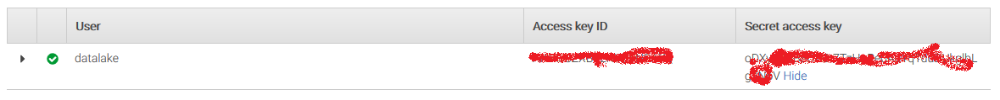
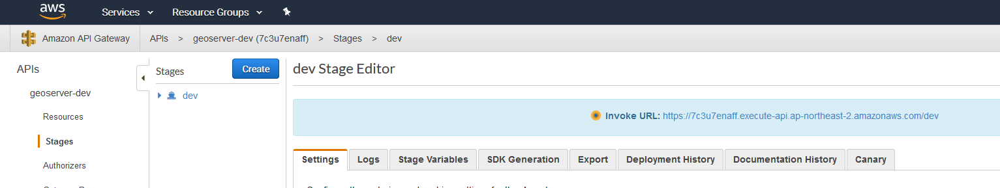
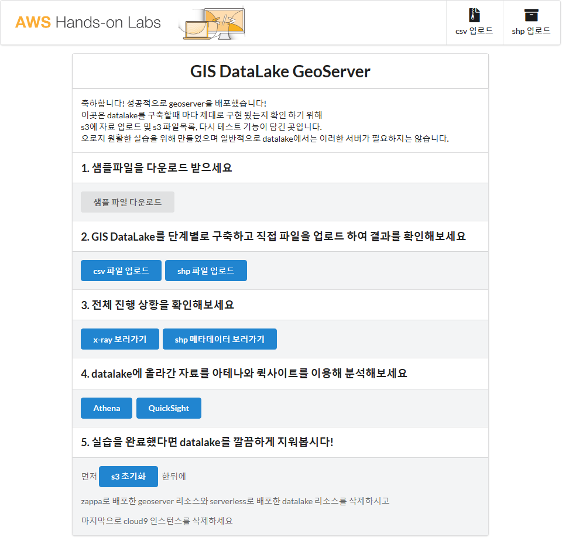
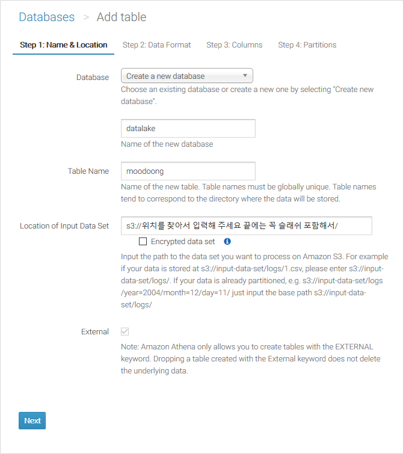
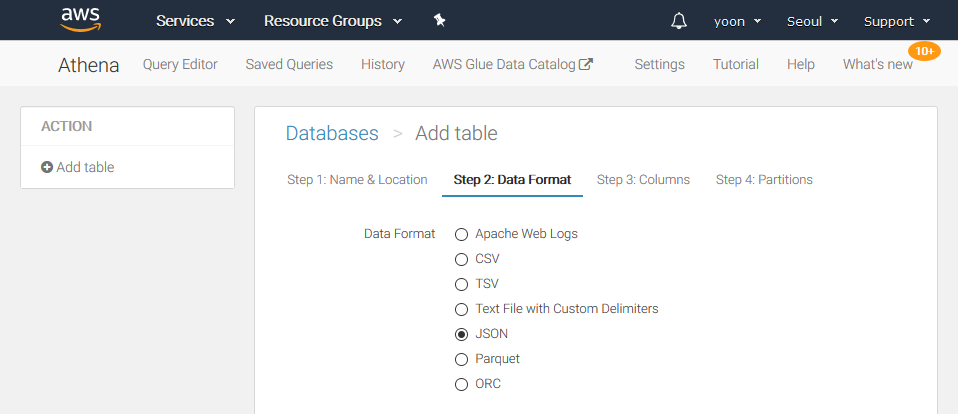
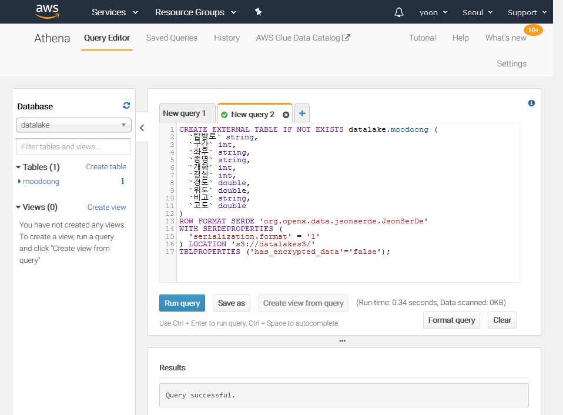
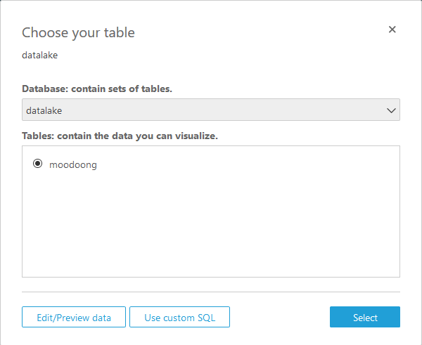
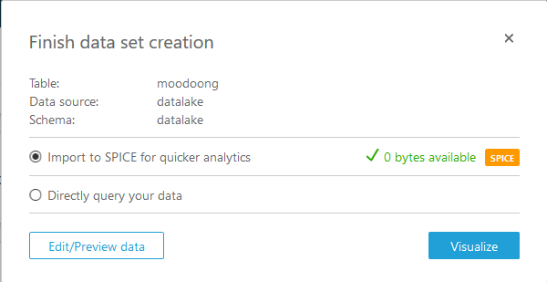
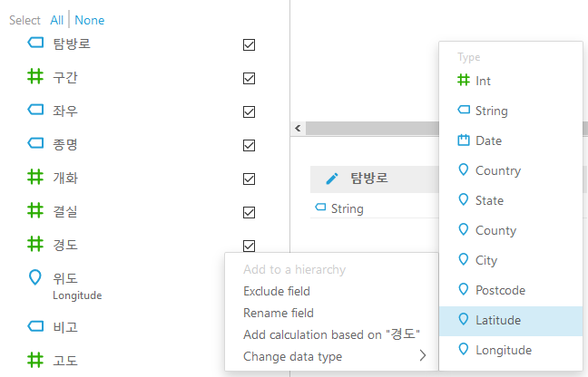

# Serverless datalake : AWSKRUG Serverless hands-on #3

오늘 구축할 구성


## 목차
* 개발환경 설정(IAM, Cloud9)
* geoserver 배포
* datalake 배포
* Athena 와 QuickSight 데이터 분석 맛보기
* Cleanup

## 개발환경 설정
* Cloud9 구성
* 계정 생성
* 계정 설정

### Cloud9 생성

1. [Web Console](https://console.aws.amazon.com)을 열고,
    우측 상단에 리전을 `싱가포르(ap-southeast-1)` 으로 선택
   
    

2. `Service` 에서 `Cloud9` 을 입력 후 아래 목록을 클릭하거나,
    [Cloud9 Console](https://console.aws.amazon.com/cloud9/home?region=ap-southeast-1#)을 열어도 됩니다.
   
    

3. `Create Environment` 클릭
   
    

4. `Name` 에 `awskrug` 입력 후 `Next step` 클릭

    

5. `Create a new instance for environment (EC2)`
   `Instance type` 은 `t2.micro` 선택 후 `Next step` 클릭

    

6. `Create environment` 클릭


> 준비되는 동안 기다리면 브라우저에서 사용할 수 있는 통합 개발 환경(IDE)가 보입니다.

### 계정 생성

1. [Web Console](https://console.aws.amazon.com)을 엽니다.

2. `Service` 에서 `IAM` 을 입력 후 아래 목록을 클릭하거나,
   [IAM Console](https://console.aws.amazon.com/iam/home?#/users)을 열어도 됩니다.

3. 좌측 메뉴에서 `Users` 클릭

4. 우측 상단 메뉴에서 `Add user` 클릭

5. `Add user` 화면에서
    - `User name*` 에 `datalake` 를 입력
    - `Access type*` 에 `Programmatic access` 을 체크
    - `Next Permissions` 클릭
      

6. `Add user` 화면에서
    - `Set permissions` 항목에서 `Attach existing policies directly` 클릭
    - 하단 목록에서 `Policy name`이 `AdministratorAccess` 체크
    - `Next: Review` 클릭
    - `Create user` 클릭

      


7. `Add user` 화면에서
    - `Access key ID` 를 복사한다.
    - `Secret access key` 에 `Show` 를 클릭하여 나온 `Secrect access key`를 복사

    

### 계정 설정

1. 이전에 생성한 `Cloud9` 창으로 돌아가서, 우측 상단에 있는 기어모양 아이콘을 클릭
    

2. `Preferences` 대화상자가 나오면 좌측 메뉴에서 `AWS Settings` 클릭

3. 우측 `AWS Settings` 에서
    - `Credentials` 항목에 `AWS managed temporary credentials:` 를 체크(색이 바뀐다)

4. 우측 상단에 있는 기어모양 아이콘을 클릭하여 `Preferences` 대화상자를 닫는다.

5. 하단의 터미널 창에서(안 보인다면 `Alt+'T'` 혹은 `Cmd +'T'`로 새 터미널 창을 열 수 있다)...

   아래와 같이 입력한다. 이후 작업은 계속 터미널을 사용한다.

    ```bash
    # aws access key 설정
    ec2-user:~/environment $ aws configure --profile datalake
    AWS Access Key ID []: 방금 생성한 access key 를 입력하세요
    AWS Secret Access Key []: 방금 생성한 secrect access key 를 입력하세요
    Default region name [ap-northeast-2]: ap-northeast-2
    Default output format [json]: json
    ec2-user:~/environment $ 
    ```

    ```
    # 파이썬 환경 설정
    ec2-user:~/environment $ echo unset PYTHON_INSTALL_LAYOUT >> ~/.bash_profile
    # 설정을 적용합니다.
    ec2-user:~/environment $ source ~/.bash_profile

    ```

### 소스 가지고 오기

    ```
    # environment 폴더에서
    ec2-user:~/environment $ cd ~/environment

    # 소스를 가지고 옵니다. 
    ec2-user:~/environment $ git clone https://github.com/awskrug/handson-labs-2018.git
    Cloning into 'handson-labs-2018'...
    ...
    
    ec2-user:~/environment $
    ```

## geoserver 배포
* zappa, sls 설명

### 배포
- 파이썬 환경 설정
    ```bash
    $ cd ~/environment/handson-labs-2018/Serverless/3_serverless_datalake/2.geoserver/
    $ python3 -m venv .venv
    $ . ./.venv/bin/activate
    # 프롬프트가 바뀝니다.
    # (.venv) ec2-user:~/environment/handson-labs-2018/Serverless/3_serverless_datalake/2.geoserver (develop) $ 
    $ pip install -r requirements.txt
    ...
    ```

- zappa 설정 변경
    `본인핸드폰번호`로 되어 있는 부분을 본인 것으로 변경해서 입력합니다.
    ```bash
    # 편집기를 열고 본인 핸드폰번호 부분을 변경합니다.
    $ nano zappa-settings.json
    {
        "dev": {
            "aws_region": "ap-northeast-2",
            "django_settings": "geoserver.settings",
            "project_name": "geoserver",
            "profile_name":"datalake",
            "runtime": "python3.6",
            "s3_bucket": "zappa-datalake-server-본인핸드폰번호",
            "extra_permissions": [
                {
                    // Attach any extra permissions to this policy.
                    "Effect": "Allow",
                    "Action": [
                        "*"
                    ],
                    // AWS Service ARN
                    "Resource": "*"
                }
            ],
            "exclude": [
                ".git",
                ".idea",
                ".venv"
            ],
            "environment_variables": {
                "DEBUG": "True"
            },
            "xray_tracing": true,
            "keep_warm": false,
            "lambda_description": "자료 입력용 장고"
        }
    }
    $
    # Ctrl + X 누르고 Save modified buffer (ANSWERING "No" WILL DESTROY CHANGES) ? 메시지가 나오면 Y 하면 저장한다.

- zappa 배포

    ```bash
    $ cd ~/environment/handson-labs-2018/Serverless/3_serverless_datalake/2.geoserver/

    $ zappa deploy
    ...
    ```

- [API Gateway Console](https://console.aws.amazon.com/apigateway/home?#/apis/)에 열고,
    - 좌측에서 `geoserver-dev` 클릭
    - 좌측에서 `Stages` 클릭
    - 우측 `Stages`에서 `dev` 클릭하면 우측에 `dev Stage Editor` 가 나옵니다.
      
      `Invoke URL` 을 클릭하면 새 창이 뜹니다. 여기 주소가 `geoserver` 웹 접속 주소입니다. 이를 메모해 둡니다.
      
      
    - 새 창에서 `1. 샘플 파일을 다운로드 받으세요`에서 `샘플파일다운로드` 클릭하면 `upload_sample.zip` 파일을 다운로드 받아 저장합니다.

## 데이터레이크 배포
* 데이터레이크 설명

### serverless 도구 설치
* serverless 도구 설명

    ```bash
    $ cd ~/environment/handson-labs-2018/Serverless/3_serverless_datalake/3.datalake/

    # serverless 및 플러그인 설치
    $ npm install -g serverless
    $ npm install
    ```

### csv2shp 배포
* serverless.yml 설명

    ```bash
    $ cd ~/environment/handson-labs-2018/Serverless/3_serverless_datalake/3.datalake/
    
    # 배포
    $ cp ./templates/1_csv2shp.yml ./serverless.yml
    $ sls deploy
    ```

### shp2meta 배포
* serverless.yml 설명

    ```bash
    $ cd ~/environment/handson-labs-2018/Serverless/3_serverless_datalake/3.datalake/
    
    # 배포
    $ cp ./templates/2_shp2metadata.yml ./serverless.yml
    $ sls deploy
    ```

### shp2json 배포
* serverless.yml 설명

    ```bash
    $ cd ~/environment/handson-labs-2018/Serverless/3_serverless_datalake/3.datalake/
    
    # 배포
    $ cp ./templates/3_shp2json.yml ./serverless.yml
    $ sls deploy
    ```

## 데이터레이크 확인 및 구동
* 구성된 데이터레이크를 확인해 봅시다.

## Athena 와 QuickSight 데이터 분석 맛보기

### Athena
* 데이터레이크 파이프라인으로 처리된 데이터를 연동하여
* SQL 형식으로 ETL(Extraction, Transformation, and Loading) 수행

### 데이터 연동 구성

1. [Web Console](https://console.aws.amazon.com)을 열고,

    우측 상단에 리전을 `싱가포르(ap-southeast-1)` 으로 선택합니다.
   
    

2. `Service` 에서 `Athena` 를 입력후, 아래 목록을 클릭하거나,
    
    

    [Athena Console](https://console.aws.amazon.com/athena/home) 열어도 됩니다.

3. `Get Started` 클릭
   

4. 콘솔이 나오면, 좌측 `Database` 패널 아래 `Create Table` 클릭

    검은 팝업 대화상자에서 `Manually` 클릭
     
      

5. `Databases > Add table` 대화상자가 나옵니다.
    - `Step 1: Name & Location` 단계입니다.
        - `Database` 에 `Create a new database` 선택
        - 아래에 `MyDatabase` 입력란에 `datalake` 이름 입력
        - `Table Name` 에 `moodoong` 입력
        - `Location of Input Data Set` 에 출력 결과물이 있는 S3 버킷 주소를 입력. 주소 값은 꼭 `/` 로 끝나야 합니다.
          예를 들어, `s3://datalakes3/` 와 같이 말입니다.

          여기 들어갈 S3 버킷 주소값은 `geoserver` 에서 
          
          `2. GIS DataLake를 단계별로 구축하고 직접 파일을 업로드 하여 결과를 확인해보세요` 에서
          
          
          
          `csv 파일 업로드` 버튼을 클릭 후 나오는 화면의 맨 아래 `json` 을 클릭하면 나오는 링크입니다.

          

        - 모두 선택하였으면, `Next` 클릭
        

    - `Step 2: Data Format` 단계입니다.
        - `Data Format` 라디오박스에서 `JSON`을 선택
        - `Next` 클릭
        

    - `Step 3: Columns` 단계입니다.

        - `Bulk add columns`를 클릭, `Bulk add columns` 대화상자가 나오면, 텍스트 입력 창에 다음을 넣어 줍니다.

            ```
            탐방로 string,
            구간 int,
            좌우 string,
            종명 string,
            개화 int,
            결실 int,
            경도 double,
            위도 double,
            비고 string,
            고도 double
            ```
            

        - 그리고 `Add` 클릭
        - 대화상자는 사라지고, 입력한 컬럼들이 보입니다. 맨 아래 내려가서 `Next` 클릭

    - `Step 4: Partitions` 단계입니다.
        - 사용하지 않으므로, `Create table` 을 합니다.
        

    - 화면이 전환되고, `datalake` 데이터베이스의 `moodoong` 이라는 테이블이 생성됩니다.
      
        - 우측 쿼리 창에는 이 테이블을 생성하는 DDL도 보입니다.
        

### 데이터 조작
- 이제, JSON 형식으로 변경된 관측 정보는 Athena 의 table 형식으로 접근하여 SQL형식으로 질의(query) 가능합니다.

- 이제 사용할 형식은 이전에 `Step 3: Columns` 단계에서 지정하였습니다.
- 데이터 파이프라인을 통해 처리된 결과가 다음과 같은 컬럼을 key/value 를 갖는 JSON 형식으로 저장되었습니다.

    필드|형식|비고
    :-: |:-:|-
    탐방로|string|
    구간|int|
    좌우|string|왼쪽에서 볼 수 있으면 L 오른쪽이면 R(출발지 기준)
    종명|string|나무 이름
    개화|int|1이면 꽃이 피었다. 0이면 안 피었다.
    결실|int|1이면 결실하였다. 0이면 결실하지 않았다.
    비고|string|
    경도|double|geometry
    위도|double|geometry
    고도|double|geometry

- 일단 테이블에 정보는 잘 있는지 확인해 봅시다. 우측 질의 창에 내용을 지우고, 다음을 입력해 봅시다.
    ```sql
    SELECT *
    FROM moodoong
    LIMIT 10
    ```
    테이블에서 10개 행을 뽑아서 보여 준 것입니다.

    관측 데이터에 기록된 탐방로를 모두 찾아보도록 합시다.

    ```sql
    SELECT "탐방로"
    FROM moodoong
    GROUP BY "탐방로"
    LIMIT 10
    ```
    한글을 컬럼명으로 사용할 때에는 쌍따옴표("")로 묶어줍니다.

    다음 정보도 추출해 보도록 합시다.
    1. 조사된 수목 종류
        ```sql
        SELECT "종명"
        FROM moodoong
        GROUP BY "종명"
        LIMIT 10
        ```
        > "종명"으로 묶었습니다.

    2. 수목별 개체수 수량
        ```sql
        SELECT "종명", COUNT("종명") AS "개체수"
        FROM moodoong
        GROUP BY "종명"
        ORDER BY "종명"
        LIMIT 10
        ```
        > `AS` 는 빼도 됩니다.

    3. 단풍나무의 분포 고도
        ```sql
        SELECT "고도"
        FROM moodoong
        WHERE "종명" = '단풍나무'
        GROUP BY "고도"
        ORDER BY "고도" DESC
        LIMIT 10
        ```
        > 문자열은 작은 따옴표('')로 묶어줍니다.

    4. 특정종('단풍나무')을 자주 살펴 볼 수 있는 탐방로는?
        ```sql
        SELECT *
        FROM
        (
            SELECT "탐방로", COUNT("탐방로") AS "개체수"
            FROM moodoong
            WHERE "종명" ='단풍나무'
            GROUP BY "탐방로"
        ) t
        ORDER BY "개체수" DESC
        LIMIT 10
        ```
        > 서브 쿼리를 사용했습니다.

    5. 특정종('단풍나무')을 고도 500m 이하에서 살펴볼 수 있는 탐방로는?
        ```sql
        SELECT *
        FROM
        (
            SELECT "탐방로", COUNT("탐방로") AS "개체수"
            FROM moodoong
            WHERE "종명" ='단풍나무' AND "고도" <= 500.0
            GROUP BY "탐방로"
        ) t
        ORDER BY "개체수" DESC
        LIMIT 10
        ```

    쿼리로 살펴 보았습니다만, 뭔가 허전합니다.
    QuickSight 에서 보여주도록 합시다.

### QuickSight 연동

#### 계정 생성
  [QuickSight Console](https://quicksight.aws.amazon.com/)를 열거나,
  `Service` 에서 `QuickSight` 을 입력 후 아래 목록을 클릭해도 됩니다.

    - `Welcome to QuickSight`를 비롯한 안내 대화상자는 `Next` 를 계속 클릭 후 사용토록 합니다.
    - `Sign up for QuickSight` 를 클릭
      
     - QuickSight account 를 생성 합니다.
        
        - `QuickSight account name` 은 `awskrug` 로
        - `Notification email address` 는 사용하는 e-mail 을 넣습니다.
        - `QuickSight capacity region` 은 `Asia Pacific(Singapore)`로
        - `Amazon Athena` 를 체크
        - `Finish` 클릭

        

#### 데이터 소스 연동
  - `New analysis` 를 클릭합니다.
    - 사용할 데이터 셋을 추가합니다.

  - `New Dataset` 을 클릭합니다.

  - `Create a Data Set` 에서 datasource 로 `Athena` 를 선택합니다.
    

    - `Data source name` 에 `datalake` 넣고, 하단의 `Validate` 버튼을 클릭하면 `SSL is Enabled` 로 변합니다.
    
    - 이후 `Create data source` 를 클릭
        

    
    - `datalake` 데이터베이스를 선택하고 `moodoong` 테이블을 선택하고, `Select` 클릭
        

    - `Import to SPICE for quicker analytics` 를 선택
        
        만약 그림과 같에 가용 공간이 없을 경우는, `Directly query your data` 선택 후 `Visualize` 클릭
            > 단, 엄청 느리므로, 1.0 GB 당 0.25$ 이니 일단 구입하는 것도 권장

        

#### 데이터 필드 자료형 변경 및 가상 필드 추가

  - 좌측 상단에 `Data set` 오른쪽에 연필 아이콘을 클릭하여 데이터 소스를 수정하여 `고도등급` 필드를 추가
    

    

    다음과 같은 팝업 대화상자가 보이면, 대화상자 오른편에 연필 아이콘을 클릭
    

  - `경도`와 `위도`를 지형좌표 형식으로 변환합니다.
    
    

#### 차트 제작
- QuickSight로 아래 그림과 같은 대쉬보드를 만들어 봅시다.
  

차트명(차트 종류)
- 자료 형식: 입력값

전체 수량(KPI)
- Value: 종명(Count)

고도별등급별 분포비율(PIE)
- GroupColor: 고도등급

고도(LINE)
- X: 종명
- Value: 고도(avg)/고도(min)/고도(max)

탐방로별 분포 비율(PIE)
- Value: 종명(Count)
- Group/Color: 탐방로번호

탐방로별 수량(TABLE)
- GroupBy: 탐방로번호
- Value: 종명(Count)

고도별 분포(HITMAP)
- Rows: 고도등급
- Columns: 종명
- Values: 종명(Count)

지도별 분포(MAP, 추가함)
- Geo: 경도,위도
- Color: 탐방로번호,고도등급,개화,결실

  > 차트의 색은 오른쪽 상단에 Format Visual 해서 Chart Color 나오는데 수정을 할 수 있습니다.

## Cleanup

* 지금 작성한 역순으로 리소스를 제거합니다. 순서가 중요합니다!

- QuickSight 삭제
  - [N.Virgina](https://us-east-1.quicksight.aws.amazon.com/sn/admin#permissions)열고,
    Account Settings 맨 아래 `Unsubscribe` 를 클릭
  - 확인 화면에서 한번 더 `Unsubscribe` 를 클릭
  - 이후 QuickSight 에서 추가된 IAM role 삭제를 위해 복사하고, 이후에 모두 삭제

    

- Athena 삭제
  - `datalake` Database 삭제
    - [Athena Database](https://console.aws.amazon.com/athena/catalog/home?region=ap-southeast-1)에서

      `datalake` 선택 후, `Drop` 클릭

       

- Datalake 삭제
  - Cloud9 에서 새 터미널을 열고,

    ```bash
    $ cd ~/environment/handson-labs-2018/Serverless/3_serverless_datalake/3.datalake/
    
    # 삭제
    $ cp ./templates/3_shp2json.yml ./serverless.yml
    $ sls remove

    $ cp ./templates/2_shp2metadata.yml ./serverless.yml
    $ sls remove

    $ cp ./templates/1_csv2shp.yml ./serverless.yml
    $ sls remove
    ```

- geoserver 삭제
  - `geoserver` 웹을 열고, `5. 실습을 완료...` 에 `S3 초기화` 버튼을 클릭

  - Cloud9 에서 새 터미널을 열고,

    ```bash
    $ cd ~/environment/handson-labs-2018/Serverless/3_serverless_datalake/2.geoserver/
    $ . ./.venv/bin/activate
    $ zappa undeploy -y
    ...
    ```

- DynamoDB 삭제
  - [DynamoDB Console](https://console.aws.amazon.com/dynamodb/home?region=ap-northeast-2#tables:selected=gis-datalake-shp-metadata;tab=overview) 에서 `gis-datalake-shp-metadata` 체크 후 `Delete table` 클릭
    - 확인 대화상자에서도 `Delete` 클릭

- Cloud9 삭제
  - [Cloud9 console](https://console.aws.amazon.com/cloud9/home?region=ap-southeast-1#) 에서 `awskrug` 삭제

- S3 버킷 삭제
  - [S3 console](https://console.aws.amazon.com/s3)에서
    - Athena 쿼리 수행 중 생성된 결과 S3 버킷 삭제
    
      `aws-athena-query-results` 로 시작하는 버킷을 모두 삭제합니다.

      

    - `gis-datalake-` 로 시작하는 버킷을 모두 삭제합니다.

- IAM 삭제
  - [IAM console](https://console.aws.amazon.com/iam/home#/users)에서 `awskrug` 삭제

