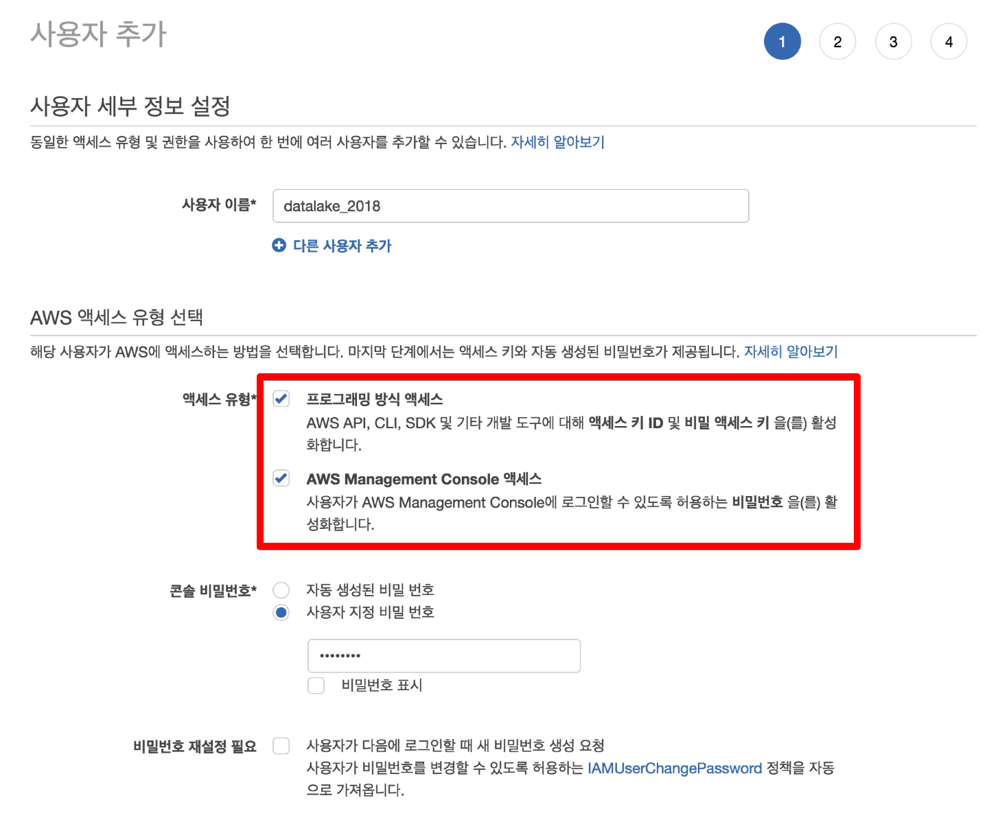
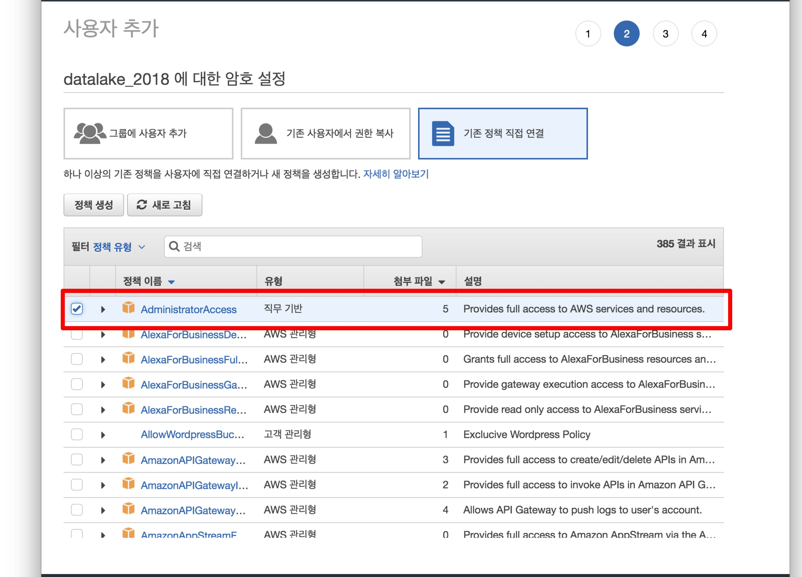

# 개발환경 구축

1. AWS IAM user 생성
[IAM 생성하기](https://console.aws.amazon.com/iam/home?region=ap-northeast-2#/users$new?step=details)
사용자 이름: datalake_2018




2. AWS CLI 설치 및 설정
[설치 방법](https://docs.aws.amazon.com/ko_kr/streams/latest/dev/kinesis-tutorial-cli-installation.html)

```
aws configure --profile datalake
AWS Access Key ID [None]: <액세스키>
AWS Secret Access Key [None]: <시크릿키>
Default region name [None]: ap-northeast-2
Default output format [None]: json
```


